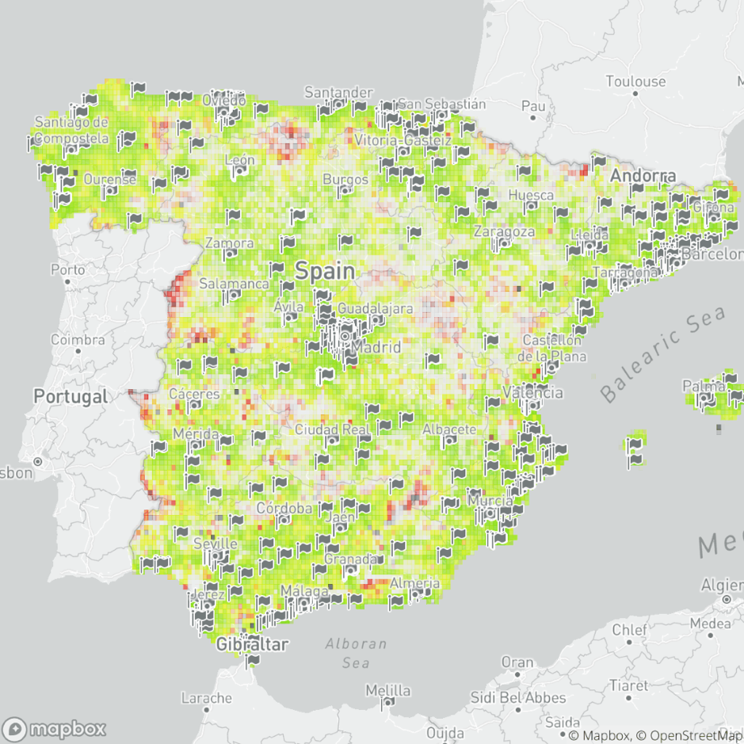

# Contributing

**Thanks for contributing to the Development Data Partnership!** The [Development Data Partnership](https://datapartnership.org/) website is a [Hugo](https://gohugo.io/)-generated static website that is deployed on [GitHub Pages](https://pages.github.com) via [GitHub Actions](https://github.com/features/actions). If not familiar with Hugo, please see this [Quick Start](https://gohugo.io/getting-started/quick-start/).

In summary, the continuous deployment (CD) works as follows:

- On each new pull request (to any branch), a preview will be made available. The preview will be posted by the `netlify bot` as a PR comment.

- On each commit to `main`, the website will be published to [datapartnership.org](https://datapartnership.org). The domain is registed AWS Route 53 with the World Bank.

## How to contritute to the Partnership blog

The [Development Data Partnership](https://datapartnership.org/) website is published on and you will be required to use GitHub. If convenient for you, you may use [GitHub Desktop](https://desktop.github.com).

## How to post on the Partnership blog

Please follow the instructions below on how to submit your story for publication.

1. Upon a [project's completion](https://github.com/orgs/datapartnership/projects/9), it is the time for dissemination.
	- [Create an issue](https://github.com/datapartnership/datapartnership.github.io/issues/new) with the title of the story to keep track of the task (e.g., this [story issue](https://github.com/datapartnership/datapartnership.github.io/issues/157)). Please remember to  link the *story issue* to the *proposal issue* (e.g., this [proposal](https://github.com/datapartnership/operations/issues/134)) on [Operations](https://github.com/orgs/datapartnership/projects/9).
	- Finalize the text (include link on the issue). If necessary, coordinate Development and Data Partner approval(s).
1. Once the text is ready, it is now time to submit the story. We adopted the [Feature Branch Workflow](https://www.atlassian.com/git/tutorials/comparing-workflows/feature-branch-workflow). All content must be in [Markdown](https://daringfireball.net/projects/markdown/) (see [reference](https://www.markdownguide.org/cheat-sheet)) and must be located under [content](https://github.com/datapartnership/datapartnership.org/tree/master/content)
	- Clone the [repository](https://github.com/datapartnership) (if you haven't already) and create a feature branch.
	- On your local repository and on your feature branch, create a story folder under `content/updates/`, e.g. [content/updates/africa-digital-transformation](content/updates/africa-digital-transformation). Create a blog post `index.md` file in Markdown using the [Story Template](#story-template). TIP: you may use [word2md](https://word2md.com).
	- Add figures to the same folder and use a relative path in Markdown (see below).
	- [Open a pull request](https://github.com/datapartnership/datapartnership.github.io/pulls) and assign a [maintainer](https://github.com/orgs/datapartnership/teams/maintainers) as reviewer.
3. The story will be published after the reviewer approves and merges the content to `main`.

## How to upload a image/picture on your blog post

To add an image to your story, upload a `.png` or `.jpeg` image to the story folder. Remember to use a relative path in Markdown.

For example,

```{markdown}

```

## Story Template

When writing about your project, please use the [TOML](https://toml.io/en/) preamble below to include metadata about your story. All files are Markdown files (If you want to know more about the syntax, please visit [GitHub Markdown Cheatsheet page](https://guides.github.com/features/mastering-markdown/)).

- title: Select title , e.g., `"Why We Should Accelerate the Use of Digital Technologies in Africa"`
- date: Select time reference when your post is published, e.g. `YYYY-MM-DDTHH:MM:SSZ`
- authors: Select authors, e.g., `["Holly Krambeck"]`
- categories: Select type, i.e. *"Case Study", "Article", "Events" or "Tutorial"*.
- dev_partner: Select Development Partner(s) associated with this project, e.g. `["World Bank"]`.
- partner: Select Data Partner(s) associated with this project, e.g. `["Meta, Mapbox"]`.
- tags: Select one or more tags, based on [World Bank Topics](https://www.worldbank.org/en/topic).
- links: Select one or more external (Read more) links.

For example, see below the preamble of [Why We Should Accelerate the Use of Digital Technologies in Africa](https://datapartnership.org/updates/africa-digital-transformation/).

```{md}
+++
title = "Why We Should Accelerate the Use of Digital Technologies in Africa"
date = 2023-04-25T00:00:00.000+00:00
authors = ["Clara Stinshoff", "Tania Begazo"]
categories = ["Case Study"]
dev_partner = ["World Bank"]
partner= ["Ookla"]
tags = ["Digital Development"]
links = [
    "https://www.worldbank.org/en/region/afr/publication/digital-africa",
]
thumbnail = "africa-digital-transformation.jpg"
+++
```

### Case Study Template

```{md}
+++
title =
date =
authors =
categories =
dev_partner
partner =
tags =
links =
thumbnail =
+++

Provide a brief introduction to the project and mention the Team/Global Practice/Sector and Development Partner.

## Challenge

Describe in detail the challenge the project addressed.

## Solution

Describe what solution the problem applied to address the challenge and what data dataset and data partners contributed to solving the problem.

## Impact
Tell us more about the impact of the project and the results obtained by implementing the solution. Please mention if the project plans to continue/expand or scale in other countries/sectors.

```
