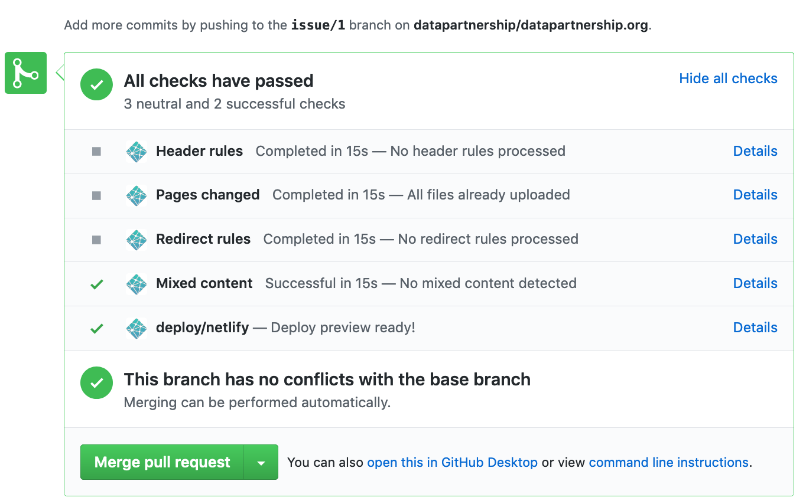
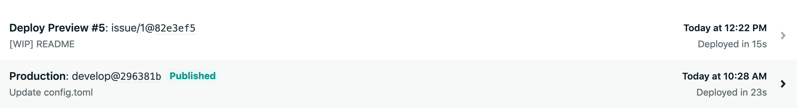
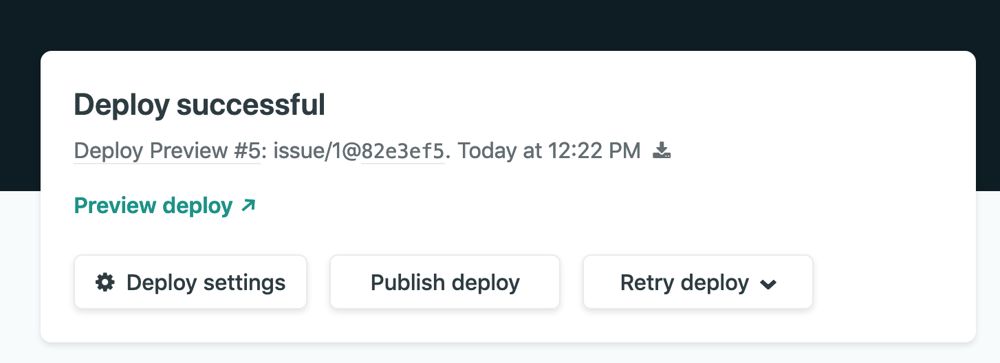
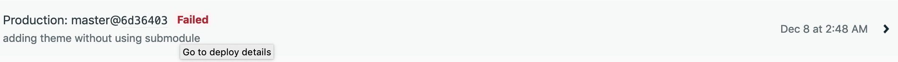
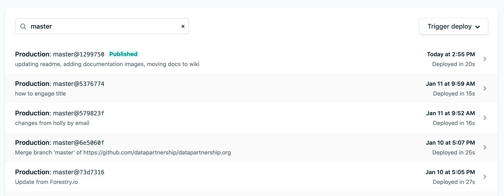
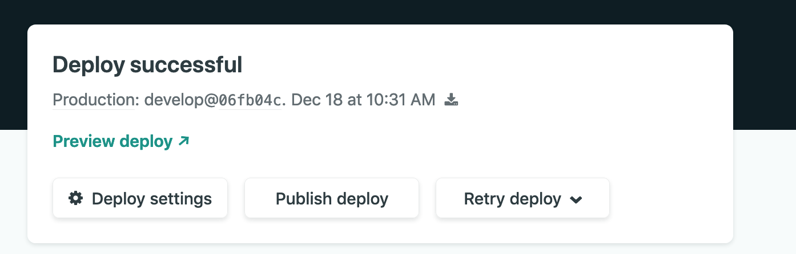

# Deploy

A video for how to setup the deploy is on this link:  

https://youtu.be/MMJ3eXZ6bQI

A video is worth a thousand word, no?

Now that you know how to do the deploy, here is an explainer of how it works.

## Background: atomic deploys, deploy previews and hooks

### 1/ Atomic deploys
Netlify enforces a strict concept of atomic deploys. If you're used to uploading files with FTP, SSH, RSync or S3's API, this is quite a different concept.

Instead of pushing individual files to netlify, you always create a new deploy. Netlify will compare the new deploy with your existing deploy and determine which files have changed and need to be uploaded.

No changes go live on your site's public URL before all changes have been uploaded. Once all the changes are ready, the new version of the site immediately goes live on the CDN.

This means deploys are atomic, and your site is never in an inconsistent state while you're uploading a new deploy.

### 2/ Deploy previews

Since Netlify uses atomic deploys, it means, you can decide to see the site before it goes live. This feature is called **deploy preview**. It is nicely integrated into **GitHub**

I created a pull request on a branch, I can see that netlify automatically creates a deploy preview, so i can see the changes on my site before deciding to merge.

**GitHub**

**Netlify**

Once you go to the detailed page, you see the preview link and publish option.

### 3/ Hooks: putting it together

So, what is happening is: netlify and github are connected through hooks. When you configure netlify, you enter your build command, which in our case is simply `hugo`. The publishing directory is `public` which is the default hugo location.

You update something, a hook is fired up, netlify pulls your code and site, it creates an atomic deploy that you can preview and see. If the site builds successfully, your main url is updated and the site goes live. If not, you are still safe, the previous version is online.

## Troubleshooting tips and preparing for failure

For one reason or another, your site might fail to build at 3am.

**True story**

What do you do?  
1/ don't decide to publish your changes at 3am.  
2/ use one of these quick fixes:

### Rollback to old version
- go to Netlify
- check the list of your deploys and find something that works.
- click on the deploy and then publish it
- take a deep breath

**Deploy list**

**Publish a deploy**

### Publish the html without a build process:
If something in the build process has failed, you can just publish your html without a build process. Generate the files locally, push them to a branch and configure netlify to work from that other branch.

- create a new branch called `static`
- on your computer, build and preview the site to make sure it works.
- push the already built html files to the new `static` branch
- configure netlify to serve files from `static`
- do not enter any build commands

If managing branches is too much for you or confusing, just create a new repo and reconfigure the site to work from the new repo.
