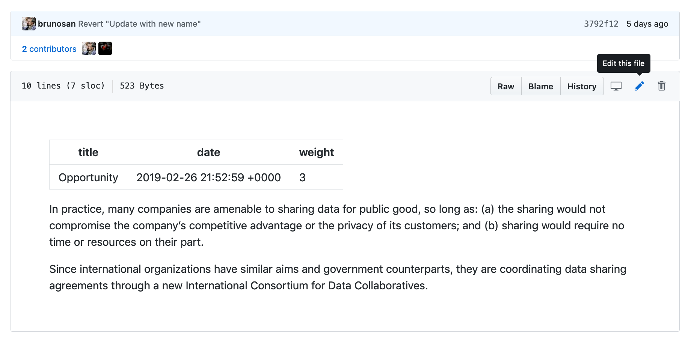
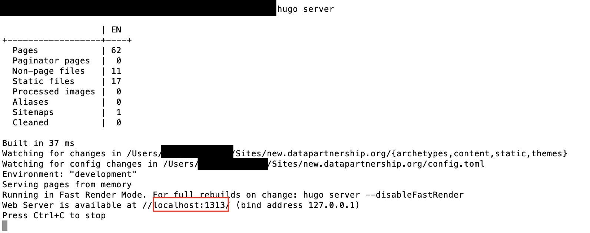

# datapartnership.org

This repo contains the code and deployment details for the datapartnership.org site.

## How does the site work?

The site is a "statically generated site". This means, instead of running a web server with a database and a traditional content management system, we use a tool called a static site generator to transform the text into ready-made html pages -- which can be served to the users at a blazing fast speed. There are no databases, no complicated servers to manage, backup, run or keep secure.

In "dev-speak", a traditional web development method might use something like "LAMP" stack (Linux, Apache, MySQL, PHP -- think Drupal) or "MEAN" stack (Mongo, Express, Angular, Node). This site uses ["JAM" Stack]( https://jamstack.org/): Javascript, API, Markdown.

## Toolset
- Static site generator: [Hugo](https://gohugo.io/)
- Deployment: [Netlify](https://www.netlify.com/)
- Editing:
  - [Forestry.io](https://forestry.io/) (can be updated/changed).
  - GitHub Web UI.
  - Your local text editor -- this assumes you know how to use the command line and git.

## Editing the site

### 1/ Edit online on Forestry.io
- Create an account with forestry.io
- Ask Holly(hkrambeck@worldbank.org) to add you to the team on Forestry.
- Login and edit (the UI is mostly self explanatory)

### 2/ Edit in the browser with GitHub's web user interface

You can use the GitHub pages to just go to any Markdown file in the `content` folder then edit it using the web user interface. Once you commit your change, it will take a few seconds for the site to rebuild.

Here is how the user interface looks like. Click the pen button.

### 3/ Edit Locally

**Assumptions**
- You can use the command line (basic level).
- You can use git.

#### Install
A faster and more flexible way to edit and tinker with the site is to work locally. This is especially recommended if you want to experiment with heavy edits. You will need to:

- install hugo https://gohugo.io/getting-started/installing/
- install git https://git-scm.com/
- optional: install GitHub Desktop or whatever UI tool you are comfortable with to push your changes. https://git-scm.com/downloads/guis

To install Hugo, you can read the instructions on the link, but in reality, it will take you only a minute or so if you do:

- OSX: `brew install hugo`  
- Ubuntu: `sudo apt-get install hugo`
- Windows: not tested, but instructions are on https://gohugo.io/getting-started/installing/

For using git and github, this is a little bit out of the scope of this readme, but there are plenty of tutorials online.
If you are using GitHub Desktop, this is a good place to start https://help.github.com/en/desktop/contributing-to-projects

#### Preview

- Navigate to the folder
- run `hugo server` to preview the site.
- go to your browser and preview the url (usually localhost:1313)

#### Build the site:
- Navigate to the folder
- run `hugo` to generate the html pages. By default the results will be in a folder called `public`.

## Deployment

The site is configured to auto-magically and automatically deploy to Netlify. You don't need to do anything or install any netlify tools. You change the content or code on a branch in GitHub and Netlify will install everything you need and generate the site. It is pretty neat and it takes one minute or less to setup. The magic of netlify.

### YouTube How-To
Here is the video of doing an actual deploy. It takes 57 seconds... this the equivalent of creating and configuring a server in the background, building the site, configuring a full continuous deployment pipeline etc...  
https://youtu.be/MMJ3eXZ6bQI

When something works, you still need to understand how it was setup, so you can troubleshoot or do updates. Check [deploy.md](/DEPLOY.md) for details, what happens in the background and some troubleshooting tips (those happened before and will happen again, be ready).

## Development

For development check [development.md](development.md) for in-depth details about Hugo and the custom theme created for this site.
