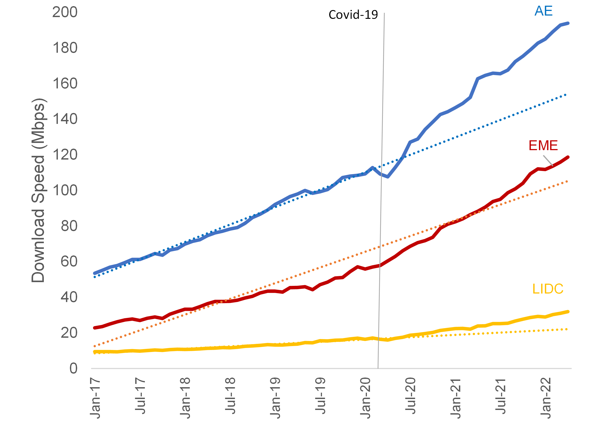

There is little evidence of a faster expansion of access to the internet (extensive margins) across all country income groups but strong evidence of an acceleration in the improvement in the quality of connectivity (intensive margins).

## Challenge

IMF Staff research shows that, contrary to popular expectations, internet adoption does not appear to have accelerated much during COVID-19. The annual growth of internet users accelerated only in Emerging Market Economies (EMEs) during COVID-19 driven mainly by the rapid internet adoption in India, which had started before the outbreak of the pandemic. Internet adoption in Advanced Economies (AEs) and Low-income Developing Countries (LIDCs) remained at the historical trend since the outbreak of COVID-19. 
## Solution

The method used to measure the intensive margins (quality of connectivity) involved utilizing Ookla's internet speed data for existing users. The data included the fixed band average download speed, weighted by population. The data spanned from January 2017 to February 2020 (before COVID-19) and from March 2020 to April 2022 (after COVID-19).

<figure align="center">
    
    <figcaption>
        

		Photo Credit: World Bank
		

    </figcaption>
</figure>
## Impact

The study found that the largest improvement in internet adoption during COVID-19 is the leap in internet speed among existing users. The average download/upload speed since the outbreak of COVID-19 accelerated considerably across all income groups. Such improvement in internet speed probably reflects the fact that existing internet users started to upgrade their internet packages as most work and household-related activities shifted online. 
 
