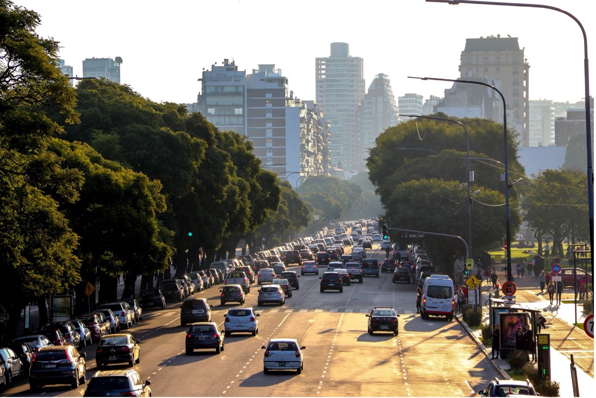
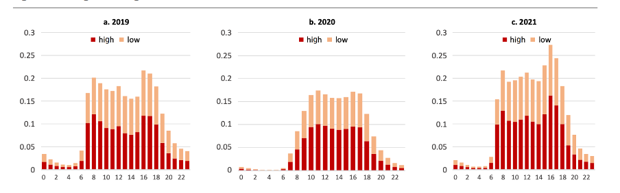

+++
title = "Insights from Leveraging Big Data to Track the Impact of the COVID-19 Pandemic on Mobility in Buenos Aires"
authors = ["Aiga Stokenberga", " Javier Morales Sarriera"]
post_type = "Case Study"
partner = ["Waze"]
dev_partner = "World Bank"
tags = ["Transport"]
links = ["https://openknowledge.worldbank.org/server/api/core/bitstreams/f1d2fd58-a15b-4e2a-b80e-1dc088f2f97f/content"]
date = 2023-07-18T00:00:00Z
+++

How did the COVID-19 pandemic and the lockdown measures affect mobility in cities around the globe? To inform transport mobility planning, congestion data provided by [Waze for Cities](https://www.waze.com/wazeforcities) was used for a World Bank study on how travel patterns in Buenos Aires changed as a result of pandemic-related restrictions and changing travel preferences. 

## Challenge

The COVID-19 pandemic and the lockdown measures implemented in 2020 disrupted mobility in cities around the globe by adding new constraints to the travel behaviors of the residents and businesses and by at least temporarily changing personal mobility preferences.

However, while various policy responses followed over the subsequent months, including by the authorities governing the Buenos Aires Metropolitan Area (AMBA for its Spanish acronym), these were implemented in the absence of adequate data that would have allowed an understanding of how exactly travel patterns had changed, their drivers, and the likely persistence of the pandemic-induced changes going forward.

<figure align="center">
    
    <figcaption>
        

		Image by Luis X from Pixabay
		

    </figcaption>
</figure>

## Solution

The World Bank conducted a study drawing on mobile phone, mobility app, and public transport smartcard-based "big data" and by surveying over 20,000 private motorized mode users on the ground.

Using millions of observations of mobile phone call detail records (CDRs) covering the Metropolitan Area, the study team analyzed several key mobility indicators at the scale of AMBA for the pre-pandemic (October 2019), pandemic (October 2020), and new normalÓ (October 2021) periods. They found that the total number of trips made in AMBA on an average weekday was more than 11 percent lower in 2021 than in 2019. 

However, as revealed by complementary analysis conducted by the team using data tracked by Waze for Cities for the same type of periods (see figure 1), even though total traffic intensity measured across the entire day was 11 percent lower, consistent with the overall figure obtained from the CDR analysis, the amount of "high" congestion in October 2021 (panel c) appears to have exceeded the October 2019 (panel a) level during the highest activity hours. Moreover, there was a particular increase in the "high" congestion level in the Autonomous City of Buenos Aires, or CABA specifically.

<figure align="center">
    
    <figcaption>
        

		Figure 1: Changes in Congestion Index in CABA in 2019 to 2021
Source: Original figure produced for this publication, based on analysis by study team, using [Waze for Cities](https://www.waze.com/wiki/Argentina/P%C3%A1gina_principal) data.
		

    </figcaption>
</figure>

## Impact

The use of Waze data for the study demonstrated the enormous potential of new data sources to complement, enrich, or even replace data sources traditionally used for mobility analysis and transport planning. It can provide crucial insights for transport planners to make more demand-responsive and informed decisions.

Many of these new data sources rest in the hands of private entities, heightening interest in exploring the establishment of data partnerships from which cities, the private sector and society as a whole can benefit. For instance, using Waze for Cities data for transportation planning, beyond just traffic management, is an opportunity to improve the mobility information available in Buenos Aires through access agreements to non-public data.
