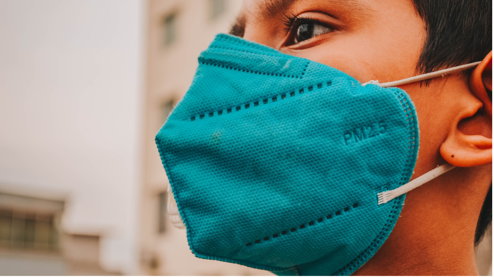
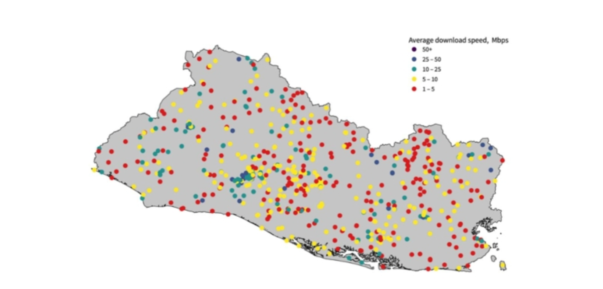

+++
title = "Is El Salvador’s health care system ready for telemedicine?"
authors = ["Niccolò Comini", "Mykhailo Koltsov"]
categories = ["Post"]
partner = ["Ookla"]
dev_partner = "World Bank"
tags = ["Health"]
links = ["https://blogs.worldbank.org/digital-development/el-salvadors-health-care-system-ready-telemedicine"]
date = 2023-07-31T00:00:00Z
+++

The World Bank’s [Digital Economy for Latin America (DE4LAC) initiative]( https://www.worldbank.org/en/programs/de4lac#:~:text=The%20Digital%20Economy%20Initiative%20for%20Latin%20America%20and%20Caribbean%20(DE4LAC,to%20an%20inclusive%20digital%20economy)leveraged data from [Ookla for Good™](https://www.ookla.com/ookla-for-good)to analyze El Salvador’s telecommunication network to understand to what extent the national healthcare system could leverage the existing digital infrastructure and develop e-health applications.  

## Challenge

Due to the COVID-19 pandemic, some countries switched to e-health services as quarantine restrictions did not allow patients to visit their doctors in person. 

The term “e-health” entails a broad spectrum of applications. From telemedicine — which consists of online consultation between a doctor and a patient — to remote surgery, the inputs required in connectivity, skills, and logistics vary significantly. Telemedicine is vital to deliver essential health services in rural areas, which often face a shortage of skilled health workers. Moreover, a connected health system makes it possible to create a shared patient and drug database and, in general, permits better communication between different actors. In this regard, it is essential to rely on a solid data infrastructure that includes data centers and cloud services.

However, many developing countries have difficulty providing e-health services because they lack well-developed digital infrastructure, advanced technological tools, and relevant digital skills for doctors and patients.

<figure align="center">
    
    <figcaption>
        

		Photo: World Bank           
		

    </figcaption>
</figure>

## Solution

As part of the Digital Economy for Latin America (DE4LAC) initiative — which maps the current strengths and weaknesses of the national digital economy ecosystem and identifies both opportunities and challenges for future growth — the World Bank Digital Development Global Practice has analyzed El Salvador’s telecommunication network to understand to what extent the national health care system could leverage the existing digital infrastructure and develop e-health applications.

Their approach consisted in checking the availability of high-speed broadband to health care facilities. To do so, they examined 810,000 internet Speedtest® by [Ookla for Good](https://www.ookla.com/ookla-for-good)measurements taken between 2019 and 2020, which were taken within a 400-meter radius of 738 health care facilities (378 in rural and 360 in urban areas). Then, they calculated the average value of the ten nearest speed tests for each facility, assuming that a building has access to a similar level of connection quality recorded in its proximity.

The facilities reporting the highest average internet speed were the Ministry of Health and its regional offices (25 megabits per second (Mbps) and 18 Mbps respectively), pharmacies — 16 Mbps, and international health offices — 14 Mbps. Only about 22 percent of health care facilities had internet speed above 10 Mbps. Fifty-three percent of them recorded an average internet speed below 10 Mbps. One-quarter of the facilities had less than ten tests in their proximity and were taken out of the analysis to mitigate potential distortions.

Overall, 89 sites (mainly primary care facilities) did not have any internet speed test recorded within the 400-meter radius, suggesting a lack of access to the internet.

Their findings show a stark disparity in internet quality between health care facilities in urban and rural areas. Only two facilities in rural areas reported an average speed above 10 Mbps; the rest were below this threshold or did not record any access in their proximity.

<figure align="center">
    
    <figcaption>
        

		Figure 1: Map of health care facilities’ internet speeds in El Salvador
           Source: World Bank analysis based on Speedtest Intelligence® data from January 2019 to December 2020 provided by Ookla for Good.
		

    </figcaption>
</figure>

## Impact

To leverage the potential of a well-developed digital economy environment, it is important that users have access to high-speed broadband to access services and perform various activities. This need was increased by the pandemic.

The analysis using data from [Ookla for Good](https://www.ookla.com/ookla-for-good)suggests that El Salvador should keep working towards deploying a more extended, reliable, and affordable data infrastructure to deliver comprehensive and inclusive e-health services. 

The findings underscore the need for the public and private sectors to work together to improve the local digital infrastructure, ensuring that health providers and patients have access to an affordable, reliable, and fast internet connection.  At the same time, the country’s Ministry of Health has the opportunity to establish digital skills programs and targeted training for health workers to leverage the opportunities offered by e-health applications.
