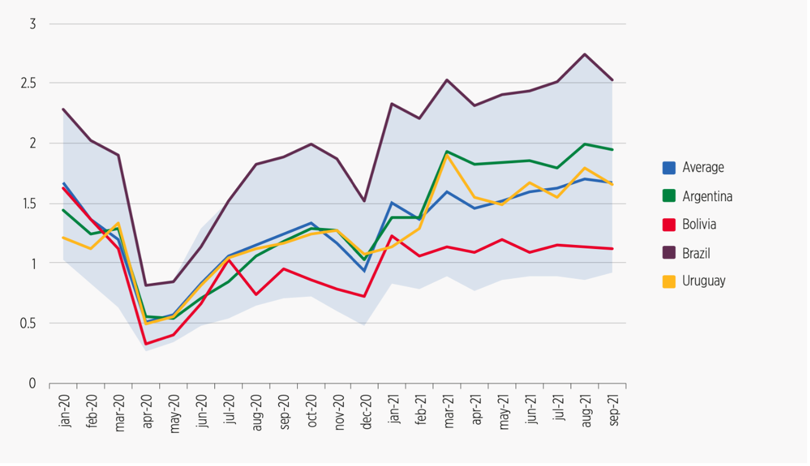

+++
title = "LinkedIn Data Reveals How Labor Markets Have Been Changing in Latin America and the Caribbean Since the Pandemic"
authors = ["Oliver Azuara", "Mauricio Mondragon", "Eric Torres"]
categories = ["Case Study"]
partner = ["LinkedIn"]
dev_partner = "Inter-American Development Bank"
tags = ["Jobs and Development"]
links = ["https://publications.iadb.org/en/linkedin-latin-america-and-caribbean-rapid-transformation-labor-market-due-pandemic"]
date = 2023-07-24T00:00:00Z
+++

Despite the devastating economic impacts of the COVID-19 pandemic, labor markets in Latin America and the Caribbean (LAC) are on the verge of recovery. Through the Development Data Partnership's support, [the Inter-American Development Bank](https://www.iadb.org/en)'s Labor Markets Division leveraged data from [LinkedIn](https://economicgraph.linkedin.com/data-for-impact) to understand the region's workforce trends. 

## Challenge

The COVID-19 pandemic has upended many people's lives worldwide, particularly regarding employment. The health crisis has changed labor markets in Latin America and the Caribbean (LAC). The Inter-American Development Bank's Labor Markets Division produced the [LinkedIn in Latin America and the Caribbean: a rapid transformation of the labor market due to the pandemic?](https://publications.iadb.org/en/linkedin-latin-america-and-caribbean-rapid-transformation-labor-market-due-pandemic) report to study how COVID-19 impacted labor markets in the region.

## Solution

The Labor Markets Division leveraged LinkedIn data to understand the change in hiring rates in different sectors and countries across LAC since the pandemic. 

For instance, it compared LinkedIn hiring rates for twenty Latin American countries and for the region. This comparison can help us better understand which country's labor market recovered the fastest or slowest from the crisis.

Additionally, the pandemic had varying effects on different sectors of the economy. The report includes comparisons of hiring rates among finance, agriculture, and manufacturing industries. With this information, we can determine which sector was least affected by the crisis.

The report also studied the penetration of technological skills in various sectors of the region's economy. A higher volume of technological skills may indicate that industries were more technologically advanced and could better prepare their workers to deal with the crisis, given the restrictions on mobility.

Some of the key findings are:

* LinkedIn's hiring rate in LAC was at its lowest level in April 2020, down as much as 70% from its January 2020 level.

* The sectors with the highest penetration of technological skills were information technology (IT), communication and media, entertainment, and education.

* Uruguay and Argentina's LinkedIn hiring rates recovered the fastest from the crisis, whereas Bolivia showed the slowest recovery.

<figure align="center">
    
    <figcaption>
        

		Figure 1: LinkedIn hiring rate in selected countries across LAC
           Source: LinkedIn data provided through the Data Partnership
		

    </figcaption>
</figure>

## Impact

The pandemic affected countries and industries differently across LAC. Some sectors grew growing at a faster pace, requiring skilled workers. However, other sectors need to catch up, with individuals needing to transition to other occupations. In response to the changes in the labor market, we need high-quality data to assess trends in a timely and comprehensive way.

Leveraging data from LinkedIn, the report provided a rich overview of the labor market dynamics in LAC, such as which industries and countries recovered faster or slower from the pandemic.

Oliver Azuara, IDB senior economist leading the Observatory, said LinkedIn's indicators provide a unique and valuable insight into the workforce trends, which complements the analysis based on traditional employment in the region. LinkedIn data provides an opportunity to understand new forms of adjustment, the supply of jobs in different sectors, and the demands of new skills. 

The report's insights are a valuable source of information that complements traditional statistics on labor dynamics, enabling policymakers and companies to understand better what can be done to ensure a sustainable and resilient transformation of labor markets in the region.

Working with data partners like LinkedIn provides an excellent opportunity to monitor the labor market, understand labor market dynamics better, and capture skills, needs, and trends focusing on different industries at a detailed level.