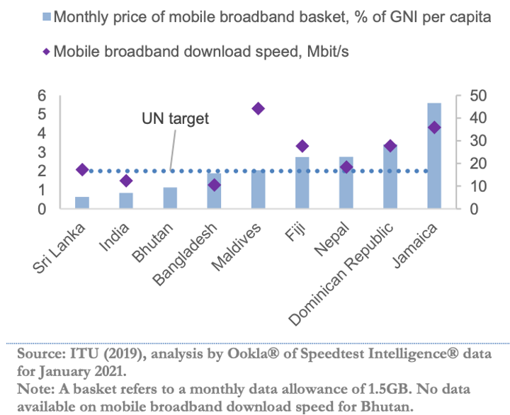
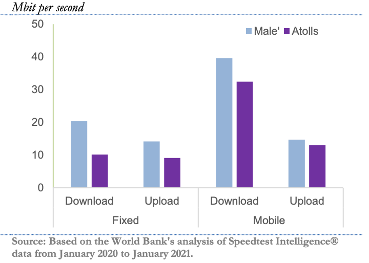

+++
title = "Maldives Development Update (April 2021): A Digital Dawn"
authors = Authors for the special focus topic (Part B) on digital development: ["Gohar Malumyan", "Junko Narimatsu" and "Pui Shen Yoong", with guidance from "Siddhartha Raja" and "Fernando Im".]
categories = ["Case Study"]
partner = ["Ookla"]
dev_partner = "World Bank"
tags = ["Digital Development"]
links = ["https://www.worldbank.org/en/news/press-release/2021/04/15/digital-technologies-can-help-maldives-build-back-better", "https://thedocs.worldbank.org/en/doc/93bdbd79b45eeb504743f4514f1095e1-0310062021/original/April-2021-Maldives-Development-Update.pdf"] 
date = 2023-09-04T00:00:00Z
+++

Despite the devastating impacts of the COVID-19 pandemic, digital technologies can be game changers for Maldives’ growth and development. To assess the country’s digital capacity, the World Bank team leveraged data from [Ookla for Good™](https://www.ookla.com/ookla-for-good)on Internet speeds to inform the special focus section on digital development for the [World Bank Maldives Development Update: A Digital Dawn](https://thedocs.worldbank.org/en/doc/93bdbd79b45eeb504743f4514f1095e1-0310062021/original/April-2021-Maldives-Development-Update.pdf). The special focus section was led by the Digital Development Global Practice (GP) in partnership with the Macroeconomics, Trade, and Investment GP that led the broader economic report.

## Challenge

The COVID-19 pandemic brought global tourism and travel to a standstill. As a tourism-dependent economy, Maldives was one of the most negatively affected economies around the world. From end-March to mid-July 2020, Maldives was forced to close its borders to tourists. According to the [Maldives Ministry of Tourism](https://www.tourism.gov.mv/en/statistics/publications), only 555,494 tourists visited the island nation in 2020 – the lowest number since 2002 and 67 percent lower than the 2019 record high of 1.7 million tourists. 

This significant drop in tourism paralyzed the country’s economy as tourism is the main driver of growth, jobs, and revenues. Construction activity also came to a halt, owing to logistical difficulties and COVID-19 outbreaks among foreign workers. According to the [latest Macro Poverty Outlook for Maldives] (https://documents.worldbank.org/en/publication/documents-reports/documentdetail/099931404122337873/idu059108a040654b043f70ac500d61fad2b62e2), the country’s real GDP contracted by 33.5 percent in 2020. To put this in perspective, real GDP contracted by 13.1 percent in 2005 following the 2004 Indian Ocean tsunami.
 
With the drop in tourism, government revenues plummeted. Total revenues and grants fell by 35 percent year-on-year due to the impact of the pandemic on economic activity and tourist-dependent tax and non-tax revenues while public and publicly guaranteed debt to GDP was almost doubled and climbed to 150 percent of GDP.

The government took steps to protect the lives and livelihoods of Maldivians, but the pandemic led to a temporary increase in poverty. Digital technologies can be game changers for Maldives’ long-term growth and development. There is tremendous potential to use digital technologies to improve the delivery of services such as health, education, and disaster risk management, especially to outer atolls.

<figure align="center">
    
    <figcaption>
        

		Photo: World Bank           
		

    </figcaption>
</figure>

## Solution

Better internet access can help make the economy more resilient during crises such as the COVID-19 pandemic which curbed travel and reduced interpersonal activities. With access to good quality internet connections, people can perform activities online such as working from home instead of in person. Additionally, small businesses can expand their markets, access cheaper and better inputs, and increase their profits.
 
Although the effect of the pandemic on Maldives’ economy was devastating, the island nation might be in a good position to leverage digital technologies to build back better for a more green, resilient, and inclusive development following the health crisis.

The World Bank leveraged data from [Ookla for Good](https://www.ookla.com/ookla-for-good)for its study on how digital technologies can help Maldives become resilient and what can be done by policymakers to strengthen the country’s existing digital infrastructure. The Ookla data demonstrated that mobile broadband services were faster and more affordable than fixed broadband services in Maldives. On average, users paid about USD 15 for a monthly data allowance of 1.5 GB, or 2 percent of average monthly per capita income. This was on par with other upper-middle income economies (Figure 1).

<figure align="center">
    
    <figcaption>
        

		Figure 1
		

    </figcaption>
</figure>

However, the Ookla data also reflected a stark digital divide in the country. The World Bank found that Internet users in Malé enjoy average download speeds that were twice as fast as those in atolls for fixed broadband connections (Figure 2).

<figure align="center">
    
    <figcaption>
        

		Figure 2
		

    </figcaption>
</figure>

## Impact

The Internet speeds data from Ookla for Good provided key insights for the World Bank to study the current state of digital connectivity and infrastructure in Maldives, identifying areas where improvements can be made.

For instance, the digital divide between Malé and atolls shown by the Ookla for Good data underscores the need for further investments to ensure equitable access to secure,
affordable and reliable high-speed Internet services. The government could play an important role in creating an enabling environment that facilitates such investments and stimulates competition.

“The Ookla data has offered critical insights for the government to consider data-driven policy decisions on improving the quality of Internet connectivity in the atolls and closing the digital divide. This has become increasingly important for inclusive service delivery and for leveraging the power of digital technologies across the economy, including tourism,” says Junko Narimatsu, the Task Team Leader for this study.

To leverage the digital dividend, Maldives needs to address policy, legal and regulatory gaps that currently inhibit the adoption of digital technologies. It also needs to boost Maldivians’ digital capabilities and skills to ensure that all Maldivians can take advantage of new technologies in an increasingly digital world.
