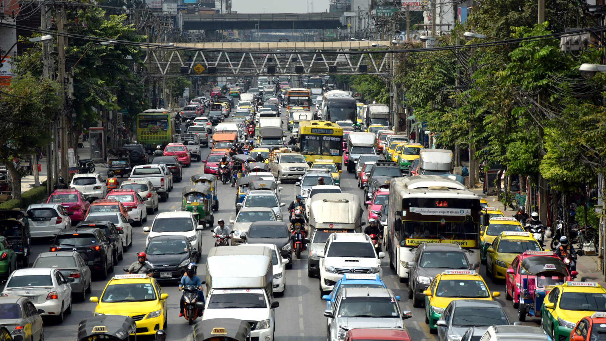
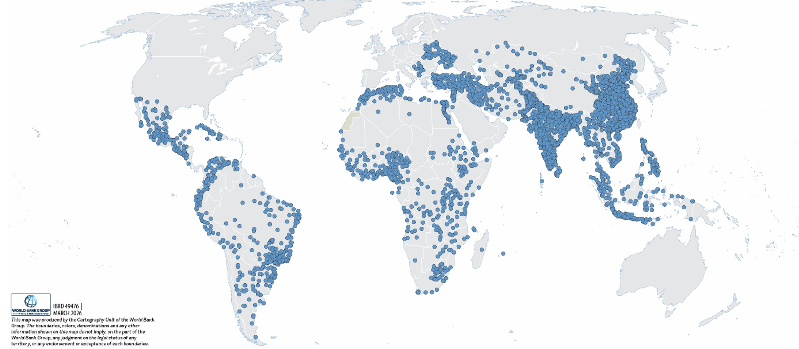
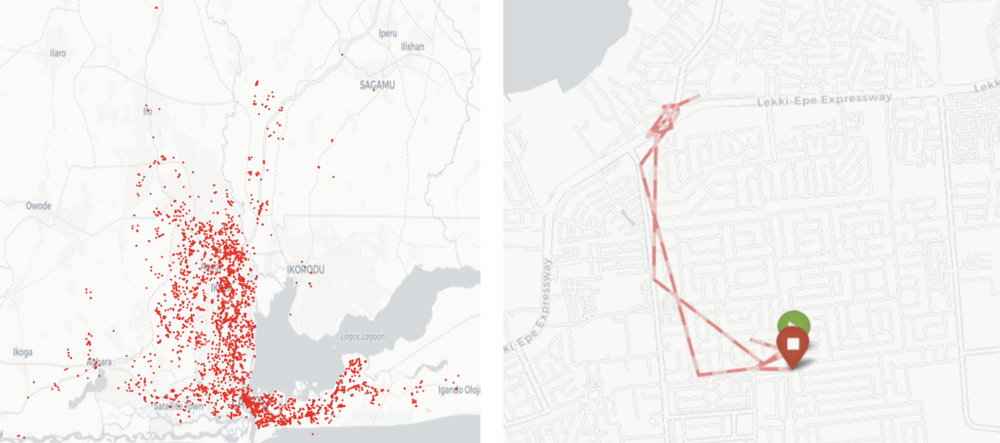
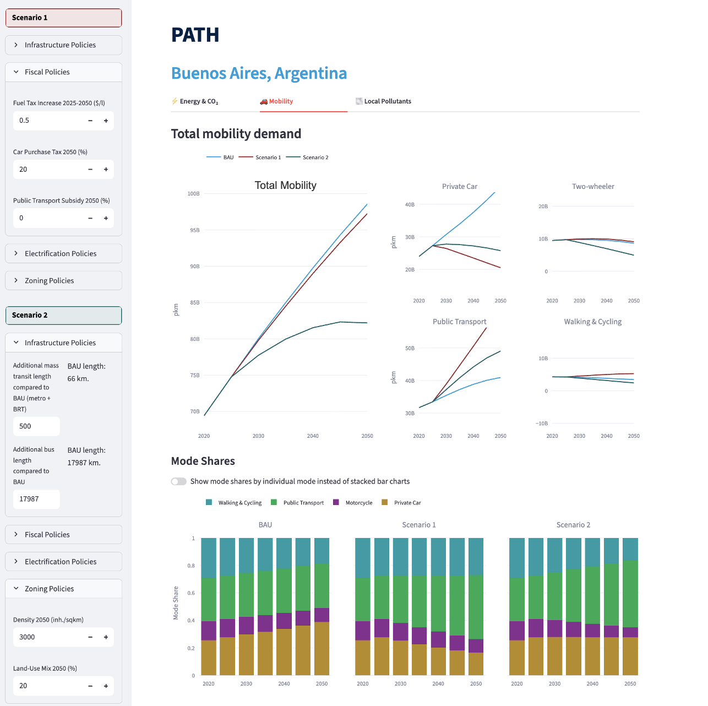

+++
title = "A Data-Driven Model for Urban Transport Emissions: Leveraging Global Mobility Data in Low- and Middle-Income Countries"
authors = ["Nino Pkhikidze", "He He"]
categories = ["Case Study"]
partner = ["Veraset"]
dev_partner = ["World Bank"]
tags = ["Transport"]
date = 2026-07-01T00:00:00Z
+++

Urban transport is a major and growing contributor to greenhouse gas emissions and local air pollution, particularly in low- and middle-income countries (LMICs), where data constraints often limit effective policy design. To bridge this gap, the World Bank’s Transport and Logistics Department developed the Passenger Transport Emissions Pathways (PATH) model and [tool](https://path-dashboard.streamlit.app) by combining multiple large-scale datasets, including anonymized smartphone mobility data from [Veraset](https://veraset.com).  The PATH model provides consistent, city-level estimates of transport demand, emissions, and air pollutants, enabling a new generation of data-driven urban transport analysis across data-scarce contexts.

## Challenge

The transport sector plays a major role in air pollution and emissions, generating significant levels of particulate matter (PM2.5), nitrogen oxides (NOx), and other hazardous pollutants that negatively affect both human health and the environment. It is also among the largest sources of greenhouse gas (GHG) emissions, accounting for 24 percent of global carbon dioxide emissions from fuel combustion (Emodi et al. 2022).

Air pollution from passenger transport imposes considerable health and economic burdens, particularly in urban areas across low- and middle-income countries (LMICs). Emissions of NOx, PM, and other harmful pollutants, intensified by rapid motorization and the widespread use of imported second-hand vehicles, are key drivers of the severe air pollution affecting many cities in LMICs (Anenberg et al. 2019; Hajat et al. 2015). Efforts to reduce transport-related pollution therefore have the potential to deliver substantial co-benefits.

However, developing effective and evidence-based transport policies remains a significant challenge in many LMICs. In particular, the lack of comparable, high-resolution mobility data limits the ability to measure travel demand, calibrate models, and simulate policy impacts across cities.  Existing modeling tools also often fall short because they are not transparent, require extensive data, are difficult to adapt across local contexts, and do not sufficiently capture consumer behavior or detailed passenger transport dynamics.

<figure style="text-align: center;">
  
</figure>

## Solution

To address these challenges, the World Bank’s Transport and Logistics Department developed the Passenger Transport Emissions Pathways (PATH) model. Designed for cities across the world, the model estimates transport demand, emissions, and air pollutants to support evidence-based urban mobility planning and policy making, covering nearly 4,000 urban areas across 116 low- and middle-income countries.

PATH adapts the traditional four-step transport demand model into a simplified three-step framework. At its core, PATH is a behavioral, demand-driven model built around three integrated modules that translate mobility data into emissions outcomes. First, it estimates total passenger travel distances using anonymized smartphone GPS data, providing a globally consistent proxy for daily mobility patterns in place of traditional costly and often unavailable travel surveys. Second, it distributes these travel distances across private cars, two- and three-wheelers, public transport, and non-motorized transport using a mode choice model that captures how costs, infrastructure, and urban form shape behavior. Third, it converts this transport activity into greenhouse gas emissions and local air pollutants using mode- and fuel-specific emission factors, linking behavior directly to environmental outcomes.

Together, these modules allow PATH not only to estimate current outcomes, but to simulate how changes in prices, infrastructure, or technology translate into shifts in travel behavior and, ultimately, emissions.

<figure style="text-align: center;">
  
  <figcaption style="text-align: center; font-size: 0.9em; color: #555;">Figure 1a: Cities Covered in the Path Model
</figcaption>
</figure>

A key innovation of PATH lies in its use of large-scale, passively collected anonymized GPS data from smartphones around the world provided by Veraset through the World Bank’s Development Data Partnership.

The Veraset dataset consists of anonymized smartphone location signals, including latitude, longitude, and timestamps. These location “pings” are used to reconstruct daily movement. After applying quality filters and aggregating across devices, the model derives comparable estimates of daily travel distances for thousands of cities globally. Rather than tracking individuals, the analysis focused on aggregated mobility trends at the city level, ensuring both privacy and scalability. These estimates are then used to calculate average daily travel distances and broader passenger transport demand.

<figure style="text-align: center;">
  
  <figcaption style="text-align: center; font-size: 0.9em; color: #555;">Figure 1b: Example of mobile GPS Data from Nigeria—snapshot of pings in Lagos (left), Illustration of a trace from single device ID in a day (right) 
Note: The ping locations on the right figure are approximate and do not reflect the exact locations of the raw device ping locations.
Source: Authors’ estimations based on the mobile GPS data.
</figcaption>
</figure>

## Impact

The PATH model provides several important insights for policymakers. Absent intervention, urban passenger transport emissions is on trend to more than double by 2050. PATH also illustrates how the effectiveness of transport policies depends on local urban contexts and mobility patterns. For example, investments in public transport tend to have the greatest impact in megacities, while electric vehicle adoption may be more effective in other highly motorized urban areas.

A central contribution of PATH is its ability to generate consistent, comparable estimates across nearly 4,000 cities, enabling cross-city benchmarking that was previously difficult in LMIC contexts. By generating more standardized and comparable estimates, PATH helps strengthen evidence-based transport planning and emissions analysis across diverse urban settings.

In summary, PATH is a scalable, data-driven model that transforms large-scale mobility data into policy insights on transport demand, emissions, and intervention trade-offs.
By estimating city-level transport demand, greenhouse gas emissions, and local air pollutants, the model provides a transparent and adaptable tool for designing context-specific urban transport strategies, particularly in data-poor contexts.

<figure style="text-align: center;">
  
  <figcaption style="text-align: center; font-size: 0.9em; color: #555;">Figure 2: Source: Authors’ estimates based on the PATH web tool. Note: Scenarios can be built in the left panel. Here two scenarios are considered: one with an increase in fuel taxes (in red) and one with transport supply and land-use policies (in grey). BAU = Business-as-Usual; BRT= bus rapid transport; inh = inhabitant; km = kilometer; pkm = passenger-kilometer; sqkm = square kilometer.
</figcaption>
</figure>

*Report: [https://openknowledge.worldbank.org/entities/publication/6376102a-c1b2-40c1-b5b1-442e7467478e](https://openknowledge.worldbank.org/entities/publication/6376102a-c1b2-40c1-b5b1-442e7467478e)* 

*Web-tool: [https://path-dashboard.streamlit.app/](https://path-dashboard.streamlit.app/)*  

