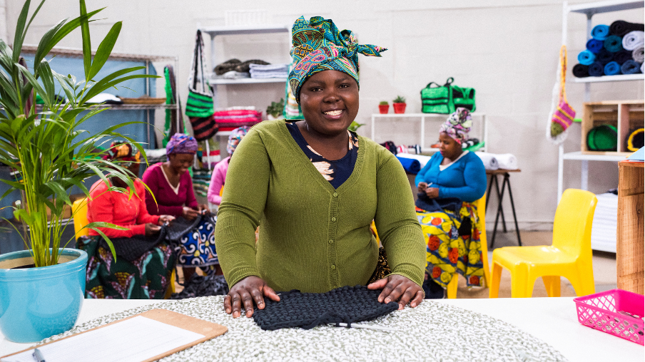

+++
title = "Advancing Women’s Empowerment Through Data"
author = ["Kwok Kin Lee"]
categories = ["Case Study"]
partners = ["Meta", "Linkedin"]
dev_partner = ["World Bank", "Inter American Development Bank"]
tag = ["Gender"]
date = 2025-03-07T00:00:00Z

+++

Data plays a fundamental role in identifying the challenges women are facing and in allowing policymakers and businesses to make informed decisions that improve women’s well-being and access to economic opportunities and overall development outcomes.

Read about the following Development Data Partnership-supported projects to understand how international organizations leveraged data from the private sector to identify challenges and opportunities for women’s empowerment.

## [Empowering female entrepreneurs to thrive in male-dominated sectors](https://datapartnership.org/updates/empowering-female-entrepreneurs-to-cross-over-into-male-dominated-sectors/)

[Women represent a larger proportion of entrepreneurs globally than ever before.](https://openknowledge.worldbank.org/server/api/core/bitstreams/7031b50b-f682-52f5-9a3a-24dc46c77942/content) Despite an increased number of women-led companies worldwide, women operate smaller businesses and concentrate in less profitable sectors than men.

Under the guidance of the World Bank’s Gender Group,  the World Bank Africa Gender Innovation Lab, the East Asia and Pacific Gender Innovation Lab, and the Latin America and the Caribbean Gender Innovation Lab analyzed data from 10 low- and middle-income countries across three regions as well as analyzing [Facebook](https://dataforgood.facebook.com/dfg/about?)’s Future of Business (FoB) survey to offer insight into women working in both male-dominated sectors (MDS) and female-concentrated sectors (FCS).

The global data from the FoB study generally indicated that women in MDS made more profits on average than women entrepreneurs in FCS. The studies of 10 low- and middle-income countries also showed the same finding in all countries except Cambodia, where the opposite is true. Crossing over to MDS in some countries could help women entrepreneurs become as profitable as their male counterparts operating in MDS.

[This World Bank study](https://datapartnership.org/updates/empowering-female-entrepreneurs-to-cross-over-into-male-dominated-sectors/) also revealed that crossing over is just one promising strategy within a wider range of policies aimed at supporting female entrepreneurs.  Even after crossing over, women still face various challenges. These may arise due to women clustering in less profitable roles/activities within the same sector, experiencing discrimination in male-dominated sectors, or facing other gender-related barriers that restrict the profits of women.

Some of the recommendations from [the study](https://datapartnership.org/updates/empowering-female-entrepreneurs-to-cross-over-into-male-dominated-sectors/) to help women succeed in MDS include encouraging spousal support, apprenticeships, and the availability of role models and mentors. 

<figure align="centre">
    
        

  

    </figcaption>
</figure>

## [Revealing gender gaps in the green economy](https://datapartnership.org/updates/green-jobs-for-women-and-diverse-groups-help-promote-equality-and-climate-resilience/) 

Women play an essential role in facilitating the decarbonization process and developing climate change resilience strategies. However, gender and inclusion gaps exist in the distribution of current and projected green jobs.

Through the Development Data Partnership’s support, the Inter-American Development Bank Group’s Gender and Diversity Knowledge Initiative (GDLab) conducted a quantitative analysis leveraging [LinkedIn](https://www.linkedin.com/) data for its [policy brief](https://publications.iadb.org/en/node/32274) on the green economy with a gender and diversity perspective.

According to the LinkedIn data, on average in seven selected Latin American and Caribbean countries, for every 100 men who reported having green talent, there were only 58 women. This indicator improved by only 2% in 6 years, from 2015 to 2021.

This study recommends implementing effective policies to increase female representation in green jobs and unlock their potential for the green transition. Learn more about this study. 

<figure align="centre">
    
        

  

    </figcaption>
</figure>

In conclusion, the two projects discussed above showcase the importance of filling data gaps through collaboration between the private sector and international organizations to identify areas and industries where women can thrive. 

