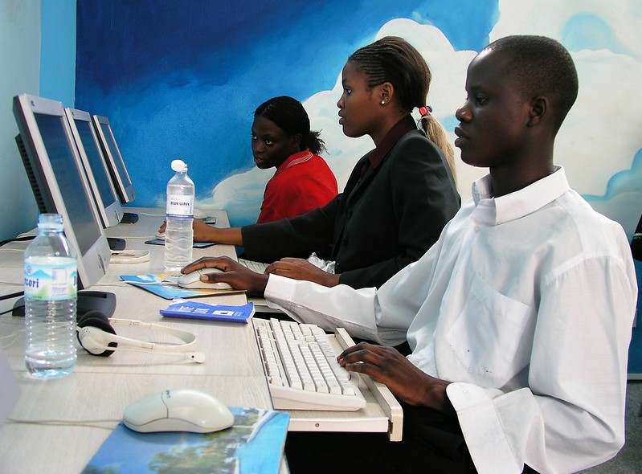
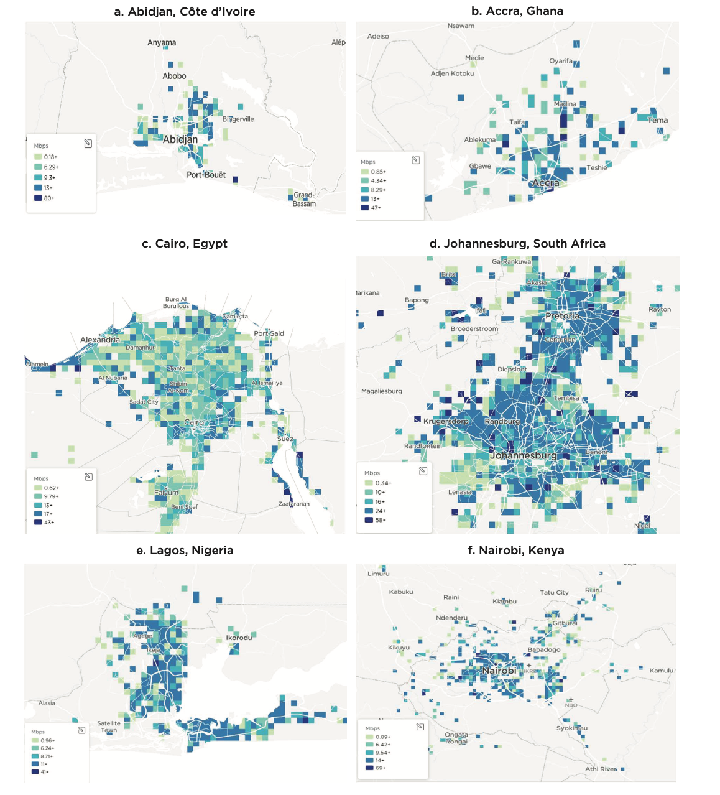

+++
date = 2023-04-25T00:00:00.000+00:00
title = "Why We Should Accelerate the Use of Digital Technologies in Africa"
authors = ["Clara Stinshoff", "Tania Begazo"]
categories = ["Case Study"]
dev_partner = ["World Bank"]
partner= ["Ookla"]
tags = ["Digital Development"]
links = [
    "https://www.worldbank.org/en/region/afr/publication/digital-africa",
]
thumbnail = "africa-digital-transformation.jpg"
+++

As Africa’s population grows, digital technologies are becoming increasingly important for the continent’s economic transformation and job creation. From computers to apps to machine learning, digital technologies offer new opportunities for people and businesses across Africa. The World Bank Group’s [Digital Africa, Technological Transformation for Jobs](https://www.worldbank.org/en/region/afr/publication/digital-africa) report studied a wide range of novel data to examine the role of the internet and digital technologies to increase jobs and reduce poverty in Africa. For instance, data on download speeds from [Ookla for Good™](https://www.ookla.com/ookla-for-good) highlighted the need to improve the availability, quality, and affordability of internet connections across the continent.

## Challenge

In Africa, more than 22 million people between the ages of 15 and 64 join the workforce each year—almost 2 million people per month. By increasing the uptake of digital technologies, the continent can help its large and growing young labor force thrive. Studies conducted in the report find that internet availability has positive impacts on employment growth, among other things. For instance, when businesses have access to faster internet, they can communicate with clients and suppliers better, and enable learning by doing of employees.

However, there are challenges to reaping these benefits: Africa’s connectivity infrastructure still lags behind other regions in coverage, capacity, and quality. In addition, large parts of the population are not covered by fast mobile internet – not only in rural areas but also in cities. Moreover, there is low uptake of digital technologies by enterprises and individuals due to a lack of ability to pay and willingness to use them. While prices for internet services and devices remain high for many Africans due to high levels of market concentration and other market failures, low willingness to use can be caused by limited capabilities and a lack of attractive applications.

Addressing these challenges is vital to unleashing the continent’s potential to create job opportunities for its growing population in a highly digitalized world.

<figure align="center">
    
    <figcaption>
        

		Photo Credit: World Bank
		

    </figcaption>
</figure>

## Solution

The [Digital Africa, Technological Transformation for Jobs](https://www.worldbank.org/en/region/afr/publication/digital-africa) report analyzed how digital technologies can enable economic transformation and boost jobs in the region, and what can be done to widen the availability and increase usage of digital technologies.

In Chapter 4, the report utilized Speedtest Intelligence® data from [OOokla for Good™](https://www.ookla.com/ookla-for-good) to understand mobile broadband download speeds across Africa. Download speed refers to how quickly data can be pulled from a server on the internet to a device, measured in megabits per second (Mbps). This data is a valuable source of information on internet speeds in the region, with disaggregated information by geographic location within major cities, enabling a more detailed analysis than with conventional (aggregated) data sources.

## Impact

[Ookla for Good™](https://www.ookla.com/ookla-for-good)’s dataset demonstrated an overall discrepancy in fast mobile internet connections within cities across Africa. For instance, in Lagos, Nigeria, download speeds differed by a range of 40Mbps, and in Abidjan, Côte d’Ivoire they differed by as much as 80Mbps. This significant variation reveals that despite improvements in connectivity infrastructure, large parts of the population might still be excluded from fast mobile internet, even in cities.

This rich source of information is crucial for African governments to implement policies that can enhance affordability, increase use, and expand availability to bridge the digital divide. Widening the availability of digital connectivity across the continent and improving affordability can help enhance its citizens' lives and unlock the continent's potential to achieve sustainable and inclusive development.

<figure align="center">
    
    <figcaption>
        

		Figure 1: Mobile broadband download speeds in Africa, 2020
        

    </figcaption>
    <figcaption>
        

		Source: Based on analysis of Ookla® Speedtest Intelligence® data for June 2020, as of September 24, 2022
		

    </figcaption>
</figure>
