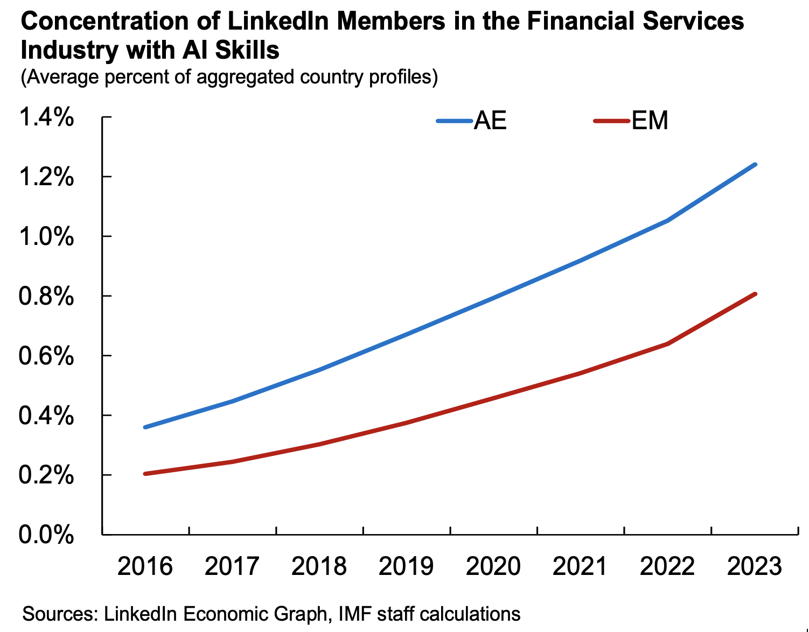
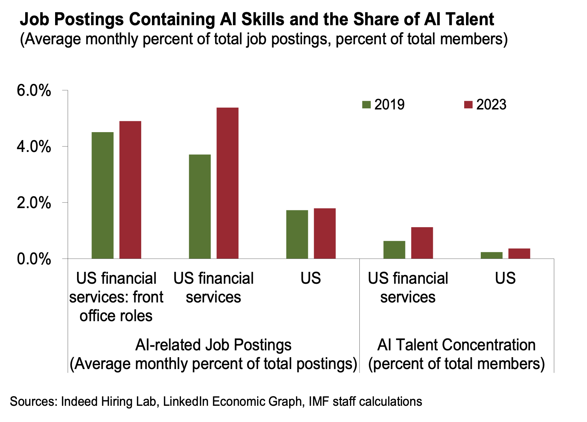

+++
title = "Analyzing the Adoption of Artificial Intelligence in Capital Market Activities"
authors = ["Mohamed Diaby ", "Xiang Li Lim" ]
categories = ["Case Study"]
partner = ["LinkedIn"]
dev_partner = ["Jobs and Development"]
link = ["https://www.imf.org/-/media/Files/Publications/GFSR/2024/October/English/ch3.ashx"]
date = 2024-12-13T00:00:00Z

+++

The analytical chapter (Chapter 3) of the October 2024 Global Financial Stability Report aims to assess the potential impact of Artificial Intelligence (AI) on capital markets. Given that the use of AI in capital market activities is relatively nascent, the chapter draws from a number of alternative data sources, including data from job markets.

The use of AI offers numerous benefits to the financial sector, but it can also introduce new forms of financial stability risks.  The International Monetary Fund’s Monetary and Capital Markets (MCM) Department used job market data including data from [LinkedIn] (https://www.linkedin.com/) to gather insight into the pace of AI adoption in capital markets activities.

## Challenge

The adoption of AI in capital market activities is still in its early stages, complicating efforts to quantify its impact.  Conceptually, AI can be used at different stages of the investment process, and for different tasks, and this makes it challenging on the basis of financial market data, such as transaction data, to segregate capital market activities to assess whether AI was involved. Consequently, datasets from alternative sources, including labor market data, but also patent filings, for example, can provide valuable information on adoption trends. The team also wanted to test a few specific hypotheses: Is the financial sector a front-runner as compared to the broader economy when it comes to the adoption of AI? Is the adoption of AI in the financial sector stronger in certain roles? Third party surveys suggested that the use of AI may have been more advanced in more operational aspects of so-called back-office roles that are crucial for ensuring efficient transaction processing and regulatory adherence. The team investigated whether front-office roles, centered around activities such as sales, trading, investment were indeed lagging behind in the adoption of AI.

## Solution

The IMF team leveraged data from LinkedIn through the Development Data Partnership to explore labor market developments that could provide supporting evidence of broad AI skill adoption. The primary objective was to investigate trends in the supply and demand for AI talent in the financial sector, specifically on AI talent profiles and job postings related to capital market activities over time. A comparison with the broader economy was also made to illustrate relative adoption rates. 

To assess trends in demand for AI skills in capital markets, the IMF team collaborated with Indeed Hiring Lab, to obtain data on job postings. Although the study was limited to the US financial sector, Indeed Hiring Lab was able to filter job postings to focus specifically on “front office” [^1] roles requiring AI skill sets, as defined in their skill taxonomy. This work also serves as an extension to Indeed’s recent study on the impact of AI on the US job market, with a broader timeline and a deeper dive into job postings related to capital market activities. 

On the supply side of AI talent, the team analyzed data pertaining to AI talent concentration across economies to illustrate the differing pace of skills adoption between Advanced Economies (AEs) and Emerging Markets (EMs). By utilizing LinkedIn’s AI skills penetration methodology, the IMF team was able to obtain time series data on AI talent concentration across the financial services industry for 30 AE and 14 EM economies. Furthermore, LinkedIn identified top skill sets listed by its “front office” member profiles through its Term Frequency-Inverse Document Frequency (TF-IDF) [^2] algorithm which evaluates how representative a skill is among its members in the US financial sector.

## Impact

The datasets obtained from LinkedIn and Indeed bolstered the broader analysis and provided evidence through the lens of labor markets of the increasing adoption of AI within the financial services industry. 

Specifically, using the LinkedIn datasets made available through the Development Data Partnership, the report highlights two main insights on AI talent demand and supply:

•	On talent supply: Although only a small share of workers claim to possess AI skills, the talent pool within the financial services industry appears to be growing. Notably, talent concentration in AEs consistently exceeds that of EMs, with AEs also experiencing a faster growth pace in recent years. Moreover, it was discovered that quantitative researchers and analyst profiles in the US financial industry frequently list AI skills—such as machine learning, natural language processing, and deep learning—among their top competencies.

<figure align="centre">
    
        

  

    </figcaption>
</figure>

•	On talent demand: The share of job postings in the financial services industry requiring AI skills has outpaced the overall share of AI-related job postings in the broader US economy, indicating a more rapid adoption compared to other industries. front office roles in financial services, which have more direct implications for capital markets, do not outpace as much when compared to the broader financial sector.

<figure align="centre">
    
        

  

    </figcaption>
</figure>

Together with additional supporting insights beyond the labor market, these trends provide some early evidence of increasing adoption of AI in capital market activities. Both supply (job profiles) and demand (job postings) for AI skills have grown over time, but it should be noted that these measures cannot be compared directly, as demand is measured as a stock-variable, and demand as a flow-variable. The GFSR chapter incorporates these findings with other evidence and analyses to assess AI-related financial stability risks in capital markets, and provides policy recommendations.

## Note

This blog post is served as input for Chapter 3 of the October 2024 Global Financial Stability Report. It benefitted from the review provided by Benjamin Mosk and Jason Wu, who served as the co-lead and overseer, respectively for the chapter.

[^1]: Including traders, portfolio managers, portfolio strategist, asset allocation analysts, and programmatic traders. “Front office” roles are primarily responsible for revenue generation, typically through active decision-making and direct participation in capital markets activities.

[^2]: TF-IDF is a statistical measure that is computed by multiplying two metrics; i) the term frequency of a skill in an entity (‘TF’) and ii) the logarithmic inverse entity frequency of the skill across a set of entities (‘IDF’), which also indicate how common or rare a word is in the dataset.

