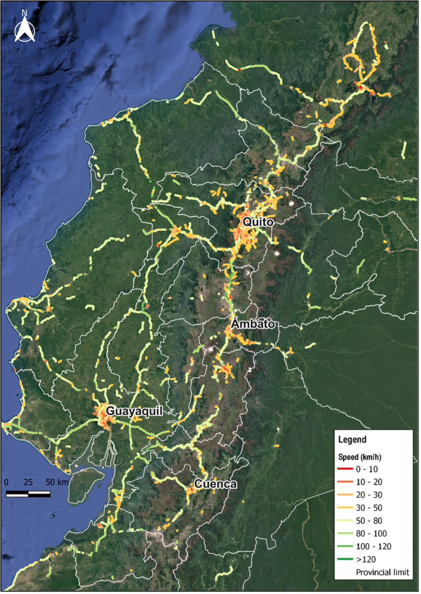

+++
title = "Aprovechando el Big Data sobre Velocidades de Viaje y Patrones de Movilidad para Actualizar el Modelo Nacional de Transporte de Ecuador"
authors = ["Aitor Franco Arana", "Ximena Velandia Villamil"]
categories = ["Case Study"]
partner = ["Mapbox", "Outlogic", "Waze"]
dev_partner = ["World Bank"]
tags = ["Transport"]
date = 2025-09-23T00:00:00Z
+++

Mejorar la planificación del transporte en Ecuador requiere contar con información actualizada sobre cómo se desplazan las personas. Desde el Plan Estratégico de Movilidad de 2012, el país no había realizado un ejercicio integral de modelización del transporte. Los procesos de planificación se habían centrado en proyectos individuales, perdiendo la perspectiva de red en su conjunto. Para contribuir a superar este desafío, el equipo de transporte del Banco Mundial en Ecuador apoyó al Ministerio de Transporte y Obras Públicas (MTOP) en la actualización del modelo nacional de transporte con datos recientes. En particular, se aprovecharon fuentes de big data sobre velocidades de viaje y patrones de movilidad de [Mapbox](https://www.mapbox.com/), [Outlogic](https://outlogic.io/) y [Waze](https://www.waze.com/wazeforcities/), que sirvieron como insumos críticos para informar sobre los componentes de oferta y demanda del modelo. Este enfoque brindó una visión nacional del comportamiento del tráfico, superando las limitaciones de las encuestas tradicionales de campo.

## Desafío

Ecuador necesitaba con urgencia un modelo de demanda de transporte para su red vial nacional que permitiera mejorar la planificación, estimar la demanda de viajes con mayor precisión y evaluar mejor las inversiones y políticas públicas. Sin embargo, recopilar los datos necesarios mediante estudios de campo convencionales resultaba altamente complejo. La red vial estatal abarca aproximadamente 9.660 km, lo que implica que levantar conteos vehiculares, velocidades y matrices origen-destino sobre el terreno sería muy costoso y tomaría demasiado tiempo. A esto se sumaban los riesgos de seguridad en ciertas zonas: la situación actual situación de orden público hacía poco viable la recopilación en sitio. Estos factores hacían inviable depender de encuestas de campo para desarrollar un modelo oportuno y completo. Ecuador necesitaba una solución innovadora para recopilar información de transporte a gran escala y confiable sin un despliegue extensivo en terreno.

<figure style="text-align: center;">
  
</figure>

## Solución

Para superar estos retos, el equipo aprovechó big data de múltiples plataformas digitales, lo que permitió generar insumos robustos tanto para la oferta de la red vial como para la demanda de viajes. A través del Development Data Partnership, se obtuvieron datos de Mapbox, Outlogic y Waze, cada uno aportando una pieza esencial del rompecabezas:

- **Mapbox**  proporcionó cartografía digital actualizada y atributos de la red vial. Esto incluyó mapas detallados de carreteras estatales con sus características, formando una base geoespacial confiable para el modelo. Los datos recientes aseguraron que las nuevas vías, los cambios en la geometría vial y otras actualizaciones de infraestructura desde 2012 se reflejaran en el componente de oferta.

- **Outlogic** proporcionó datos de localización agregados y anonimizados que revelaron patrones de movilidad. Al analizar trazas de dispositivos, se pudieron inferir flujos origen-destino, tiempos de viaje entre regiones y corredores o zonas de atracción. Estos insumos alimentarán el componente de demanda, ayudando a construir matrices origen-destino en la siguiente fase del proyecto.

- **Waze** aportó información de tráfico en tiempo real y reportes de usuarios. Los datos agregados de velocidad permitieron observar velocidades efectivas de viaje y patrones de congestión en la red vial del país. Además, las alertas sobre incidentes y retrasos complementaron el análisis con información de embotellamientos, siniestros y condiciones viales casi en tiempo real.

La integración de estas tres fuentes permitió calibrar el modelo con mayor precisión, incorporando dinámicas actuales de movilidad que difícilmente se captarían con encuestas tradicionales. El uso de big data amplió considerablemente el volumen y la cobertura de observaciones: en lugar de unos pocos conteos vehiculares aislados, el equipo accedió a una gran cantidad de registros digitales, haciendo los insumos mucho más representativos de las condiciones típicas. En síntesis, el MTOP pudo recolectar información de viajes a nivel nacional de manera remota, superando los altos costos y los riesgos de la recolección en campo.

Antes de incorporar los nuevos datos al modelo, el equipo lo revisó para extraer hallazgos clave y confirmar su fiabilidad. El análisis mostró que la mayoría de los conductores respetan los límites de velocidad, y que las menores velocidades se asocian principalmente con dos factores: congestión en las principales áreas urbanas y limitaciones de infraestructura o topografía en ciertos corredores interurbanos.

Como se observa en la Figura 1, el análisis confirmó un cumplimiento generalizado de los límites de velocidad. Las variaciones en la velocidad promedio revelaron patrones espaciales importantes: concentración de menores velocidades en las principales zonas urbanas, donde la congestión y las intersecciones frecuentes limitan el flujo vehicular, y mayores velocidades en corredores interurbanos planos y bien mantenidos, particularmente en zonas costeras. Estos patrones son consistentes con diferencias conocidas en topografía, diseño y estándares de mantenimiento, subrayando el valor de integrar el comportamiento real del tráfico en el modelo.

<figure style="text-align: center;">
  
  <figcaption style="text-align: center; font-size: 0.9em; color: #555;">Figura 1: Velocidades promedio de vehículos por ubicación en Ecuador</figcaption>
</figure>

En general, la revisión de los datos de Mapbox, Outlogic y Waze mostró consistencia con la realidad y capturó comportamientos conocidos del tráfico. Esto dio confianza al MTOP en la fiabilidad de estas fuentes de calibración del modelo. Los datos de patrones de movilidad de Outlogic y Mapbox, por ejemplo, serán validados con información de operadoras de telefonía móvil para construir una matriz de origen-destino robusta en la siguiente etapa de modelación.

## Impacto

La actualización del modelo nacional de transporte del Ecuador es un paso crítico hacia una planificación de infraestructura basada en evidencia. El nuevo modelo responde a la necesidad de incorporar las dinámicas actuales de movilidad, crecimiento urbano y cambios territoriales desde 2012. En la última década, el país ha experimentado variaciones en los patrones de viaje, expansión de la infraestructura vial, auge de servicios digitales de transporte y nuevas tendencias socioeconómicas que inciden en el transporte. El modelo actualizado aprovecha estos datos para fortalecer la planificación multimodal, mejorar la eficiencia operativa e integrar criterios de sostenibilidad y resiliencia climática en la toma de decisiones.

Contar con un modelo de transporte actualizado y basado en datos será de gran utilidad para el Ecuador. Brinda a los responsables de política una herramienta objetiva para probar escenarios y tomar decisiones informadas. En particular, permitirá:

- **Evaluar impactos de proyectos nuevos o existentes** sobre flujos de tráfico y desempeño de la red. Antes de asignar recursos, podrá simular cómo nuevos corredores viales afectarán a los tiempos de viaje, congestión y accesibilidad.

- **Mejorar la eficiencia de la planificación** al adoptar una perspectiva de red. El modelo ayuda a priorizar inversiones que generan el mayor beneficio para el sistema de transporte en su conjunto, asegurando un uso más eficiente de los fondos públicos y apoyando un enfoque de portafolio  para el desarrollo de infraestructura.

- Evaluar los efectos de los cierres e interrupciones viales, incluyendo los causados por desastres naturales y eventos climáticos. La topografía diversa del Ecuador –desde llanuras costeras hasta la selva amazónica y la cordillera Andina–  hace que su red vial sea altamente vulnerable a inundaciones, deslizamientos, sismos y erupciones volcánicas. El modelo puede cuantificar el impacto de un cierre vial en tiempos de viaje y conectividad, ayudando a diseñar planes de contingencia e invertir en infraestructura resiliente.

Al adoptar big data y modernizar sus herramientas analíticas, el Ecuador se posiciona para planificar su red de transporte de forma más proactiva y eficiente. La colaboración con Mapbox, Outlogic y Waze a través del Development Data Partnership ejemplifica cómo soluciones de datos innovadoras pueden llenar vacíos de información y mejorar la planificación pública. En definitiva, un modelo nacional de transporte calibrado y basado en datos reales y confiables ayudará a el Ecuador a priorizar las inversiones en infraestructura, mejorar la seguridad vial y la movilidad, y fortalecer su resiliencia frente a desafíos futuros.
