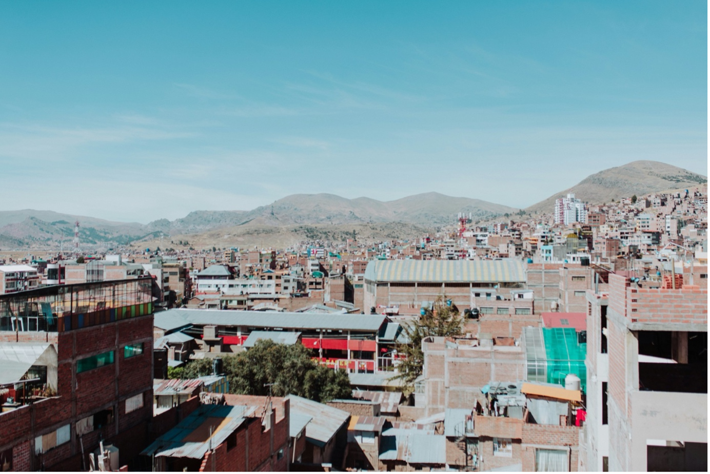
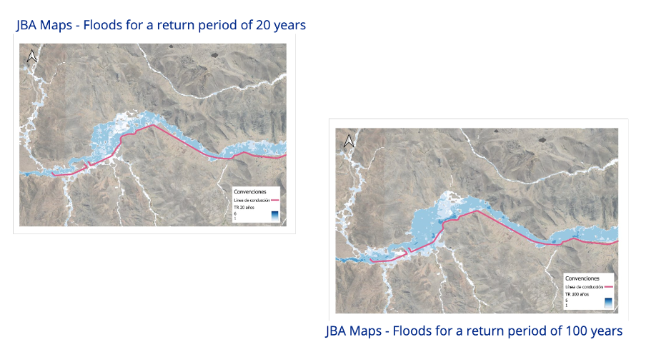

+++
title = "Assessing Flood Risks in Peru"
authors = ["Lorena Cano", "Melissa Barandiaran", "Adriana Barreto" ]
categories = ["Case Study"]
partner = ["Jba"]
dev_partner = ["Inter American Development Bank"]
tags = ["Digital Development"]
date = 2024-11-18T00:00:00Z

+++

The Inter-American Development Bank (IDB) Water and Sanitation division leveraged data from [JBA's Global Flood Maps] (https://www.jbafloodmaps.com/) as supporting information to identify areas of exposure to flooding risk prior to the implementation of PROYECTO PARA LA AMPLIACIÓN Y MEJORAMIENTO DE LOS SERVICIOS DE AGUA POTABLE Y ALCANTARILLADO DE LA CIUDAD DE JULIACA-PUNO (in Spanish) to design and build a resilient water and sanitation infrastructure in Peru’s Puno region. 

## Challenge

[Puno is the poorest region in Peru, with a poverty rate almost 20 points above the national average, according to the Peruvian Institute of Economics. Improving infrastructure and essential services in the region is critical to enhance local people’s lives.] (https://www.iadb.org/en/news/peru-improve-water-and-sanitation-services-juliaca-puno-region) 

The IDB has [approved a project] (https://www.iadb.org/en/news/peru-improve-water-and-sanitation-services-juliaca-puno-region) with an investment loan of $425 million to design and build resilient water and sanitation infrastructure in the region. This will enhance the delivery of services to the population by service provider EPS Juliaca, benefitting over 500,000 residents who have been waiting for this project for more than 15 years.  

However, Puno faces natural hazards such as earthquakes, droughts and floods. Consequently, the IDB has classified this project as ‘High’ in its Disaster Risk and Climate Change assessment. Flooding is one of the main hydrometeorological natural hazards in IDB operations, consistently ranking among the top hazards affecting projects across Latin America and the Caribbean region. 

<figure align="centre">
    
        

  

    </figcaption>
</figure>

## Solution

Through the Development Data Partnership, the IDB leveraged [JBA's Global Flood Maps] (https://www.jbafloodmaps.com/) to identify potential flood risk areas before the project’s implementation. These insights were integrated into the project’s design to enhance resilience. 

While the IDB has internal information and tools to identify natural hazards, JBA's Global Flood Maps offer a higher resolution. These maps provide up-to-date data to assist in decision making and raise awareness of potential flood hazards, thereby reducing community vulnerability and increasing territorial resilience.  

For instance, the maps help define flood risk extents in countries and cities, allowing users to prioritize engagements and resources. Their visual nature makes them effective decision-making tools. For this IDB project, the Maps enabled the team to visualize flood risks for return periods of 20 and 100 years (see maps below). This is particularly important because the tool allows them to see geospatially how, in different return periods, the areas are more exposed and vulnerable to flooding. 

<figure align="centre">
    
        

  

    </figcaption>
</figure>

## Impact

As regions across Latin America face increasing vulnerability to extreme weather events, disaster risk assessments in the region are essential for project planning and implementation strategies. This data collaboration between the IDB and [JBA's Global Flood Maps] (https://www.jbafloodmaps.com/) through the Development Data Partnership plays a key role in helping the IDB and local governments, in places like Puno, prioritize efforts and allocate resources effectively. This ensures the construction of resilient water and sanitation infrastructure while mitigating flood risks. 

