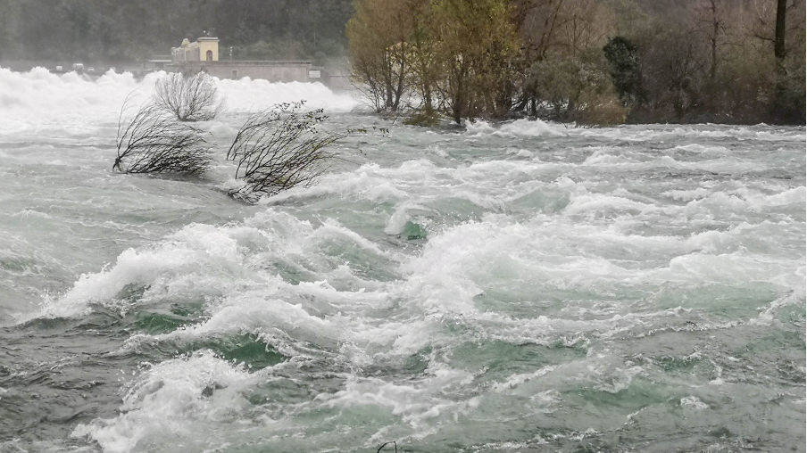
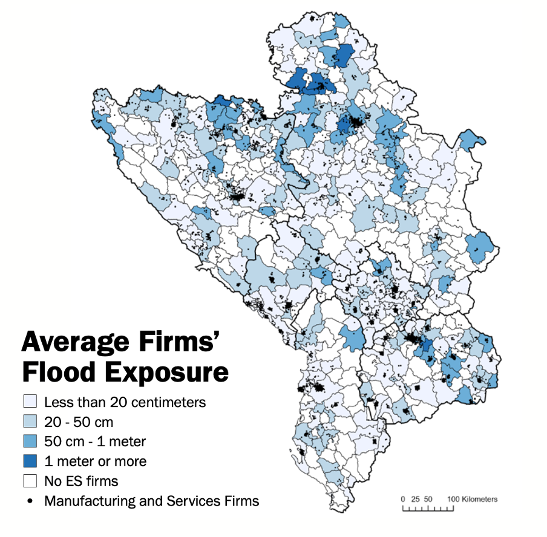

+++
title = "Assessing How Floods Affect Economic Growth – The Case of the Western Balkans"
authors = ["Megha Mukim", "Giuseppe Rossitti", "Luc Marius Jacques Bonnafous", "Solene Dengler" ]
categories = ["Case Study"]
partner = ["JBA"]
dev_partner = ["World Bank"]
tags = ["Disaster Risk Management"]
links = ["https://www.worldbank.org/en/region/eca/publication/western-balkans-6-ccdr"]
date = 2025-04-01T00:00:00Z

+++

The World Bank published the Western Balkans regional Country Climate and Development Report (CCDR) that assesses natural hazard risks (linked to climate change and seismic activity) across people and places and provides specific and prioritized actions to enhance the region's climate resilience and to stimulate economic growth. The World Bank team worked with [JBA’s Global Flood Maps](https://jbagr.com/digital-tools/global-flood-maps/) to analyze flood risks in the Western Balkans. Other natural hazards studied included droughts, wildfires, extreme heat, landslides, and earthquakes. 

## Challenge

Western Balkans (WB6) consist of six upper-middle-income economies: Albania, Bosnia and Herzegovina, Kosovo, Montenegro, North Macedonia, and Serbia, which have [demonstrated strong economic performance](https://www.worldbank.org/en/region/eca/publication/western-balkans-regular-economic-report) over the last two decades. From 2000 to 2022, these six economies increased their overall output twofold and raised their per capita income accordingly.

At the same time, the Western Balkans are highly vulnerable to a range of natural hazards, a situation that is expected to worsen significantly due to climate change. The region will face increasing instability and unpredictability in wildfires, flash floods, and landslides. For instance, fluctuations in rainfall heighten the risk of flash floods, which—along with other flooding events—have already caused extensive destruction and loss of life in recent years.

Beyond the human toll, climate-related hazards will also lead to varying degrees of economic damage across the Western Balkans, resulting in substantial losses in output.

<figure align="center">
    
</figure>

## Solution

On of the objectives of the CCDR is to analyze the impact of extreme weather events, including flooding, and to highlight actions that can be taken to enhance climate adaptation and reduce greenhouse gas emissions while continuing to pursue broader development goals.

The World Bank’s Urban, Resilience and Land team for Europe and Central Asia (IECUR), which jointly led the CCDR alongside other sectors, leveraged data from [JBA’s Global Flood Maps](https://jbagr.com/digital-tools/global-flood-maps/) to assess the economic impacts of flooding in the region. For instance, riverine floods are projected to cause the most significant damage to GDP in all 6 countries, ranging from about 15 percent loss in 2050 GDP for Serbia and about 3 percent of GDP loss for North Macedonia under trend growth scenarios.

Additionally, the analysis that used JBA data identified vulnerability hotspots in the region. The report highlights that flood risk is highest in northern Bosnia & Herzegovina, and Serbia, particularly along the Danube and Sava rivers, which flow through Belgrade and several secondary cities. These floods frequently impact municipalities that are already vulnerable, owing to demographic decline and isolation from markets. 

The report also highlights the significant flood risk faced by firms in the Western Balkans, particularly in urban municipalities that concentrate people, assets, and economic activity. Many businesses are highly exposed to riverine flooding, and, on average, they are located in riskier areas than their surrounding municipalities. In 69% of cases, firms’ flood exposure exceeds the municipal average, with the risk particularly pronounced in Bosnia and Herzegovina (81%) and North Macedonia (76%).

<figure align="center">
    

<figcaption style="text-align: center;">

<strong>Figure 1:</strong> Several manufacturing and service firms face high exposure to floods. 
   Source: ETIIC Firms and Climate Adaptation Toolkit for the geocoded locations of manufacturing and services firms (black dots) from the World Bank Enterprise Surveys (WBES) with a 3 km deviation, <a href="https://jbagr.com/" target="_blank">JBA Global Resilience</a> for flood exposure.  
The last WBES wave is used for each country (2019 for Albania, Kosovo, and Serbia; 2023 for the remaining countries).   
Note: Due to the masked firms’ geolocation (random deviation of 3 km from actual location), flood exposure is measured as the average raw depth of an event with a 1 percent yearly probability within a 6 km radius around the available geolocations.
</figcaption>
</figure>

## Impact

Analysis of the impacts of flooding, and other risks, has been very useful to policy makers and clients in the Western Balkans, especially as the data and analytics on exposure to flood risks was accompanied by specific, implementable, and costed actions that could be taken to adapt to the growing threats. For instance, primary cities may prioritize infrastructure investments, maintenance, and strengthening of city-level government capacity, while secondary cities could focus on early warning systems and regional coordination for rapid emergency response. 

To enhance climate resilience in the Western Balkans, the report recommends transversal, transboundary and targeted policies – those that would maximize the effectiveness of adaptation and mitigation efforts. Examples of such measures include investing in regional early warning systems to monitor and forecast natural hazards in high-risk areas, as well as implementing disaster risk management plans to safeguard both communities and economic stability, among others.