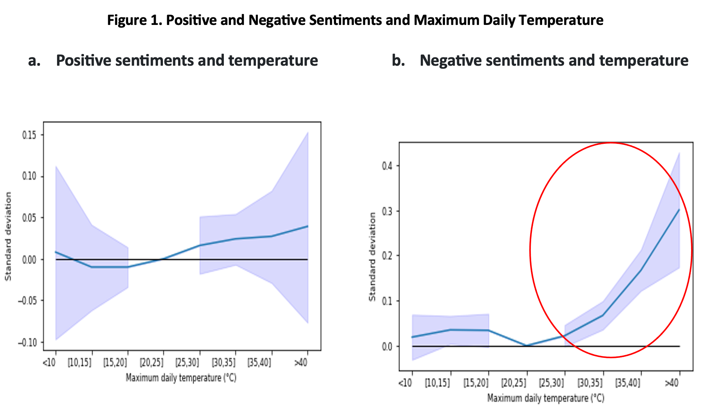

+++
title = "Assessing the Impact of Extreme Temperatures on Sentiments through Social Media Data in Argentina"
authors = ["Jose Daniel Aromi", "Mariana Conte Grand", "Mariano Rabassa", "Julie Rozenberg"]
categories = ["Case Study"]
partner = ["X"]
dev_partner = "World Bank"
tags = ["Health"]
date = 2024-08-11T00:00:00Z
+++

How do extreme weather events affect people's sentiments? Leveraging [X](https://x.com/) (formerly known as Twitter) data, the World Bank's Regional Direction of Sustainable Development for Latin America and the Caribbean worked with researchers from Argentina universities to study how extreme temperatures impact people's moods in Argentina.

## Challenge

Weather profoundly influences human life and society. Temperature fluctuations have been linked to agricultural productivity, labor efficiency, and health outcomes. Notably, extreme temperatures correlate with increased violence, social unrest, higher suicide rates, and crime. 

In Argentina, a country increasingly vulnerable to extreme heat, the six highest annual average temperatures on record have all occurred within the past decade (2012, 2015, 2017, 2020, 2021, and 2023). As climate change progresses, understanding the impact of temperature on individual sentiment is critical for effective behavioral management, benefiting citizens, healthcare professionals, and policymakers.

<figure align="center">

<figcaption>

 Photo: World Bank 

</figcaption>
</figure>

## Solution

While surveys traditionally gauge individual perceptions, the advent of social media offers a transformative approach to research on human-environment interactions. Social media data, with its real-time, non-intrusive, and cost-effective nature, provides a novel lens for capturing individual sentiments. 

Leveraging the Development Data Partnership, a team from the World Bank's Regional Direction of Sustainable Development for Latin America and the Caribbean jointly with researchers from Argentina universities analyzed 80 million geo-tagged tweets from Argentina over five years via the X-Twitter API. This data was linked to daily temperature records from the Argentina Meteorological System.

Using text mining, we developed two quantitative metrics: sentiment (positive and negative) and a social media aggression index based on the frequency of profanity. Our findings reveal that while heat intensifies negative sentiments, it does not significantly affect positive ones (Figure 1a and 1b). Cold temperatures do not appear to impact people's moods. Additionally, our profanity index—an indicator of the intensity of negative sentiments—mirrors the trends observed for negative sentiments.

<figure align="center">
     
    <figcaption>
        

Note: This figure reports the estimated impact of sentiment indices for daily maximum temperature intervals. They represent mean differences with respect to expected values for temperature bin [20–25 °C]. Dashed lines correspond to the 95th confidence intervals.   

    </figcaption>
</figure>

## Impact

Our research indicates that higher temperatures lead to increased negative sentiments. Implementing adaptive measures, such as early warning systems, is essential not only for preparing the public but also for providing ongoing education about the psychological consequences of extreme heat, which could help alleviate harmful behaviors.  Furthermore, it is critical for the health sector to be ready to confront the increase in mental health issues induced by heat. Our research suggests that extreme temperatures can intensify irritability, and there is a significant body of evidence showing that individuals with certain mental health conditions are more susceptible to the effects of heat.

The link between online aggression and real-world violence underscores the importance of social media monitoring, especially as law enforcement activity tends to diminish in hotter conditions. Our insights are instrumental in shaping adaptation strategies that can ensure funding and personnel are in place for violence prevention hotlines and security agencies, bolstering resilience against the onslaught of extreme heat.