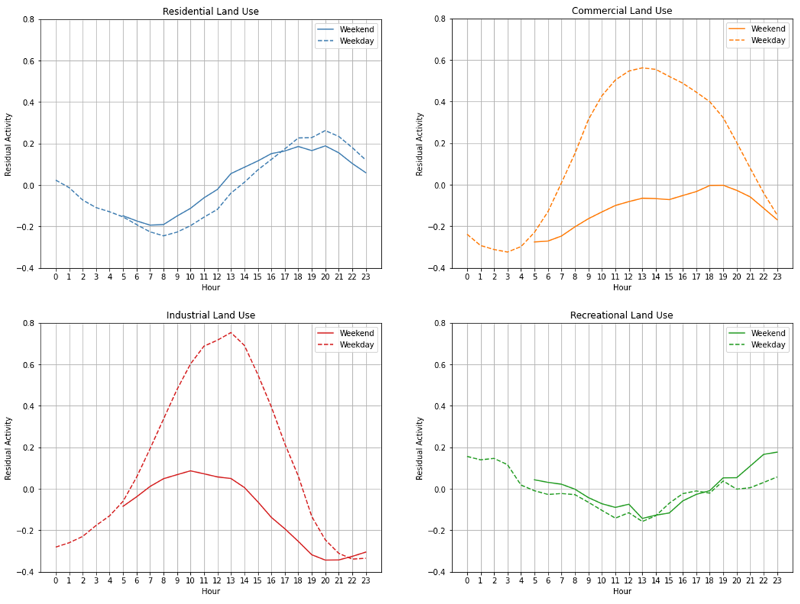
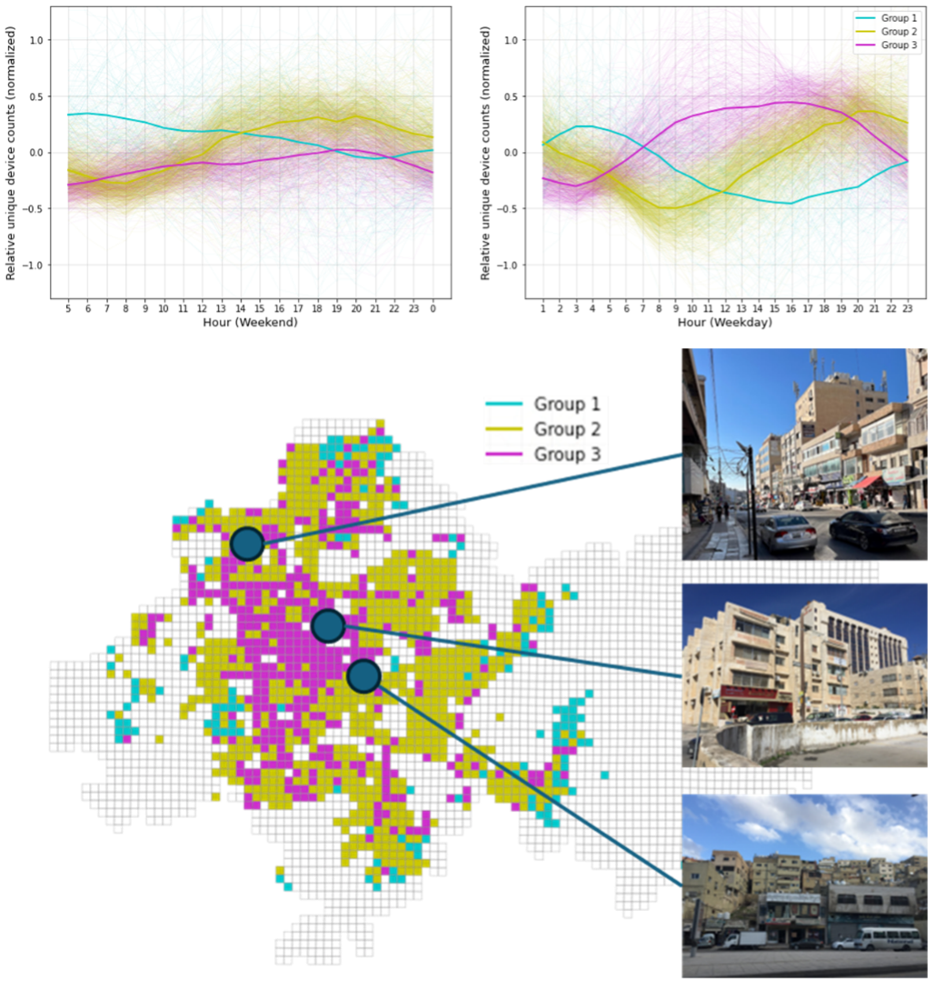
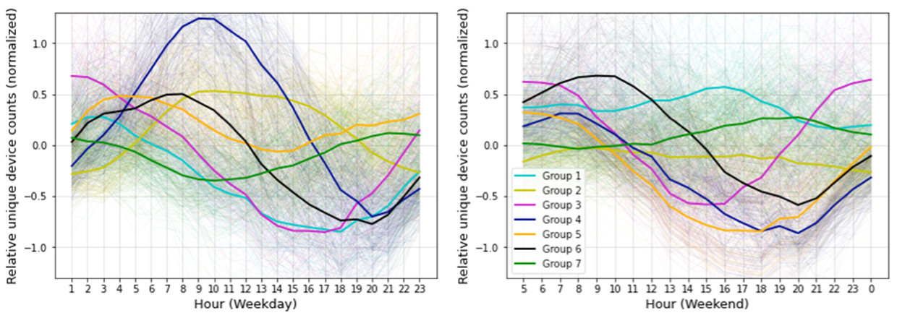

+++
title = "Bridging the Gap Between Plans and Reality: A Data-Driven Look at Urban Land Use in Amman"
authors = ["Hogeun Park", "Boyeong Hong"]
categories = ["Case Study"]
partner = ["Veraset"]
dev_partner = ["World Bank"]
tags = ["Urban Development"]
date = 2025-06-09T00:00:00Z
+++

Urban landscapes are transforming rapidly, often outpacing the capabilities of traditional planning tools. In Amman, Jordan—a city shaped by swift population growth and complex migration flows—this challenge is particularly acute. By leveraging data from [Veraset](https://www.veraset.com/), our recent study investigates how actual land use patterns diverge from official zoning plans and how data-driven approaches can help cities respond more effectively.

## Challenge

Since 2000, Amman’s population has more than doubled, fueled in part by regional conflicts that triggered large-scale refugee inflows. This demographic surge has overwhelmed existing planning frameworks, leading to a growing mismatch between designated land uses and how neighborhoods actually function. Traditional planning methods often fail to accommodate these evolving dynamics, resulting in inefficiencies and missed opportunities for inclusive urban development.

<figure align="center">
     
</figure>

## Solution

To better understand these discrepancies between planned and actual land use, we analyzed anonymized smartphone geolocation data from Veraset through the Development Data Partnership, covering the period between January and September 2023. By overlaying this mobility data with official land use maps, we identified where and how real-world activity diverges from planned zoning. Our methodology—available on [https://github.com/worldbank/understanding_urban_activity](https://github.com/worldbank/understanding_urban_activity)—offers a replicable framework for urban diagnostics using high-frequency, privacy-preserving data.

Here are our key findings:

1.	Land Use Patterns Vary Sharply by Type

Urban activity in Amman shows distinct temporal patterns across land use types:

• **Residential** areas exhibit consistent behavior across weekdays and weekends, with low morning activity and evening peaks—likely reflecting post-work routines.
• **Commercial** zones are busiest on weekdays, peaking in the early afternoon.
• **Industrial** zones follow a clear 8-to-5 weekday schedule, with reduced activity on weekend evenings.
• **Recreational** areas show less fluctuation but are more active during evening and nighttime hours.

<figure align="centre">
    
        

**Figure 1**: Urban activity patterns in different land uses
  

    </figcaption>
</figure>

2. Residential Doesn’t Always Mean Residential

A deeper dive into residential zones revealed three distinct activity clusters using k-means clustering:

• **Group 1** peaked between 4–5 AM, suggesting labor or low-income housing given their longer-commuting distances.
• **Group 2** followed typical residential patterns, with evening peaks.
• **Group 3** mirrored commercial or light industrial activity, despite being zoned residential.

These findings suggest that one-third of “residential” areas are functionally mixed-use, challenging the validity of current zoning classifications.

<figure align="centre">
    
        

**Figure 2**: Distinct urban activity patterns in residential land use
  

    </figcaption>
</figure>

3. Outside Zoned Areas Are Functionally Active

Although not formally designated for development, “Outside Zoned Areas” exhibited structured activity patterns:

• One cluster resembled recreational zones with weekend afternoon peaks.
• Another followed weekday work patterns, likely linked to roads and retail.
• A third showed nighttime activity consistent with residential use.
• A fourth combined early morning peaks from both residential and retail activity, indicating mixed-use neighborhoods.

<figure align="centre">
    
        

**Figure 3**: Distinct urban activity patterns outside of zoned areas
  

    </figcaption>
</figure>

## Impact

The observed discrepancies between planned and actual land use underscore the limitations of static zoning maps. Many neighborhoods operate in ways that existing plans fail to appreciate, revealing the need for more flexible, responsive planning strategies. By integrating real-time data and urban informatics, cities like Amman can better align infrastructure, services, and regulations with how people actually live and work. To bridge the gap between plans and reality, we propose the following:

1. **Establish an Urban Observatory**
Create a real-time monitoring hub to track urban activity using mobile data, Geographic Information System (GIS), and other digital tools.

2. **Implement Dynamic Zoning**
Regularly update land use plans based on observed activity patterns, not just projections.

3. **Engage Communities**
Involve residents in zoning reforms through consultations and participatory planning, especially in informal or mixed-use areas.

4. **Integrate Informal Areas**
Recognize and support the economic and social roles of informal settlements through targeted infrastructure and policy interventions.
