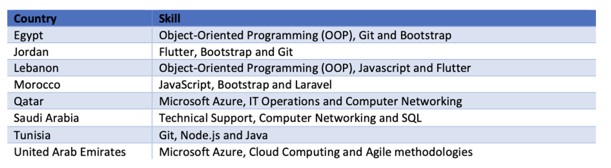

+++
title = "Building a Future-Ready Workforce: Addressing Skills Gaps in a Changing Labor Market"
authors = ["Kwok Kin Lee"]
categories = ["Case Study"]
partner = ["LinkedIn"]
dev_partner = ["Organisation for Economic Co Operation and Development", "World Bank"]
tags = ["Jobs and Development"]
date = 2025-08-08T00:00:00Z
+++

Employment reduces poverty by offering opportunities for financial stability and mobility. As the global labor market evolves with digitalization and green energy shifts, new jobs and skill requirements emerge, but challenges like gender disparities and skills gaps persist. Through the Development Data Partnership, international organizations access [LinkedIn](https://www.linkedin.com/)  data to analyze these trends and inform policies that help workers adapt and bridge skills gaps.

## Challenge

[Investing in job creation is one of the most effective ways to reduce poverty and foster broad-based prosperity, enabling countries to build self-sufficient economies and strengthen their labor forces.](https://www.worldbank.org/en/news/immersive-story/2025/04/17/jobs-the-surest-way-to-fight-poverty) Sustained economic growth, driven by a dynamic private sector, creates more and better jobs, leading to improved living standards. However, achieving both high economic growth and quality jobs can be challenging, especially as digitalization and the green energy transition reshape existing roles and skill requirements.

These transformations are taking place amid growing demographic pressures. [According to the World Bank, over the next decade, 1.2 billion young people are expected to reach working age, yet projections show that only about 420 million jobs will be created during that time.](https://www.worldbank.org/en/news/immersive-story/2025/04/17/jobs-the-surest-way-to-fight-poverty) This widening gap between labor supply and demand underscores the need for inclusive labor markets that can absorb new entrants while ensuring equitable access to opportunity.

Yet inclusion remains a persistent challenge, particularly in emerging green sectors. While the green economy presents a significant opportunity for women to take leadership roles and contribute to sustainable solutions, [the collection of gender-specific data within the energy sector is fraught with challenges.](https://www.iea.org/data-and-statistics/data-tools/gender-and-energy-data-explorer?Topic=Skills&Indicator=Most+prominent+skills+by+region+and+category#metadata) The current landscape reveals a striking scarcity of data broken down by gender, coupled with significant ambiguity in sectoral classifications related to energy. This lack of data hinders our understanding of women’s roles and contributions, ultimately weakening policy and decision-making processes aimed at enhancing workforce diversity and attracting top talent.

Understanding the challenges facing labor markets and addressing them effectively is therefore essential for adapting to the changes brought about by digitalization and the green energy transition.

<figure align="centre">
    
        

Photo: World Bank
  

    </figcaption>
</figure>

## Solution

The Development Data Partnership provides international organizations with access to LinkedIn data, offering valuable insights into labor market trends and skills gaps. By analyzing this data, organizations can identify areas where skills shortages exist, regions that need workforce development, and industries that are evolving.

[The International Energy Agency (IEA) analyzed LinkedIn data to examine gender differences in skills within the energy sector.](https://datapartnership.org/updates/examining-gender-disparities-in-skills-within-the-energy-sector-insights-from-linkedin-data/) Their findings reveal several disparities. For instance, from 2017 to 2023, both men and women in the European oil and gas and mining industries reported oil- and gas-related technical skills as their most prominent skills. However, women were more likely to report additional skills of a more generic nature, including software, language, and soft skills.

[Apart from gender disparities, LinkedIn data also shed light on broader digital skills gaps in Latin America and Central America.](https://datapartnership.org/updates/prevalence-of-technology-skills-in-cadr/) For instance, the World Bank found that Costa Rica and Panama lagged in the technology and disruptive technology skills most closely associated with new technologies, with technology skills penetration scores that are around 75 percent of the global average and disruptive technology scores that are lower than this. In particular, Costa Rica and Panama performed substantially lower than the global average in the penetration of technology skills such as digital literacy, graphic design, and mobile app and web development as well as in disruptive technology skills such as AI, data science, and robotics.

<figure align="centre">
    
        

Figure 1: Penetration of Technology and Disruptive Technology Skills, 2022
  

    </figcaption>
</figure>

[Turning to the Middle East and North Africa (MENA), a World Bank analysis of digital skills highlights distinct national trends in the Software & IT Services sector, underscoring both shared priorities and localized specialization.](https://datapartnership.org/updates/digital-skills-gap-mena/) Programming languages such as Bootstrap, Git, JavaScript, and Object-Oriented Programming were most characteristic in Morocco, Lebanon, Jordan, and Egypt. In contrast, Qatar and the United Arab Emirates ranked Microsoft Azure—Microsoft’s cloud computing platform—as the most prominent skill (see Figure 2).

<figure align="centre">
    
        

Figure 2: Top three most characteristic skills for the Software & IT Services Industry per country (MENA only) in 2021
  

    </figcaption>
</figure>

## Impact

The insights derived from LinkedIn data, accessed through the Development Data Partnership, can play a pivotal role in shaping effective labor market responses. By identifying skill gaps and regional trends, international organizations can recommend targeted upskilling initiatives in areas most in need.

Further, by using these data-driven insights, policymakers can develop strategies that close skills gaps, enhance gender inclusivity, and better prepare workers for the demands of the digital and green transitions.

As these transitions continue to reshape the global economy, timely labor market data is essential for equipping workers with the skills and opportunities they need. With the support of targeted policies and inclusive initiatives, we can build a resilient and future-ready workforce.

