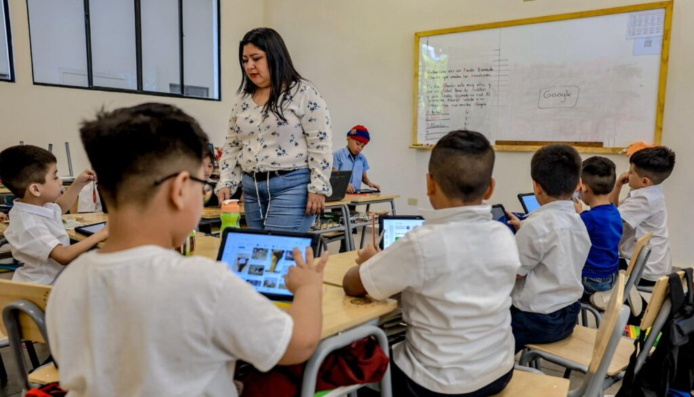
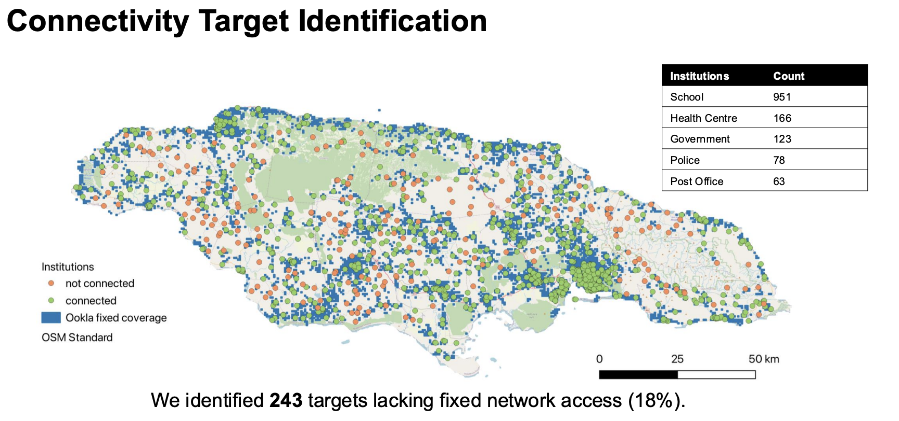

+++
title = "Cost-Effective Solutions to Close Jamaica’s School Connectivity Gap"
authors = ["Pau Puig Gabarró", "Nicolas Albornoz Basto"]
categories = ["Case Study"]
partner = ["Ookla"]
dev_partner = ["Inter American Development Bank"]
tags = ["Digital Development"]
date = 2026-05-11T00:00:00Z
+++

Reliable internet access is essential for achieving quality education. To help close Jamaica’s school connectivity gap, the Inter-American Development Bank (IDB) is partnering with the International Telecommunication Union (ITU)’s Future Networks and Spectrum (FNS) Division to help governments devise cost-effective connectivity solutions. Using data and insights from [Ookla®](https://www.ookla.com/ookla-for-good), this collaboration provides evidence-based solutions to improve internet access for schools across the country.

## Challenge

Reliable internet connectivity in schools is the foundation for modern learning, giving teachers and students access to up-to-date information and digital textbooks and interactive learning platforms.

Yet in many low-income countries, thousands of schools remain offline. Closing this gap is a priority for developing countries, which must identify solutions that are both affordable and capable of delivering the quality connectivity needed to improve learning outcomes. 

<figure style="text-align: center;">
  
  <figcaption style="text-align: center; font-size: 0.9em; color: #555;">Photo credit: IDB, El Salvador.</figcaption>
</figure>

## Solution

IDB is collaborating with ITU to identify where connectivity gaps exist in Jamaica and compare the costs and feasibility of multiple connectivity options.

Their analysis focuses on public institutions nationwide. Using data from Ookla, it found that while most government offices, health centers, police stations, and post offices had fixed broadband access, 236 schools did not. In total, 243 public institutions, around 18% of those assessed, lacked fixed broadband connectivity, highlighting a significant connectivity gap in critical public services.

<figure style="text-align: center;">
  
</figure>

The team estimated internet demand for schools by counting the number of children of compulsory school age living within a 1-km radius of each school. Results show a median school size of around 30 users and a median required download speed of about 45 Mbps, with the highest-demand schools often located on the edges of existing networks.

## Impact

Extending fiber optic infrastructure to connect the missing institutions would require an estimated 890 kilometers of new deployment nationwide, according to the study. At the same time, the study highlights the viability of wireless alternatives: although the 243 institutions lacked fixed broadband coverage, 95 percent already had fallback access through 4G or 3G mobile networks, pointing to opportunities for faster, interim solutions.

Cost comparisons underscore the importance of a balanced approach. While fiber delivers high quality, long term connectivity, it comes at a higher cost. Wireless options, such as cellular and satellite, offer more affordable alternatives that can help expand access more quickly where budgets are constrained.

Beyond schools, improved connectivity could also benefit surrounding communities. Each fiber-connected school has the potential to extend high-bandwidth internet access to nearby areas within a 1-km buffer, enabling more than 100,000 people to gain access.

By examining connectivity with the support of Ookla data and comparing multiple technology options, this project provides policymakers with valuable insights to design the best cost-effective solution to help close Jamaica’s school connectivity gap.

*Note: This analysis is based on data collected prior to Hurricane Melissa making landfall in Jamaica in 2025, providing a pre-hurricane snapshot of connectivity conditions. Connectivity availability may have changed since then. Complementing this, Ookla has conducted a post-hurricane analysis. Read more [here](https://www.ookla.com/articles/jamaica-melissa-communication-network-durability)*

