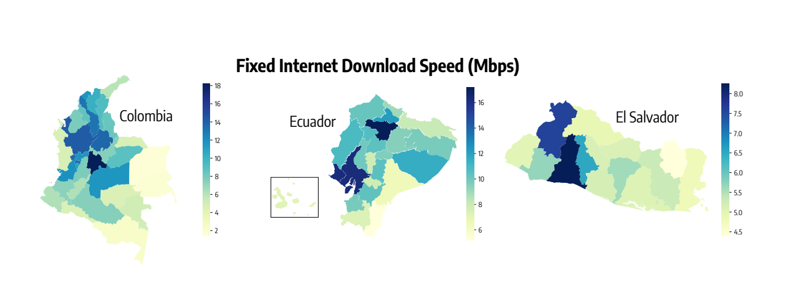
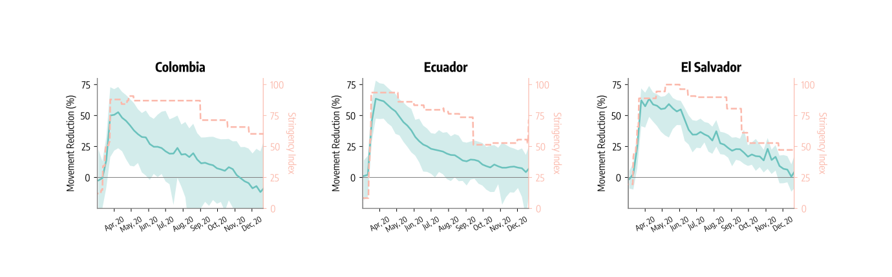

+++
title = "For Reduced Exposure to COVID-19, the Quality of Your Internet Matters"
authors = ["Niccolo Comini", "Nicola Perra", "Nicolo Gozzi"]
post_type = ["Case Study"]
partner = ["Meta", "Ookla"]
dev_partner = ["World Bank"]
tags = ["COVID-19", "Health", "Digital Development"]
links = [
	"https://blogs.worldbank.org/digital-development/did-internet-speed-impact-exposure-covid-19"
]
date = 2023-04-06T00:00:00Z
thumbnail = "covid19-internet-speed-impact-figure1.png"
+++

During the height of the COVID-19 pandemic, governments-imposed movement restrictions to curb the spread of the disease. With access to the internet, people could work or study remotely, therefore making it easier for them to adhere to pandemic-related movement restrictions. However, this was not the case in places where internet speed was slow and unreliable. The Digital Development Global Practice of the World Bank and the University of Greenwich used data provided by [Ookla for Good](https://www.ookla.com/ookla-for-good)™ and [Meta](https://dataforgood.facebook.com/dfg/about) to examine how differences in internet quality affect exposure to COVID-19 in Colombia, Ecuador, and El Salvador.

## Challenge

The internet played an important role during the COVID-19 pandemic because it enabled many people to work, access services, and socialize without physical contact— which played a key role in curbing the virus’s spread.

However, the internet connection alone is not enough to unlock the benefits of digital technologies.  For instance, access to many online public services offered during the pandemic depended on having an affordable, reliable, and fast connection.

In addition, while the critical role of internet access during the pandemic was clear early on, until now there has not been data-based analysis focused on the specific role played by internet speed, particularly in low- and middle-income countries.

## Solution

In 2022, the Digital Development Global Practice of the World Bank and the University of Greenwich conducted research on how access to the internet and variety in speed impacted adherence to pandemic-related movement restrictions in three Latin American countries: Colombia, Ecuador, and El Salvador.

Using Speedtest Intelligence® data provided by [Ookla for Good](https://www.ookla.com/ookla-for-good), the study examined the average download speeds within the three countries, which indicate the quality of internet connections.

Additionally, the team utilized Movement Range Maps from Data for Good from [Meta](https://dataforgood.facebook.com/dfg/about) capturing aggregated mobility changes in the countries where the governments adopted policies to limit the movement of people to tackle the spread of the pandemic.

The dataset reported a significant drop in mobility in all three countries, with maximum reductions of 53 percent in Colombia and 64 percent in both Ecuador and El Salvador between late March and early April in 2020. This decrease coincided with the introduction of stronger restrictions which were subsequently eased in the early summer of the same year.

The analysis found that socio-economic factors played a key role in people’s ability to adhere to movement restrictions, and consequently their exposure to COVID-19. For instance, residents of urban areas and those with greater wealth moved less. Moreover, the research suggested that better fixed internet connections made it easier for people to adhere to pandemic-related movement restrictions.

<figure align="center">
  
  <figcaption>Figure 1: Fixed internet quality varied widely across Colombia, Ecuador, and El Salvador (2019/2020)</figcaption>
  <figcaption>Source: World Bank analysis of Ookla® Speedtest Intelligence® data</figcaption>
</figure>

<figure align="center">
  
  <figcaption>Figure 2: Average fixed internet download speed by department (megabits per second)</figcaption>
  <figcaption>Source: World Bank analysis of movement range maps from Meta’s Data for Good Program.</figcaption>
</figure>

## Impact

This research is part of the Digital Economy Assessment for Latin America and the Caribbean (DE4LAC) initiative, a series of national digital ecosystems assessments and uses Ookla Speedtest Intelligence data.

In addition to Ookla Speedtest Intelligence, this study used data from [Meta](https://dataforgood.facebook.com/dfg/about) to underscore both the importance of internet access and the role played by the connection speeds, suggesting that poor access and low-speed connectivity might increase vulnerability to health shocks.

Importantly, the data can provide crucial information for policymakers and private actors to consider why it is essential to not only focus on providing internet access, but also to focus on factors such as reliability, affordability, and speed in developing countries.

Using data-based analysis creates opportunities for different industries to develop and build new models that help the public understand the severity of pandemic disease and ensure preventive measures.
