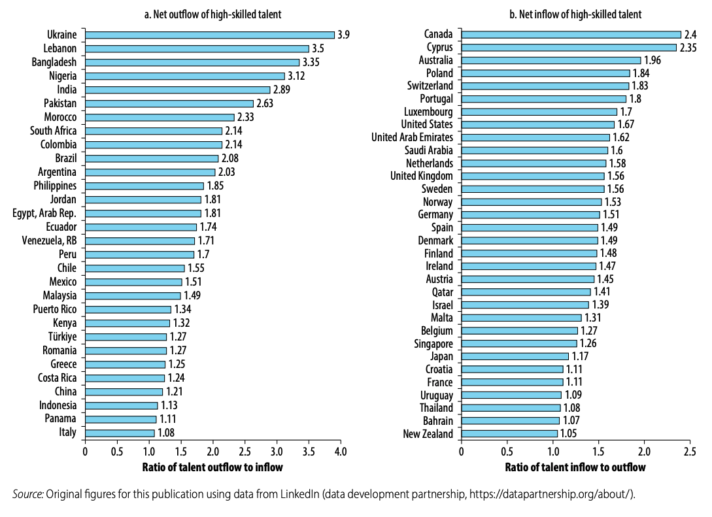

+++
title = "Cross-Border Mobility of High-Skilled Digital Talent in the Age of AI"
authors = ["Yan Liu", "Saloni Khurana"]
categories = ["Case Study"]
partner = ["LinkedIn"]
dev_partner = ["World Bank"]
tags = ["Jobs and Development"]
link = ["https://openknowledge.worldbank.org/entities/publication/8f5d2cb9-92d4-42fd-a4ad-fa538f081488"]
date = 2026-03-02T00:00:00Z
+++

Digitalization is profoundly reshaping labor markets and transforming skills demand worldwide. As digital skills become essential across a growing range of occupations, high-skilled workers are increasingly mobile across borders. Using [LinkedIn](www.linkedin.com)’s data, the World Bank’s Digital and AI Vertical analyzed cross-border mobility patterns of high-skilled talent.

## Challenge

The rapid advancements in artificial intelligence (AI) are reshaping labor markets and raising demand for diverse digital skills related to the usage, integration, and development of AI. Digital transformation has already increased the demand for digital skills across economies, industries, and occupations.

Although surging demand for digital and AI skills has driven rapid expansion in supply, gaps remain because of rapid technological advances, specialized and evolving skills requirements, outdated curricula, competition for talent, brain drain, lack of infrastructure, and access disparities. As a result, differences in countries’ ability to develop and retain digital skills are reflected in cross-border movements of high-skilled talent.

<figure style="text-align: center;">
  
</figure>

## Solution

As part of the [Digital Progress and Trends Report 2025: Strengthening AI Foundations](https://openknowledge.worldbank.org/entities/publication/8f5d2cb9-92d4-42fd-a4ad-fa538f081488), the World Bank’s Digital and AI Vertical leveraged LinkedIn data to analyze mobility patterns among tech workers. The analysis helps inform policymaking in developing countries about brain drain, the mobility of highly skilled professionals.

The study reveals that highly skilled digital talent enjoys global mobility and often moves across borders to pursue better job opportunities. This has benefited high-income countries while accelerating brain drain in developing countries. LinkedIn data shows that in Bangladesh, Lebanon, Nigeria, and Ukraine, talent outflows are 3–4 times higher than inflows. Argentina, Brazil, Colombia, India, Morocco, Pakistan, and South Africa follow, with outflow-to-inflow ratios between 2 and 3 (see Figure 1, panel a). In contrast, countries such as Australia, Canada, and Cyprus attract high-skilled workers at least twice the rate at which they leave. Poland, Portugal, and Switzerland also attract a substantial share of skilled professionals (see Figure 1, panel b).

<figure style="text-align: center;">
  
  <figcaption style="text-align: center; font-size: 0.9em; color: #555;">Figure 1: Cross-border mobility of high-skilled talent, 2022
</figcaption>
</figure>

## Impact

The findings above highlight the need for countries experiencing outflows of digital talent to cultivate and retain it. Governments can integrate digital skills into formal education curricula, collaborate with educational technology providers to expand access, align training programs with labor market demands, subsidize training for underserved populations and small and medium-sized enterprises, and implement policies to attract and retain digital talent, including streamlined visa processes. Leveraging diaspora digital talent facilitates access to skills and knowledge transfer that can drive economic growth.

For this study, LinkedIn data provided a snapshot of high-skilled talent inflow and outflow ratios, offering a partial view of cross-country mobility patterns among highly skilled workers. To more accurately assess the scale of brain drain and brain gain, these insights need to be complemented with other data sources, preferably administrative and representative datasets.

