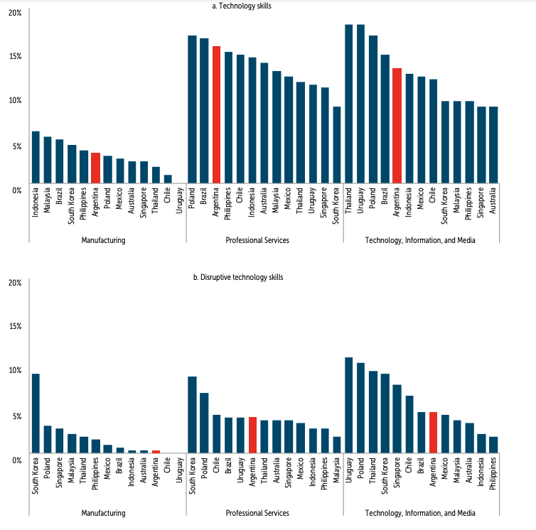
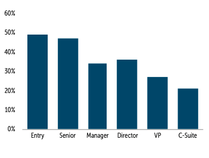

+++
title = "Cultivating Human Capital and Skills in Argentina for Sustainable Long-Term Economic Growth"
authors = ["Sonia Araujo", "Harry Moroz", "Daniel Reyes"]
categories = ["Case Study"]
partner = ["LinkedIn"]
dev_partner = "World Bank"
tags = ["Jobs and Development"]
date = 2024-08-06T00:00:00Z
links = ["https://www.worldbank.org/en/country/argentina/publication/un-nuevo-horizonte-de-crecimiento-para-argentina"]
+++

Argentina holds immense potential to achieve sustained and inclusive economic growth. However, the country is facing structural challenges to growth, including the gradually declining quality of human capital. Through the Development Data Partnership, the World Bank leveraged [LinkedIn data](https://economicgraph.linkedin.com/content/dam/me/economicgraph/en-us/PDF/data-for-impact-primer-fall-2023.pdf) for a chapter on human capital for the [Argentina Country Economic Memorandum: A New Growth Horizon – Improve Fiscal Policy, Open Markets, and Invest in Human Capital](https://www.worldbank.org/en/country/argentina/publication/un-nuevo-horizonte-de-crecimiento-para-argentina?). The data analyzed provides detailed insights into the kinds of skills that are in demand in the Argentine labor market compared to other countries globally.

## Challenge

Human capital is underutilized in Argentina, particularly those of women and young people. Women work in more precarious employment, undertake more unpaid work, and are underrepresented in high-level jobs. A large proportion of young people are not employed or in school. Dropout rates among secondary and tertiary students are high and students do not access science and technology degrees and technical schools to the extent that changing skill needs requires. Evolving technologies implies that educational institutions need to adapt to constantly shifting needs that include higher-order cognitive and socioemotional skills.

Without corrective policies, the skills of the country's workforce could fall behind those demanded by a dynamic, technology-driven, knowledge-intensive global economy, limiting the potential of Argentina to return to a sustainable and inclusive growth path over the medium term.

<figure align="center">
    
        

  

    </figcaption>
</figure>

## Solution

To get a clearer picture of human capital in Argentina, the team leveraged LinkedIn data on skills similarity, skills penetration, career transitions, hiring rate, and skills genome.

The analysis found that Argentina is lagging peers in the disruptive technology skills most closely associated with the future of work[^1].  Relative to comparators, the LinkedIn data showed that technology skills such as the use of digital devices, communications applications, and networks are common in Argentina's manufacturing, professional services, and ICT sectors (Figure 1 Panel A). However, the country underperforms on the disruptive technology skills most closely associated with the future of work, such as AI (Figure 1 Panel B). These skills are increasingly demanded in global labor markets. In the manufacturing and ICT sectors, disruptive technology skills are much less common in Argentina than in peer countries.

<figure align="center">
    
        

Figure 1: Percent of industry's top 50 skills in each skill group by country, 2021
  

    </figcaption>
</figure>

In addition, the study found that women are underrepresented in high-level jobs. Data from LinkedIn show that the share of women in employment declines as seniority increases, with only 21 percent of C-Suite roles (top senior executives)  occupied by women (Figure 2).

<figure align="center">
    
        

Figure 2: Share of women by job seniority in Argentina, as % of employment, 2021
 
Note: C-Suite designates titles of top senior executives, such as CEOs.
  

    </figcaption>
</figure>

## Impact

Utilizing [LinkedIn]( https://www.linkedin.com/) data, the study shows that technology skills are in demand in Argentina, but the adoption of disruptive technology skills lags behind. Additionally, the study identifies a gender gap with women underrepresented in high-level jobs.

To help Argentina overcome these human capital challenges, the report suggests policy recommendations in different areas. They include offering lifelong learning programs to ensure reskilling and upskilling throughout people's working lives as their skills needs evolve, as well as expanding access to child and elderly care services for improving women participation in the labor market.

Moving forward, Argentina will need to rethink and strengthen policies that promote the accumulation and facilitate the deployment of human capital in the context of a world of work that is rapidly changing. The country needs to undertake reforms that promote skills development while also helping to establish pathways for workers with newly acquired skills to utilize them in the labor market. 

[^1]: Disruptive technology skills are the skills most closely associated with the future of work like artificial intelligence, Python, and data analytics.
