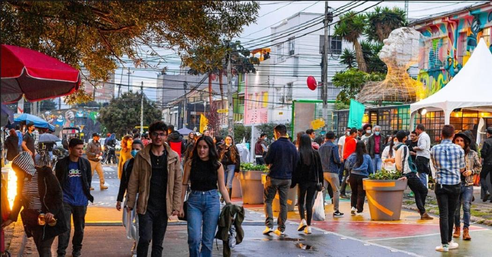
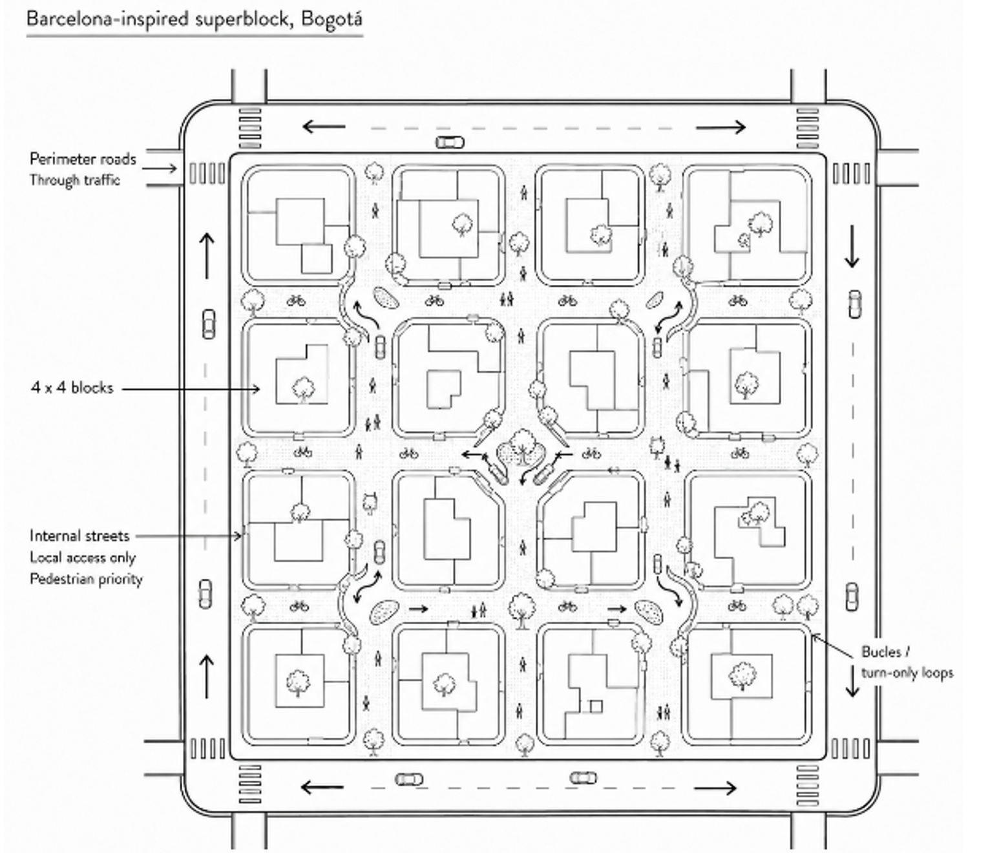

+++
title = "Data-Driven Urban Transformation: Evaluating Bogotá’s Vital Neighborhoods Strategy"
authors = ["Leonardo Canon Rubiano"]
categories = ["Case Study"]
partner = ["Mapbox"]
dev_partner = ["World Bank"]
tags = ["Urban Development"]
links = ["https://documents.worldbank.org/en/publication/documents-reports/documentdetail/099060123135042769"]
date = 2026-06-22T00:00:00Z
+++

Cities around the world are rethinking how urban spaces are designed with the aim of improving people’s lives and promoting sustainable development. In 2021, Bogotá, Colombia, introduced the [Vital Neighborhoods (VN) Strategy](https://bogota.gov.co/en/international/mayor-lopez-presented-project-barrios-vitales-world-bank) to catalyze urban transformation. The World Bank’s Urban, Disaster Risk Management, Resilience, and Land Global Practice supported the city by providing technical assistance, including assessing the impact of the strategy. As part of this evaluation, the team leveraged multiple datasets, including [Mapbox](https://www.mapbox.com/) traffic data, to better understand changes in mobility patterns.

## Challenge

Over the last half-century, cities in Colombia have undergone rapid urbanization, accompanied by a significant expansion of their urban footprint. The proportion of the population living in urban areas increased from 46 percent in 1960 to 82 percent in 2021 and is projected to reach 88 percent by 2050 (World Urbanization Prospects, 2018).

As the country’s capital and largest urban center, Bogotá accounts for 25.3 percent of national GDP, the highest contribution among all cities in Colombia (DANE, 2021). However, the city has been facing a range of challenges, including rising traffic congestion and air pollution, an increase in road accidents, and a lack of resilience to climate disasters.

<figure style="text-align: center;">
  
  <figcaption style="text-align: center; font-size: 0.9em; color: #555;">
    Photo Credit:
    <a href="https://bogota.gov.co/que-hacer/cultura/el-circuito-san-felipe-llega-nuevamente-al-distrito-creativo" target="_blank" rel="noopener noreferrer">
      Alcaldía Bogotá
    </a>
  </figcaption>
</figure>

## Solution

In response to these challenges, Bogotá periodically updates its land use masterplan, POT, which strives to encourage mixed land use, density and improved access to jobs, health and education services by public transport. These density, land use and public transport levers are put to action through the Vital Neighborhoods (VN) Strategy, an urban redesign approach based on Barcelona’s superblock model, which reorganizes the hierarchy of city streets in four by four block grids that reduce through-traffic within neighborhoods, optimize and simplify the bus network, and provide low-speed, livable urban space within the blocks protected by the 4 by 4 grid, and ultimately becoming the cornerstone of Bogotá’s 30-minute city approach. The San Felipe neighborhood in Bogotá, which implemented the city’s first VN between 2020-2022, has become the city’s living lab for the strategy, catalyzing the transformation of a run-down residential area with low-key office space into Bogotá’s upcoming art gallery district, with shops, cafes and restaurants opening every other day and drawing people to enjoy traffic-free outdoor life.

<figure style="text-align: center;">
  
  <figcaption style="text-align: center; font-size: 0.9em; color: #555;">Source: Leonardo Canon Rubiano, WBG
</figcaption>
</figure>

The strategy was selected for its potential to deliver multiple benefits, including promoting low-carbon transport modes and reducing traffic speeds on neighborhood streets.

As part of its broader commitment to sustainable urban development, and building on the success of San Felipe, the 2023 Bogotá Land Use Plan includes the implementation of 33 Low-Carbon Vital Neighborhoods (LCVN) across Bogotá. 

The World Bank’s Urban, Disaster Risk Management, Resilience, and Land Global Practice has provided technical assistance to the city administration, including providing insights, data analytics, and lessons learned from the pilot interventions implemented in San Felipe.

Project results go beyond a success story of reclaimed public space for pedestrians. The World Bank team leveraged multiple datasets, including Mapbox traffic data, accessed through the Development Data Partnership. The analysis of live traffic patterns conducted in 2022 observed changes in road speeds and safety, complementing other sources needed to assess how neighborhood interventions influenced traffic patterns and mobility over time.

The analysis showed positive impacts: on the inner streets of San Felipe, average speeds decreased by 6.6 percent between 6:00 am and 8:00 pm from 2021 to 2022, dropping from 17.3 km/h to 14.3 km/h. On perimeter roads, average speeds decreased by approximately 11.6 percent, from 28.4 km/h to 25.1 km/h.

At the same time, road accidents decreased by approximately 47 percent in 2023 compared to 2019. However, the number of serious accidents, those involving injuries or fatalities, increased by about 30 percent between 2021 and 2022, rising from 27 to 37 registered cases. This divergence between reduced speeds and higher rates of severe accidents highlights the need for more detailed, case-by-case analysis to identify potential infrastructure improvements.

## Impact

Bogotá’s 2023 masterplan identified the potential it has to evolve from a large megacity into a network of more sustainable and livable, 30-minute city. The use of Mapbox data, combined with other datasets, provided valuable insights into the impacts of the city’s Vital Neighborhoods Strategy on road safety, traffic calming and emissions. Through this data-driven technical assistance, the World Bank helped the city administration argue with facts the importance of pushing for the VN strategy.

Building on these insights, the World Bank team put forward recommendations to support the effective and long-term implementation of the LCVN Strategy. These include identifying appropriate institutional and governance arrangements, as well as designing a management model with viable financial and operational mechanisms.

As cities continue to promote sustainable development, data will play an increasingly central role. Bogotá’s experience shows that data can help bridge the information gap between planning and implementation by providing evidence to guide informed decisions.

