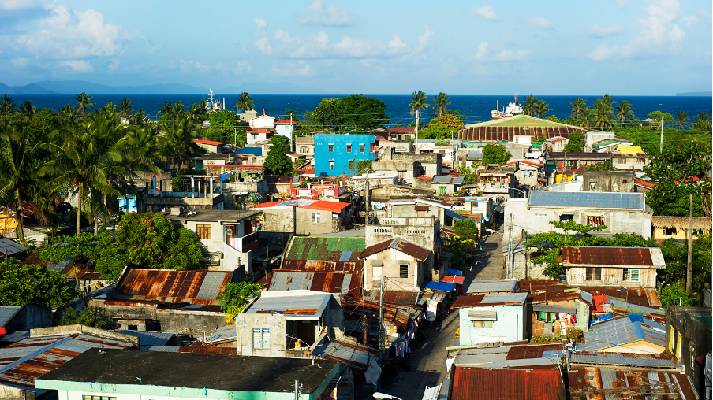
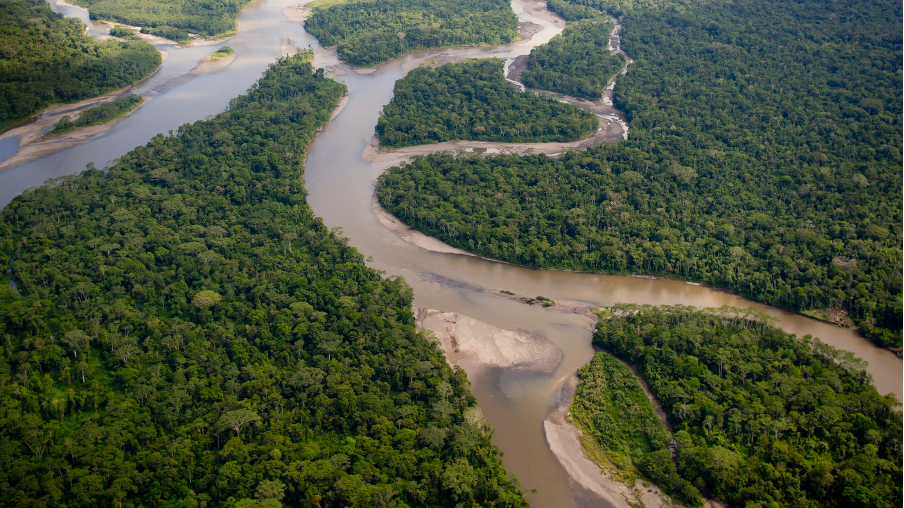

+++
title = "Data for Impact: South-South Cooperation in Action"
authors = ["Kwok Kin Lee"]
categories = ["Case Study"]
partner = ["Ookla", "AtlasAI", "JBA", "Google", "Mapbox", "Meta" ]
dev_partner = ["Asian Development Bank", "World Bank", "Inter American Development Bank"]
tags = ["Digital Development", "Inequality and Shared Prosperity", "Disaster Risk Management", "Transport"]
date = 2025-09-08T00:00:00Z

+++

On September 12, the International Day for South-South Cooperation, we celebrate how countries across the Global South are working together to solve shared development challenges. One of the most powerful enablers of that cooperation is data.

Through the Development Data Partnership’s projects in various regions—such as Asia, Africa, and Latin America—we collaborate with data partners and international organizations to uncover insights that improve people’s lives. Our work spans a range of areas, including internet connectivity, flood risk assessment, and infrastructure—areas where better data can lead to more sustainable decisions and lasting impact.

These projects wouldn’t be possible without our data partners, whose trusted collaboration allows us to responsibly turn private and public data into public good.

Here are a few examples of how the Development Data Partnership is turning data into impact across the Global South:

**Harnessing Ookla® Data: The Impact of Mobile Internet on Household Wealth in the Philippines**

The Asian Development Bank (ADB) conducted a study utilizing [Ookla](https://www.ookla.com/ookla-for-good) data to assess the impact of mobile internet connectivity on household wealth in the Philippines, a lower-middle-income archipelagic nation. The study revealed that enhanced internet quality significantly boosts household wealth, especially in rural areas and among households with lower education levels, highlighting the critical role of both internet access and quality in promoting economic development. [Discover more](https://datapartnership.org/updates/mobile-internet-connectivity-and-household-wealth-in-the-philippines).

<figure style="text-align: center;">
  
</figure>

**How Atlas AI Helped Assess Economic Well-Being Around African Parks**

The World Bank collaborated with [Atlas AI](https://www.atlasai.co) to assess the impact of private management of protected areas in Africa, particularly through African Parks (AP). Atlas AI provided vital data on asset wealth by utilizing high-resolution optical imagery and machine learning to study economic well-being in areas surrounding AP-managed parks. This partnership enabled the World Bank to evaluate whether AP management improves local economic conditions. Findings suggested that while communities near AP parks experienced an increase in wealth, this trend may not be solely attributed to AP’s management, emphasizing the complexity of the relationship between conservation and economic outcomes. [Find out more](https://datapartnership.org/updates/can-private-management-of-african-protected-areas-improve-socioeconomic-and-wildlife-outcomes).

**Leveraging JBA’s Global Flood Maps: Enhancing Flood Risk Assessment for Infrastructure Projects in Peru**

The Inter-American Development Bank (IDB) used [JBA’s Global Flood Maps](https://jbagr.com/digital-tools/global-flood-maps/) to assess flood risks in Peru’s Puno region, which is prone to natural hazards like floods. Utilizing JBA’s high-resolution flood maps, the IDB was able to identify areas at risk before implementing a project aimed at improving water and sanitation infrastructure for over 500,000 residents. The maps provided essential data for understanding the extent of potential floods over various return periods, enhancing project resilience and helping local governments prioritize resources effectively while mitigating flood risks. [Learn more](https://datapartnership.org/updates/assessing-flood-risks-in-peru).

**Bridging the Amazon’s Infrastructure Gap: Insights from Google, Mapbox, Meta, and Ookla**

The World Bank utilized data from [Google](https://www.google.com), [Mapbox](https://www.mapbox.com), [Meta](https://dataforgood.facebook.com), and [Ookla](https://www.ookla.com/ookla-for-good) to analyze infrastructure gaps in the Amazon regions of Brazil, Colombia, and Peru. Google’s satellite imagery and Open Buildings Dataset helped assess population density and connectivity, while Ookla provided internet speed metrics to reveal significant digital disparities. Meta contributed movement data to understand population dynamics, and Mapbox offered tools for mapping transportation networks. This collaborative effort identified critical infrastructure challenges and investment opportunities, emphasizing the need for tailored solutions to enhance connectivity and support sustainable development in the Amazon. [Read more](https://datapartnership.org/updates/how-to-leverage-data-for-better-transport-digital-connectivity-and-sustainable-development-in-the-amazon).

<figure style="text-align: center;">
  
</figure>

The impacts of these projects across various regions highlight the crucial role of our data partners. Their collaboration with international organizations enables the effective use of diverse data sources, turning information into valuable insights that tackle development challenges. Through these partnerships, sustainable development initiatives across the Global South can become more focused, effective, and resilient, demonstrating that strong data partnerships are essential for building a better future.

