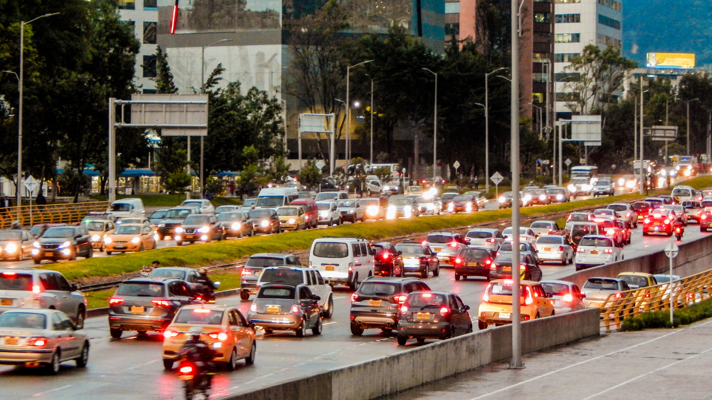
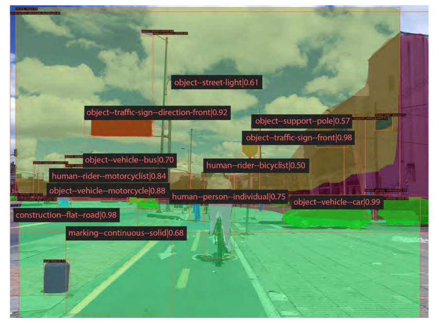
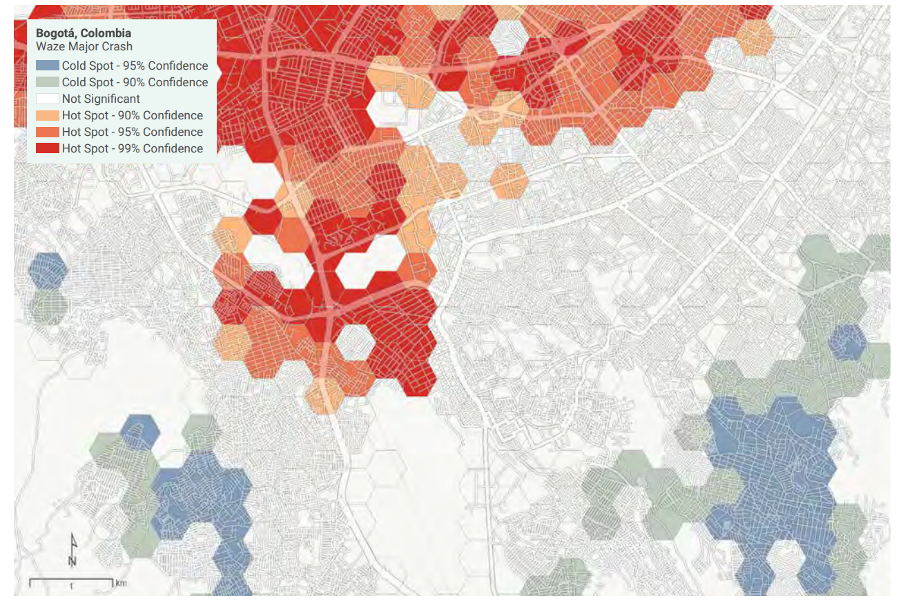
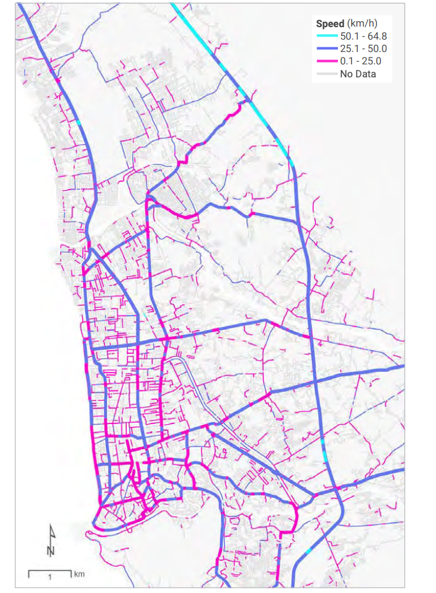

+++
date = 2023-05-05T00:00:00Z
title = "How Big Data and Machine Learning Can Strengthen Road Safety"
authors = ["Sarah Antos", "Luis Jan"]
partner = ["Mapbox", "Mapillary", "Waze"]
dev_partner = ["World Bank"]
categories = ["Case Study"]
tags = ["Transport"]
links = [
	"https://documents1.worldbank.org/curated/en/099200002152227482/pdf/P170812026cd2b0550acec0ef8165301833.pdf"
]
thumbnail = "detecting-urban-clues-for-road-safety-figure1.png"
+++

High-quality and reliable data is necessary to gain useful, actionable insights and enhance road safety conditions. However, collecting data on road safety through manual detection can be expensive, time-consuming, and complex. [Detecting Urban Clues for Road Safety: Leveraging Big Data and Machine Learning](https://documents1.worldbank.org/curated/en/099200002152227482/pdf/P170812026cd2b0550acec0ef8165301833.pdf) leveraged the [Development Data Partnership](https://datapartnership.org) to access information from [Mapillary](https://www.mapillary.com), [Mapbox](https://www.mapbox.com), and [Waze for Cities](https://www.waze.com/wazeforcities/) to study how big data and machine learning can improve data collection and analysis and ultimately increase road safety.

## Challenge

Transport services and infrastructure are crucial to economic development because they connect people to jobs and businesses. However, if transport services and infrastructure are poor, this can result in road accidents, causing significant costs to our society.

Road safety analysis is crucial to protect people’s lives by preventing road fatalities and injuries. This requires the availability of high-quality and reliable data so that we can extract useful, actionable insights and enhance road safety conditions. For instance, with quality data, it is easier to estimate crash locations, crash types, at-risk individuals, key risk factors influencing exposure to risk, crash involvement, crash severity, and post-crash outcomes.

However, there are challenges to assessing road safety. For example, there can be a lack of adequate crash data or road ratings in data-scarce countries and regions for identifying risk factors. Governments wishing to identify road safety risks and perform road safety assessments often lack adequate and reliable data.

Also, collecting data on road safety attributes through manual detection or special equipment can be costly, time-consuming, and complicated. In addition to the quality and availability of road safety data, preparing and analysing it can also be expensive, resource-intensive, and technically demanding.

<figure align="center">
    
    <figcaption>
        
Photo Credit: Arturo Rosenow from Getty Images

    </figcaption>
</figure>

## Solution

With the support of the Development Data Partnership, [Detecting Urban Clues for Road Safety: Leveraging Big Data and Machine Learning](https://documents1.worldbank.org/curated/en/099200002152227482/pdf/P170812026cd2b0550acec0ef8165301833.pdf) provided concrete guidance on how big data and machine learning (ML) can be leveraged in road safety analysis to identify opportunities to reduce crashes. This publication used data from sources including [Mapillary](https://www.mapillary.com), [Mapbox](https://www.mapbox.com), and [Waze for Cities](https://www.waze.com/wazeforcities/).

In the case study of Bogotá, Colombia, a machine-learning-based framework was implemented to evaluate road safety. For this framework, two machine-learning models were developed. The first model was developed using [Mapillary](https://www.mapillary.com) to obtain street-view images near the centroid of a road segment. The images gave information about road characteristics such as crosswalks, sidewalks, streetlights, traffic signs, and utility poles.

<figure align="center">
    
    <figcaption>
        
Figure 1: Image segmentation in Bogotá
		

    </figcaption>
	<figcaption>
		
Source: Original figure from <a href="https://documents1.worldbank.org/curated/en/099200002152227482/pdf/P170812026cd2b0550acec0ef8165301833.pdf">Detecting Urban Clues for Road Safety: Leveraging Big Data and Machine Learning</a> based on data from <a href="https://www.mapillary.com">Mapillary</a>.
		

    </figcaption>
</figure>

The second model was created to evaluate road risks in selected areas. Then, the team compared the road risk predictions to the crash data from [Waze for Cities](https://www.waze.com/wazeforcities) which provided a valuable source of crash and traffic data by allowing users to report road crashes through their smartphone applications.

<figure align="center">
    
    <figcaption>
        
Figure 2: Hotspot analysis of major crashes reported by Waze application users
		

    </figcaption>
	<figcaption>
	      
Source: Original figure from <a href="https://documents1.worldbank.org/curated/en/099200002152227482/pdf/P170812026cd2b0550acec0ef8165301833.pdf">Detecting Urban Clues for Road Safety: Leveraging Big Data and Machine Learning</a>. Data provided by Waze App. Learn more at <a href="waze.com">waze.com</a>.
		

    </figcaption>
</figure>

It was found that the framework’s predictions of low-risk road segments were correct 70 percent of the time, and predictions of high-risk road segments were correct 75 percent of the time.

Road safety assessments may also require operating speeds of road segments. [Mapbox](https://www.mapbox.com) collects this data from mobile devices and provides typical speeds per road segment in 5-minute increments. In the case study of Padang, Indonesia, Mapbox speeds were shown on a map for a specific period.

<figure align="center">
    
    <figcaption>
        
Figure 3: Mapbox typical speeds in Padang on Thursday, 5:00 p.m. to 6:00 p.m.
		

    </figcaption>
	<figcaption>
        
Source: Original figure from <a href="https://documents1.worldbank.org/curated/en/099200002152227482/pdf/P170812026cd2b0550acec0ef8165301833.pdf">Detecting Urban Clues for Road Safety: Leveraging Big Data and Machine Learning</a> based on data by <a href="https://www.mapbox.com/about/maps">© Mapbox</a>.
		

    </figcaption>
</figure>

## Impact

Poor quality of roads can lead to road accidents which themselves can lead to delays to successful emergency response efforts. It’s essential to understand that improving road quality can be life-saving. However, finding valid and representative data can be challenging in evaluating road safety risks and reducing crash fatalities. With the support of  [Mapillary](https://www.mapillary.com), [Mapbox](https://www.mapbox.com), and [Waze for Cities](https://www.waze.com/wazeforcities/), this publication demonstrated how big data and machine learning can be used to improve road safety analysis throughout the life cycle of World Bank projects.

The team also produced a guidance note for task team leaders, showing them how this data could be incorporated into the World Bank project cycle and more specifically into the tools or models they already have in place to assess road safety.

The case studies also underscored the power of big data and machine learning to reduce the manual inspection of roadways and provide road safety insight where otherwise the information is in short supply, thereby contributing to safer roads.

Additionally, due to the strength of the Bogotá model, the team shared the data with the Bogotá government’s Geographic Information System team for further validation and inclusion into a neighbourhood vulnerability index they are creating.

As big data and machine learning become more accessible, and as their adoption accelerates worldwide, it is vital for road safety practitioners and governments to work with companies through data partnership agreements to unlock their immense potential to improve the quality and efficiency of road safety assessments.
