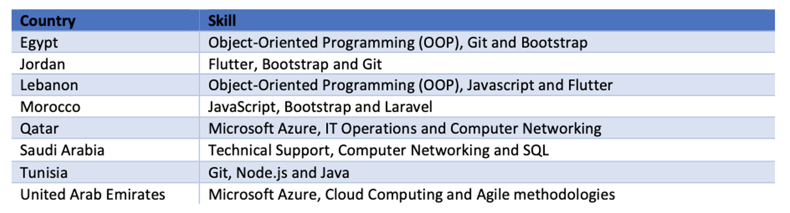

+++
title = "Analyzing Digital Skills Gap in MENA Countries to Inform An Upskilling Initiative"
authors = ["Angela Elzir Assy", "Sabine Habibian", "Fadi Daouk"]
categories = ["Case Study"]
partner = ["LinkedIn"]
dev_partner = "World Bank"
tags = ["Jobs and Development"]
date = 2023-10-12T00:00:00Z
+++

Digital technologies are reshaping work and traditional jobs. It is essential for workers across all sectors to acquire and strengthen their digital skills to stay competitive in the job market. A team from the World Bank Human Development Practice Group collaborated with [LinkedIn](https://economicgraph.linkedin.com/data-for-impact)to study the labor markets in the Middle East and North African (MENA) region, and to analyze the most relevant and characteristic skills according to selected industries and occupations in the tech and digital sector. This analysis works to inform policymakers, employers, the World Bank and its partners in developing tailored training programs for people to thrive in this digital age.

## Challenge

The rise and spread of digital technologies have brought transformational changes to the labor market. Basic digital skills and literacy will thus be essential for most employees to stay competitive in the future.

According to the World Economic Forum’s [Future of Jobs Report 2023] (https://www3.weforum.org/docs/WEF_Future_of_Jobs_2023.pdf), it is estimated that 83 million jobs will be displaced in the next five years, while 69 million jobs will be created, constituting a structural labour-market churn of 152 million jobs. Furthermore, the survey analyzed the expected impact of technology on employment with all but two technologies (i.e., robot, humanoid and robot, non-humanoid) that are expected to be job creators in the next five years.  The skill sets that are in high demand today did not exist five years ago and the pace of this trend is only expected to accelerate.

Existing workforces in MENA are not well-equipped to reap the benefits of a digital economy [^1]. Considering the youth bulge in MENA as well as the high youth unemployment rate, opportunities brought by the digital and tech sectors should be seized upon to provide income generating activities and jobs for youth across skills levels. As people are adapting their skills for a changing job market, it is vital to understand the emerging trends in the labor markets in the MENA region by identifying key skills in demand across different occupations and industries. In doing so, countries become better positioned to address the skills mismatch in a country’s labor supply.

<figure align="center">
    
    <figcaption>
        

  Photo: World Bank
  

    </figcaption>
</figure>

## Solution

The World Bank MENA Human Development Practice Group leveraged data from LinkedIn to study the labor markets in the MENA region, specifically in Saudi Arabia, Qatar, the United Arab Emirates (UAE), Lebanon, Jordan, Iraq, Morocco, Tunisia and Egypt. These countries were selected as they represent a source of labor demand. Non-MENA countries were also analyzed to provide comparisons for some sections in the report. These include Australia, France, Germany, Switzerland, the Netherlands, and Japan.

The World Bank team analyzed the LinkedIn data as follows: (i) Global Skill Genome by Occupation; (ii) LinkedIn Hiring Rate by Country and Sub-Industry and; (iii) Skill Genome by Country and Industry.

The skills genome of a job tracks a set of skills that are most unique to and most representative of a job, based on the skills LinkedIn members feature on their profiles [^2]. The analysis showcased a list of the characteristic skills needed in 2021 for the following three industries: Corporate Services, Software & IT Services, and Consumer Goods. For instance, when analyzing the Software & IT Services industry, specific programming languages such as Bootstrap, Git, JavaScript and Object-Oriented Programming stood out as the most characteristic skills found in Morocco, Lebanon, Jordan, and Egypt, whereas Qatar and the United Arab Emirates ranked Microsoft Azure, also known as Microsoft Cloud Computing, as the number one most found skill (see Figure 1).

<figure align="center">
    
    <figcaption>
        

  Figure 1: Top three most characteristic skills for the Software & IT Services Industry per country (MENA only) in 2021
  

    </figcaption>
</figure>

The team also found fluctuating hiring rates across the selected MENA countries and across sub-industries. Tunisia for instance displayed the steepest increase in IT services and the IT consulting sub- industry across the MENA region. This finding raises an important question related to what extent Tunisia’s skills ecosystem differs from the other MENA countries analyzed in the study.

<figure align="center">
    
    <figcaption>
        

  Figure 2: LinkedIn Hiring Rate index for all sub-industries for MENA Countries and France as comparison,2022 
  

    </figcaption>
</figure>

## Impact

[LinkedIn](https://economicgraph.linkedin.com/data-for-impact)data helps to provide a clear picture of what the job landscape looks like and how people can better equip themselves with the skills employers want. More importantly, policy makers can use this data to develop more tailored in-demand training programs that help workers reskill or upskill. As each country displays different skills, adapting training to the local needs of the private sector is of utmost importance to ensure successful results and impact. For instance, mastering programs or applications such as Bootstrap, Git, JavaScript and Object-Oriented Programming, is considered a unique skill in the labor markets in some MENA countries such as Morocco and Lebanon. This analysis also highlighted which industries were hiring the most using the LinkedIn hiring rates. This can again help policymakers adapt training programs to the most outsourced jobs in the region.

Going forward, the World Bank team will be leveraging the results stemming from this analysis as a reference in the partnership discussion with leading tech companies to increase access to their trainings and certifications. The global list of most characteristic skills founds, as well as the one related to specific industries, will be worth investigating for when selecting the specific technical digital skills training to offer. All MENA countries analyzed in the paper showcased a high increase in their LinkedIn Hiring Rate in the IT sector (i.e, Egypt, Tunisia, Morocco, Saudi Arabia, the UAE). This confirms the strong potential of outsourcing in the digital and tech sector.

*Note: Data analysis and feedback on the write up was provided by Casey Weston, Senior Manager, Public Policy & Economic Graph at LinkedIn, and Rosie Hood, Senior Data Scientist, Economic Graph Research Institute at LinkedIn. The team is grateful for the guidance, feedback and comments provided by Andreas Blom, MENA Education Practice Manager.*

[^1]: The Upside of Digital for the Middle East and Africa, World Bank Group,2021,https://openknowledge.worldbank.org/bitstream/handle/10986/37058/9781464816635.pdf?sequence=10&isAllowed=y

[^2]: https://engineering.linkedin.com/blog/2019/how-we-mapped-the-skills-genome-of-emerging-jobs
