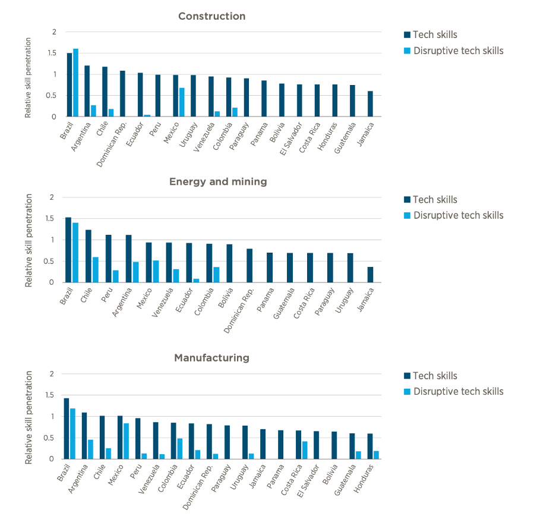

+++
title = "Assessing Digital Transformation in Firms in Latin America and the Caribbean"
authors = ["Alison Cathles", "Claudia Suaznabar", "Fernando Vargas"]
categories = ["Case Study"]
partner = ["LinkedIn"]
dev_partner = "World Bank"
tags = ["Jobs and Development"]
links = ["https://publications.iadb.org/en/360-digital-transformation-firms-latin-america-and-caribbean"]
date = 2023-11-06T00:00:00Z
+++

Are firms in Latin America and the Caribbean lagging in terms of their adoption of digital technologies? The Inter-American Development Bank's Competitiveness, Technology, and Innovation Division leveraged [LinkedIn](https://www.linkedin.com) data on the penetration of digital skills as part of an assessment on the adoption of technologies in the region.

## Challenge

Digital technologies have become indispensable to both firms and the people who use them. They lower all kinds of costs, from searching costs (i.e., finding information), to replication costs (afforded by scanners or photocopy machines), transportation costs (digital goods travel through cyberspace via digital environments at almost zero cost), tracking costs (orders, status, and location), and verification costs (i.e., employee vetting processes, consumers online rating systems).

Despite the growing importance of the digital economy in Latin America and the Caribbean (LAC), there is a widespread belief that the adoption of digital technologies by firms in the region remains far behind that of advanced economies. To study the digital landscape in the region, accessible and high-quality data is essential.

However, national account systems and traditional metrics have big blind spots in measuring digital transformation. To address some of these blind spots, data support from the private sector is critical.

<figure align="center">
    
    <figcaption>
        

  Photo: World Bank
  

    </figcaption>
</figure>

## Solution

Through the Development Data Partnership, the Inter-American Development Bank's Competitiveness, Technology, and Innovation Division accessed [LinkedIn](https://www.linkedin.com) data for part of their quantitative and qualitative assessment of the current state of digital technologies in LAC's productive sector. 

For this study, LinkedIn provided data on the penetration of digital skills in different industries in LAC countries. Having the requisite digital skills is a key enabling condition for digital technology adoption by firms. Digital technologies require unique skills to facilitate adoption, since successful implementation can require firms to reorganize themselves, coordinate via new digital channels with buyers and suppliers, and even reassign tasks to reconfigure division of labor [Ciarli et al., 2021](https://www.sciencedirect.com/science/article/abs/pii/S0048733321000913).

Additionally, as pointed out by [Pisu et al. 2021](https://www.oecd.org/global-forum-productivity/events/Spurring-growth-and-closing-gaps.pdf) a strong set of basic digital skills across an economy is very important for supporting further uptake of digital technologies.

The team used the LinkedIn data to analyze the presence of digital skills in the industrial sector, selected traditional services, and knowledge intensive based services. Distinct patterns of digital skills penetration across the different industry groups were notable.

Based on the LinkedIn data on tech skills and disruptive tech skills, the study revealed that Brazil was the only country in the LAC region with both tech and disruptive tech skills above the global average in each of the selected industrial sectors (i.e., construction, energy and mining, and manufacturing) (Figure 1). Several countries in the region did not appear to have disruptive tech skills in the selected industrial sectors.

Disruptive tech skills include aerospace, engineering, AI, data science, and robotics. Tech skills include animation, computer graphics, computer hardware, computer networking, data storage technologies, data-driven decision making, digital literacy, graphic design, information management, mobile application development, web development, and web hosting[^1].

<figure align="center">
    
    <figcaption>
        

  Figure 1: Tech skills and disruptive tech skills in selected industrial sectors in LAC 
Source: LinkedIn skills penetration data obtained via the Development Data Partnership. All data has been processed, analyzed, or graphed, so the study does not share original data.
  

    </figcaption>
</figure>
  
Additionally, the team found that in industries that were crucial during the pandemic, such as the health care industry, no country in the region appeared to have disruptive tech skills penetration above the global average.

## Impact

The digital transformation of LAC countries is an ongoing process that is not exempt from challenges. The findings of this study underscore the need for a wide range of differentiated policy interventions to foster technology adoption in the region.

For instance, governments should consider implementing comprehensive policies to close the digital talent gap faced in the region. This implies developing a wide range of skills and profiles of specialists: data analysts who work on data management, data scientists who develop the algorithms, or data engineers and programmers.

In addition, [LinkedIn](https://www.linkedin.com) provided critical data for this study. An advantage of LinkedIn data is that, in LAC, it covers more countries and digital skill groups than other sources of data. The analysis of the LinkedIn data presents a foray into a new way to measure and assess the supply of digital skills for more countries and sectors in the region than virtually any other source of data allows.

[^1]: Source: Excerpted from World Bank Group-LinkedIn Digital Data for Development: Skill Group Definitions. Available at https://development-data-hub-s3-public.s3.amazonaws.com/ddhfiles/144635/skill-group-definitions.pdf  
