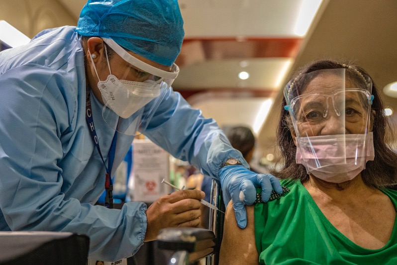
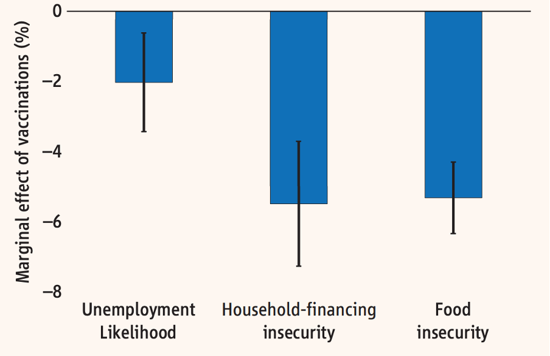

+++
title = "Understanding the Economic Impact of Vaccination"
authors = ["Daisuke Fukuzawa","Ergys Islamaj","Duong Le","Aaditya Mattoo"]
categories = ["Case Study"]
partner = ["Meta"]
dev_partner = "World Bank"
tags = ["Health"]
links = ["https://openknowledge.worldbank.org/bitstream/handle/10986/37097/9781464818585.pdf"]
date = 2023-09-18T00:00:00Z
+++

[The World Bank East Asia and the Pacific Economic Update April 2022](https://openknowledge.worldbank.org/server/api/core/bitstreams/3f1e8677-a3aa-555c-a145-ee6c30d23fae/content) analyzed challenges and opportunities facing the East Asia and the Pacific (EAP) region. To inform the update, the team looked at the correlation between vaccination and household economic performance using [Meta](https://dataforgood.facebook.com/dfg/about) data.

## Challenge

The COVID-19 pandemic created devastating health impacts across the EAP region leading to hospitalizations and fatalities. The virus was not only a health shock, but it and related measures also damaged the region's economy by dampening domestic consumption, private investment, and international tourism.

Vaccines are key to reducing the impact of the virus on the region. It is evident that vaccines are doing exactly what they were designed to do: prevent serious illness. Countries with high levels of population immunity through varying combinations of prior infection and vaccination reported significantly lower levels of mortality compared to the previous waves. 

<figure align="center">
    
    <figcaption>
        

		Photo: World Bank
		

    </figcaption>
</figure>

## Solution

The World Bank leveraged data from [Meta](https://dataforgood.facebook.com/dfg/about) to study the economic impacts of vaccination on households. Empirical evidence using micro-level data from Meta's Global COVID-19 Trends and Impact Survey suggested that vaccination was significantly correlated with improved economic circumstances of households. On average, being vaccinated was associated with a 2 percentage points lower likelihood of unemployment, and over a 5 percentage points lower likelihood of a household facing financial and food insecurities (figure 1).

<figure align="center">
    
    <figcaption>
        

		Figure 1: Correlation between vaccination and household economic circumstances

      
 Source: EAP staff research, based on data from Meta's Global COVID-19 Trends and Impact Survey

  
 
The figure's data covered the period of March-December 2021. Dependent variables were derived from individual responses to the following questions in the survey: 

* "In the past 4 weeks, did you do any work for pay? By work for pay, we mean any kind of business, farming, or other activity to earn money, even if only for one hour." (unemployment);
* "How worried are you about having enough to eat in the next week?"(food security); and
* "How worried are you about your household's finances in the next month?"(household finance security).

## Impact

The COVID-19 pandemic was both a health shock and an economic shock to all regions in the world, EAP included. It is vital for policymakers to manage the endemicity of COVID-19 and prepare health systems for future pandemics. This will require strengthening surveillance and preparedness.

The data from [Meta's Global COVID-19 Trends and Impact Survey]((https://dataforgood.facebook.com/dfg/tools/covid-19-trends-and-impact-survey)) highlighted the positive correlation between vaccination and household economic wellbeing, reflecting the essential role of wide-spread coverage of COVID-19 vaccines in addressing the health crisis.

Countries must invest in building resilience against future pandemics for a sustainable economic recovery and poverty reduction.