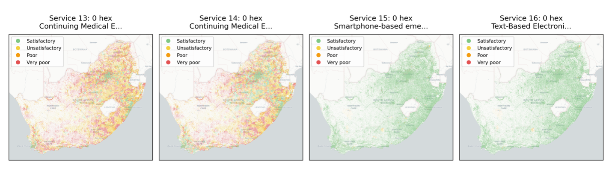

+++
title = "Enhancing E-Health Accessibility: Bridging the Digital Divide in Healthcare Services in Least Developed Countries"
authors = ["Miguel Nunez-del-Prado", "John Barreda", "Mersedeh Tariverdi"]
categories = ["Case Study"]
partner = ["Ookla"]
dev_partner = ["World Bank"]
tags = ["Health", "Digital Development"]
date = 2025-08-27T00:00:00Z
+++

The imperative to enhance equitable access to healthcare through e-health services has never been more pronounced, especially in light of crises such as the COVID-19 pandemic. The Global Unit for Disaster and Climate Risk Management, a division of the World Bank, undertook an evaluation of the digital infrastructure quality necessary for effective e-health services in least developed countries, utilizing data from [Ookla®](https://www.ookla.com/ookla-for-good).

## Challenge

The COVID-19 pandemic unveiled the grim reality of the issue as millions were unable to visit a health worker, get a regular checkup or even purchase their prescription due to movement restrictions, transportation limitations, and overstretched healthcare systems. This served as a reminder of the need to boost and ensure the availability of electronic health (e-health) services that can serve as a viable alternative to traditional healthcare delivered in person.

Additionally, during periods of natural disasters such as floods and earthquakes, equitable access to healthcare services becomes even more critical. 

Vulnerable populations, including the elderly and individuals with disabilities, must not be left behind when it comes to accessing essential services. E-accessibility plays a vital role in ensuring that everyone can access essential health services.

However, digital infrastructure—the physical and organizational systems that enable internet connectivity, such as fiberoptic cables, cell towers, network routing equipment, and last-mile connections—can be subject to degradation over time due to lack of maintenance, environmental conditions, or overuse. Additionally, internet performance is not constant and can vary throughout the week or even within a single day due to network congestion, power outages, or other operational limitations.

Understanding these dynamics is a major challenge, especially in countries or regions where there is limited access to infrastructure performance data.

<figure align="centre">
    
        

  

    </figcaption>
</figure>

## Solution

The Global Unit for Disaster and Climate Risk Management under the World Bank implemented a project to assess the quality of the digital infrastructure required to implement e-health services, as it is often not as robust as it should be in least developed countries. By also examining the spatiotemporal dimension of digital accessibility, this project aimed to assess where e-health services can be effectively implemented and what social and economic factors exist in each country that shape this landscape.

With support from the Development Data Partnership, the team utilized Ookla Speedtest Intelligence® data focusing on three key metrics: download speed, upload speed, and latency. Additionally, they used the associated timestamp and the geographic coordinates, as well as the dataset which includes measurements from both mobile devices (connected via cellular networks) and fixed devices (connected through wired broadband infrastructure), allowing for a more comprehensive view of connectivity conditions across different types of access technologies.

Some of the findings from this study include the fact that not all populated regions have connectivity, or that in some cases, data is simply unavailable. The team also observed temporal fluctuations in internet performance. Furthermore, they were able to assess the quality of digital infrastructure and analyze which services could potentially be enabled in each area.

Moreover, across nearly all the countries studied - including Peru and South Africa – the team found that the infrastructure generally does not support the most advanced telemedicine services. Services such as video calls tend to be limited to urban areas, while simpler communication services, such as messaging or basic electronic communication, have coverage that approaches 100%.

<figure align="centre">
    
        

Figure:  E-Health services in South Africa
  

    </figcaption>
</figure>

## Impact

Evaluating the quality of the digital infrastructure required to implement e-health services is crucial, as it is often not as robust as it should be in the least developed countries. Insights from this World Bank project will inform health policy making and ultimately contribute to the fair allocation of health services, ensuring that vulnerable populations are not excluded from the advantages offered by the use of advanced e-health solutions, especially during periods when risks make it difficult for all of us to reach health facilities.

The Ookla data played an essential role in the project as it served as one of the most realistic proxies for the quality of digital infrastructure available. The Ookla data allowed the team to conduct temporal analyses to evaluate the stability of internet performance over time, using techniques such as Jensen-Shannon distance. This approach enabled the researchers to identify regions that not only have sufficient connectivity to support e-health services, but also maintain that quality consistently over time—both of which are critical for enabling services such as real-time teleconsultations, remote diagnostics, and health information exchange.

Through the team’s analysis, they were able to identify which services could be delivered to the population and to quantify how many people are located in areas with sufficient connectivity to support such services, and also which health facilities are located in similar areas.

In conclusion, as the demand for e-health services continues to grow, it is imperative that policymakers prioritize the enhancement of digital infrastructure to ensure equitable access to healthcare for all, especially during times of crisis.

