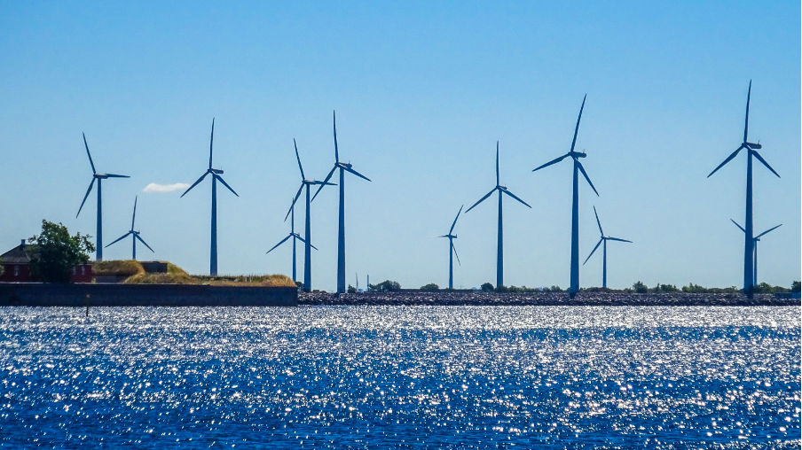

+++
title = "Examining Gender Disparities in Skills within the Energy Sector: Insights from LinkedIn Data"
authors = ["Konstantina Kalogianni"]
categories = ["Case Study"]
partner = ["LinkedIn"]
dev_partner = ["Organisation for Economic Co Operation and Development"]
tags = ["Gender", "Jobs and Development"]
date = 2025-06-27T00:00:00Z

+++

Analyzing gender differences in skills in the energy sector offers insights into disparities and facilitates better future planning. [The International Energy Agency (IEA)](https://www.oecd.org/en/topics/policy-areas/energy.html), a sister entity to the Organisation for Economic Co-operation and Development, utilized [LinkedIn](https://www.linkedin.com/) data for [the Gender and Energy Data Explorer](https://www.iea.org/data-and-statistics/data-tools/gender-and-energy-data-explorer?Topic=Skills&Indicator=Most+prominent+skills+by+region+and+category), a platform which provides information on gender gaps in the energy sector related to employment, wages, senior management, entrepreneurship, and innovation.

## Challenge

Women are pivotal in the energy landscape, serving not only as consumers but also as producers and influential decision-makers. Their engagement is critical in enhancing global energy security and facilitating transitions toward more sustainable practices. By participating actively in the energy sector, women help forge a future that is not only secure but also equitable and just for all stakeholders involved.

However, the collection of gender-specific data within the energy sector is fraught with challenges. The current landscape reveals a striking scarcity of gender-disaggregated data, coupled with a significant ambiguity in the definition of sectoral classifications related to energy. This shortfall hinders our understanding of women's roles and contributions, ultimately detrimentally affecting policy and decision-making processes which aim to enhance the diversity of skills and perspectives within the energy sector and attract top talent.

<figure align="center">
    
</figure>

## Solution

To better understand the gender gap in the energy sector, the IEA launched the Gender and Energy Data Explorer in 2022 to collect data related to gender, identify gaps, and track trends over time. The goal is to support the development of well-informed strategies and programs to assist governments in achieving their policy objectives.

To create a comprehensive gender dataset, the Gender and Energy Data Explorer compiles information from a variety of sources, including the LinkedIn dataset received through the Development Data Partnership.

This LinkedIn dataset covers the skills genome, a detailed representation of skills, and ranks the 10 most prominent skills by country gender and energy subsector. Currently, this dataset is the only available source capturing skills reported directly by LinkedIn members, offering a unique, self-identified perspective on how men and women present themselves in the energy industry workforce. 

Here are some of the key findings:

From 2017 to 2023, both men and women in the oil and gas and mining industry in Europe reported oil- and gas-related technical skills as their most prominent skills. However, women were more likely to report additional skills of a more generic nature, including software, language, and soft skills.

In the utilities sector in Europe, the difference in skills between men and women is more pronounced. Women predominantly report soft skills and proficiency in software tools as their most prominent competencies, while men are more likely to report skills related to renewable energy.

Within the United States’ utilities sector, men predominantly report technical skills specific to utilities, such as power generation and power plant operations. Conversely, women report a broader range of skills, including energy engineering competencies like utility industry expertise and general energy sector understanding, at higher rates than men.

## Impact

The LinkedIn skills dataset serves as a unique qualitative resource within the Gender and Energy Explorer. It provides insights into how LinkedIn members present themselves in the energy sector and the skills they emphasize to maintain relevance in the energy workforce.

The Gender and Energy Explorer aims to offer comprehensive and freely accessible data while providing powerful visualizations. The portal is designed to assist policymakers, researchers, and other users in their analyses and reports.

Skills shortages in the energy sector persist, indicating a lack of workers possessing the specific skills required by employers (World Energy Employment 2024, IEA). Analyzing gender differences in skills offers insights into how to attract new talent to a sector that requires qualified employees and also facilitates better planning for the future. The LinkedIn skills genome dataset enables this type of targeted, future-oriented analysis.

