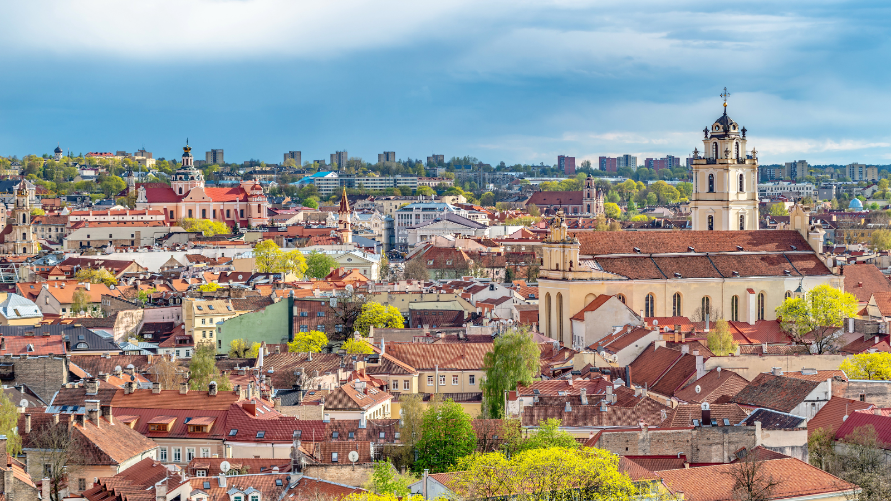
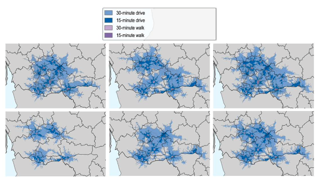

+++
title = "Facilitating Inter-Municipal Cooperation in Lithuania to Provide Better Access to Healthcare and Long-Term Care Services to Citizens"
authors = ["Margaux Vincent", "Antti Moisio" ]
categories = ["Case Study"]
partner = ["Mapbox"]
dev_partner = ["Organisation for Economic Co Operation and Development"]
tags = ["Health"]
links = ["https://www.oecd.org/en/publications/enabling-inter-municipal-shared-service-provision-in-lithuania_f8ad6859-en.html"]
date = 2024-12-02T00:00:00Z

+++

Lithuania is experiencing rapid demographic change, with the population both aging and significantly shrinking in recent decades. This trend has put pressure on the provision of public services such as health care, especially at the municipal level, and is expected to continue in the coming years. The Regional Development and Multilevel Governance (RDG) Division of the Centre for Entrepreneurship, SMEs, Regions and Cities (CFE) at the OECD, leveraged [Mapbox](https://www.mapbox.com/) Isochrone API data to show the access of citizens to healthcare and long-term care services in the Tauragė+ functional zone, Lithuania.

## Challenge

In Lithuania, the Tauragė+ functional zone is a voluntary and bottom-up initiative that has been established by the four municipalities of the area (Tauragė district municipality, Jurbarkas district municipality, Pagėgiai district municipality and Šilalė district municipality) with the aim to provide an integrated response to common problems.

Municipalities in Tauragė+ functional zone grapple with an ageing and shrinking population, necessitating the integration of tailored primary healthcare (PHC) and long-term care (LTC) services for the elderly. There are also difficulties such as a shortage of specialist doctors and other medical staff, and a lack of investment in healthcare premises. 

In addition, despite a good public transportation network in the Tauragė+ functional zone, the physical accessibility to PHC and LTC can be a challenge for patients due to geographical distances and fewer healthcare facilities.

<figure align="centre">
    
        

  

    </figcaption>
</figure>

## Solution

Through the Development Data Partnership, the RDG Division of the CFE at the OECD leveraged [Mapbox](https://www.mapbox.com/) Isochrone API data to understand physical accessibility to PHC and LTC services in the functional zone.

Using Mapbox API data enabled the OECD team to use isochrones, which accounted for the road network and actual typical travel times instead of straight-line distance isochrones. Utilising these isochrones, they identified the areas reachable from a facility within a set time frame for driving or walking. Overlaying these areas with the population grid gives an estimate of population access to these services.

The physical accessibility of services in the Tauragė+ functional zone, which depends mainly on travel time to the service units, is depicted in Figure 1. Both walking and driving distances are measured, showing that accessibility to public health care is complemented by the private PHC service provision, especially in Tauragė district municipality, whereas in the other three municipalities, the public health provision has at least as good or even better coverage than the private sector. As for the LTC, private sector provision has importance from a physical accessibility perspective, especially in Pagėgiai municipality and Šilalė district municipality. The maps also show that there are some specific areas in Tauragė+ functional zone which are not covered by either public or private health or LTC services.
 
<figure align="centre">
    
        

Figure 1:  Travel time to care in Tauragė+ functional zone: physical accessibility of PHC and LTC
Note: Note: Private PHC units (top left panel); public PHC units (top centre panel); public and private PHC units (top right panel); private LTC units (bottom left panel); public LTC units (bottom centre panel); public and private LTC units (bottom right panel). Grey colour represents areas where healthcare/LTC facilities are far from more than 30-minute drive.
  

    </figcaption>
</figure>

## Impact

To ensure efficient PHC, the team provided two roadmaps with concrete actions to enhance IMC in the area. This notably requires to improve sharing comparable information and data about PHC and LTC services. To improve and provide more equal availability and accessibility of PHC services, municipalities can also develop mobile services (e.g., improved transport services, minibuses touring municipalities in the region, bringing selected services to people living in remote areas).