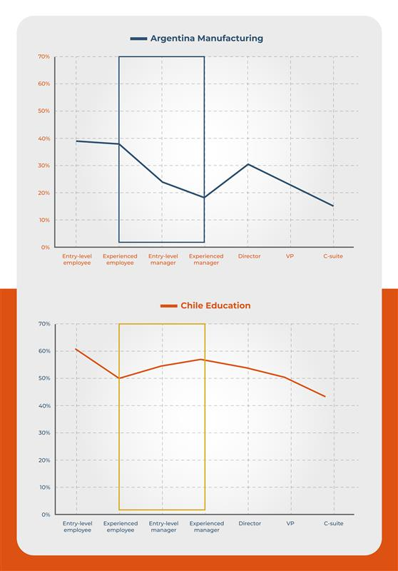

+++
title = "Fixing the Broken Rung: How Data Can Help Advance Women’s Careers in Latin America and the Caribbean"
authors = ["Patricia Yanez-Pagans", "Jimena Serrano", "Mattia Chiapello", "Magdalena Barafani","Casey Weston", "Silvia Lara", "Alejandra Barrientos"]
categories = ["Case Study"]
partner = ["LinkedIn"]
dev_partner = ["IDB Invest"]
tags = ["Gender", "Jobs and Development"]
links = ["https://idbinvest.org/en/blog/gender/fixing-broken-rung-how-data-can-help-advance-womens-careers-latin-america-and-caribbean"]
date = 2026-01-15T00:00:00Z
+++

In Latin America and the Caribbean (LAC), the greatest disruption in women’s career progression occurs during the transition into managerial roles. A collaboration between [IDB Invest](https://idbinvest.org/en) and [LinkedIn](https://www.linkedin.com), within the framework of the Development Data Partnership, uses large-scale labor-market data to identify where women’s participation declines and what barriers exist across sectors and career stages.

## Challenge

While it is widely documented that women face challenges in advancing their professional careers, identifying the critical moment when women’s participation declines remains a key issue.

Analyzing career progression across specific roles, from entry-level to managerial and executive positions, requires data that can capture different levels of the career ladder and allow comparisons across sectors and countries. This type of information is crucial for developing public policies and guiding private sector efforts to support women’s career advancement.

<figure style="text-align: center;">
  
  <figcaption style="text-align: center; font-size: 0.9em; color: #555;">Photo Credit: IDB Invest</figcaption>
</figure>

## Solution

Through the Development Data Partnership, IDB Invest leverages aggregated [LinkedIn data](https://economicgraph.linkedin.com) for LAC to reconstruct what happens at each step toward leadership positions, identifying where women’s participation falls most sharply and how these patterns vary by sector. The findings offer timely insights to inform initiatives aimed at advancing women's careers.  

The analysis of LinkedIn data, focused on 18 countries across the LAC region, reveals that women represent 49% of entry-level positions. However, their share drops to 35% in managerial roles and barely reaches 26% in senior executive positions. 

The countries included in the analysis are: Argentina, Barbados, Bolivia, Brazil, Chile, Colombia, Costa Rica, Dominican Republic, Ecuador, Guatemala, Jamaica, Mexico, Panama, Peru, Trinidad and Tobago, Uruguay, and Venezuela.

It is important to note that LinkedIn’s aggregated data may not comprehensively represent the entire labor market. However, the platform is highly valuable for making relative comparisons between countries and for examining specific rungs of the career ladder – from entry-level to executive roles.

Consistent with prior literature ([Inter-American Development Bank, 2024](https://publications.iadb.org/es/publications/english/viewer/Expanding-Opportunities-Policies-for-Gender-Equality-and-Inclusion.pdf?_gl=1*1yqg74y*_ga*MjA1MjE1NjEyNC4xNzY1MjkxMzYy*_ga_T7MXBVEPG7*czE3NjU2MTIyMTYkbzIkZzEkdDE3NjU2MTM0MzQkajYwJGwwJGgw)), the evidence indicates that not all sectors behave uniformly. Women remain underrepresented in leadership roles in high-income sectors such as oil, gas, and mining, as well as in the sectors of technology, information, and media. In technology, women hold 40% of entry-level jobs but only 17% of executive roles. 

Women’s leadership roles are concentrated in service-oriented industries, particularly in health, education, and consumer services. In these sectors exhibit high female representation across all career stages. For example, in the health sector, women hold 68% of entry-level positions but still only 39% of top management posts.

<figure style="text-align: center;">
  
  <figcaption style="text-align: center; font-size: 0.9em; color: #555;">Figure 1: Share of Women Within Each Role and Specific Sector
Source: Authors' own analysis based on LinkedIn data. Simple average of a subset of eight countries whose data is representative of most of their industries: Argentina, Brazil, Chile, Colombia, Costa Rica, Mexico, Panama, and Uruguay.
</figcaption>
</figure>

Additionally, the analysis goes deeper by industry and country to better understand specific dynamics. For example, in the manufacturing sector in Argentina, women are slightly underrepresented in entry level employee positions (approximately 40%) and when moving to entry-level leadership positions, there is a significant drop in female representation (around 24%). In contrast, the progression in the education sector in Chile is relatively flat, with women being overrepresented in earlier stages of career progression and then with a gradual decline from entry-level to leadership positions.

<figure style="text-align: center;">
  
  <figcaption style="text-align: center; font-size: 0.9em; color: #555;">Figure 2: Share of Women within each role in selected industries in Argentina and Chile
Source: Authors' own elaboration analysis based on LinkedIn data.
</figcaption>
</figure>

## Impact

The goal is to identify these patterns and, more importantly, understand the factors behind them, to design better-targeted policies that remove barriers and accelerate women’s advancement into decision-making positions.

Supporting women’s advancement into managerial roles and encouraging them to transfer their skills to high-growth sectors fosters opportunities for women and serves as a key strategy to expand economic growth across the region.  

While LinkedIn data serves as a critical input for designing public policies tailored to each country, sector, and career stage, it also helps the private sector identify where bottlenecks occur and adopt data-driven measures.

In addition to this analysis, IDB Invest has developed specific tools to help companies advance women’s leadership, including “[A Roadmap to Advance Women’s Leadership in Latin America and the Caribbean](https://www.idbinvest.org/en/publications/roadmap-womens-leadership-development-latin-america-and-caribbean?_ga=2.263320520.579527197.1765612216-2052156124.1765291362)”. This toolkit guides firms in implementing effective programs through senior management commitment, clear internal targets, and training that combines mentoring and coaching, all supported by monitoring and evaluation.

As we deepen our analysis and understanding of the women’s career landscape across the LAC region, we will continue to advise and support our private sector partners, drawing on our experience to deliver even more tailored, data driven solutions.

