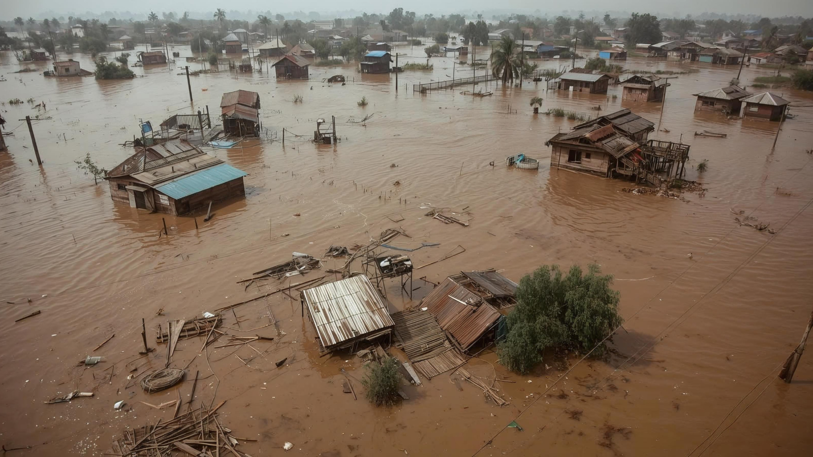

+++
title = "From Flood Data to Better Decisions: How Data Partnerships Support Disaster Risk Reduction"
authors = ["Development Data Partnership Team"]
categories = ["Case Study"]
partner = ["Jba"]
dev_partner = ["Inter American Development Bank", "World Bank"]
tags = ["Disaster Risk Management"]
date = 2026-10-06T00:00:00Z
+++

Across the world, communities face natural hazards such as floods, storms, droughts and earthquakes. When people, infrastructure and economic activity are exposed and vulnerable, these hazards can cause deaths, damage livelihoods and disrupt essential services. Understanding where risks are concentrated is therefore an important step toward reducing their effects.

Observed each year on October 13, the International Day for Disaster Risk Reduction draws attention to efforts to prevent new risks, reduce existing risks and strengthen resilience. These efforts depend on decisions about where to invest, what infrastructure to protect and which communities require the most support.

Data can help governments and development organizations make these decisions. Information about the location, extent and severity of hazards can be combined with data on communities, buildings, infrastructure and economic activity. This allows decision makers to identify exposed areas, anticipate potential losses and prioritize measures that can reduce vulnerability.

The Development Data Partnership brings together development organizations and [JBA Global Resilience](https://jbagr.com)(JBA) to examine flood risks and support disaster risk reduction. The following projects show how these data have been combined with other sources and analytical methods to support disaster risk reduction in Rwanda, Costa Rica and Egypt.

<figure style="text-align: center;">
  
</figure>

## Prioritizing sustainable landscape investments in Rwanda

Flooding is one of the most significant natural hazards affecting people, livelihoods and infrastructure in Rwanda. It also forms part of a wider set of environmental and economic challenges, including land degradation. To support the Rwanda Sustainable Landscape Management Investment Framework, the World Bank used [JBA’s Global Flood Maps](https://jbagr.com/digital-tools/global-flood-maps) to assess flood hazards and prioritize areas for sustainable landscape management and ecosystem restoration interventions.

The maps provided detailed information on flood extent and depth across multiple return periods. The assessment found that the highest flood risks to people were concentrated in the far north of Western Province, particularly around Rubavu and near Volcanoes National Park. For infrastructure, the northern Kivu catchment faced the greatest flood risk. These findings helped direct attention and resources under the investment framework toward areas with the greatest needs and potential for impact. Learn more [here](https://datapartnership.org/updates/leveraging-jba-data-for-flood-risk-assessment-in-rwanda-sustainable-landscape-management-framework).

## Strengthening road infrastructure resilience in Costa Rica 

Costa Rica’s National Route 35 connects the Central Valley with the northern region of San Carlos and forms part of the Mesoamerican International Highway Network. As part of its assessment of the Bernardo Soto to Florencia section, the Inter-American Development Bank examined how climate change could affect the performance, safety and resilience of this economically important road corridor.

The study used JBA’s high-resolution Global Flood Maps alongside hydrological, hydraulic and geospatial analyses, including flood susceptibility mapping. Together, these sources helped identify road sections exposed to flooding and prioritize areas requiring greater attention in infrastructure design. The analysis also supported efforts to identify, anticipate, prevent and mitigate potential project-related impacts on communities. Where necessary, it informed refinements to the hydraulic design of specific sections and elements of the corridor. Find out more [here](https://datapartnership.org/updates/mapping-flood-hazard-to-strengthen-road-infrastructure-resilience-in-costa-rica).

## Assessing flood risks and economic impacts in Egypt

Egypt’s coastal cities face flooding associated with sea level rise as well as pluvial flooding caused by intense rainfall. The World Bank studied the potential physical and economic effects of severe flooding in Alexandria, Damietta and Port Said. JBA’s flood hazard layers were combined with a detailed exposure dataset estimating the replacement value of residential and nonresidential buildings in each city.

The study used a computable general equilibrium model calibrated for Egypt to examine direct losses from damaged capital as well as indirect and spillover effects across sectors and regions. It found that flood-related output losses could extend beyond affected areas through supply chains and regional economic connections. The findings pointed to the need for stronger management of coastal flooding in Port Said and Damietta, while improved stormwater management and preparedness for extreme rainfall were more important for Alexandria. Discover more [here](https://datapartnership.org/updates/mapping-flood-risk-and-economic-impacts-in-egypt-coastal-cities).

## From flood data to risk reduction

These projects demonstrate how private-sector data can complement public data, local knowledge and project-specific analysis. Consistent flood extent and depth information can help fill data gaps, support comparisons across locations and provide a more detailed picture of where people, infrastructure and economic activity are exposed.

Data alone cannot reduce disaster losses. Its value lies in how it is combined with technical expertise and translated into decisions - from prioritizing landscape restoration to strengthening road design and directing urban resilience investments. Collaboration with private-sector data providers can give governments and development organizations additional insights to understand risks and act before hazards become disasters.

