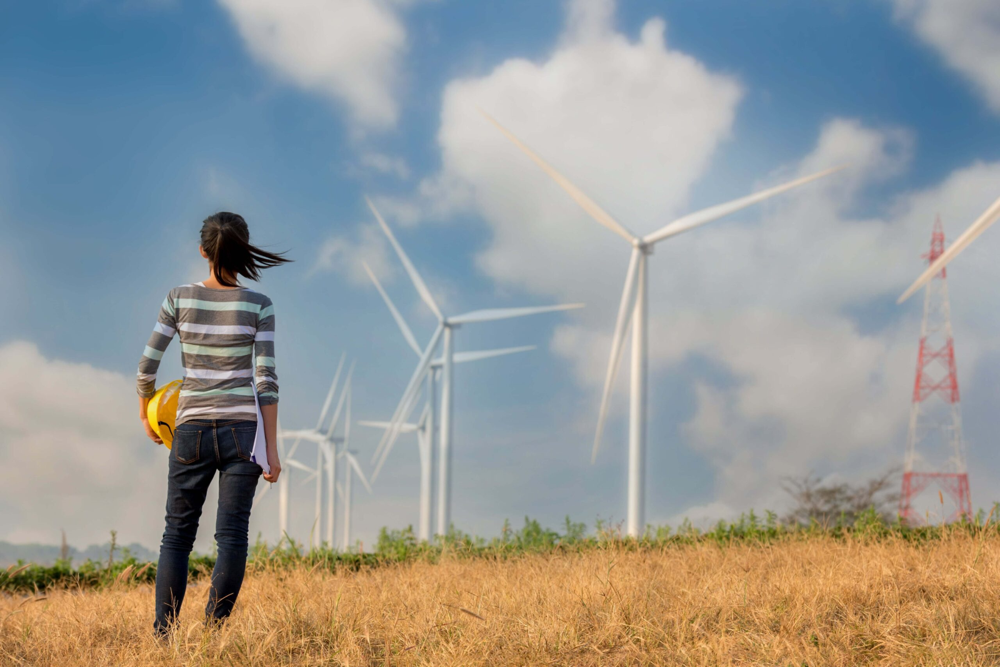

+++
date = 2023-06-08T00:00:00.000+00:00
title = "Green Jobs for Women and Diverse Groups Help Promote Equality and Climate Resilience"
authors = ["Monserrat Bustelo","Karen Martinez","Agustina Suaya", "Sofia Gonzalez Prieto"]
dev_partner = ["Inter-American Development Bank"]
partner= ["LinkedIn"]
tags = ["Climate Change", "Jobs and Development", "Gender"]
links = [
    "https://publications.iadb.org/en/gender-and-inclusion-green-agenda-where-are-we-and-how-move-forward",
    "https://blogs.iadb.org/igualdad/es/empleos-verdes-oportunidad-equidad-de-genero",
]
thumbnail = "green-jobs-for-women-and-diverse-groups-help-promote-equality-and-climate-resilience-thumbnail.png"
+++

The role of women and diverse populations, including indigenous peoples, persons of African descent, persons with disabilities, and LGBTQ+ persons, is crucial in driving the decarbonization process and developing climate change resilience strategies. However, gender and inclusion gaps exist in the distribution of current and projected green jobs. Leveraging data from [LinkedIn](http://www.linkedin.com), the Inter-American Development Bank Group's [Gender and Diversity Knowledge Initiative (GDLab)](https://gdlab.iadb.org/en) produced a [policy brief](http://dx.doi.org/10.18235/0004285) on the opportunities and challenges facing women and diverse groups in Latin America and the Caribbean (LAC).

## Challenge

The economic repercussions of climate change are devastating. In Latin America and the Caribbean, current carbon emission trends threaten inevitable and irreversible changes to the environment that could cost in the region of [US$100 billion annually by 2050 and the loss of up to 2.5 million jobs by 2030](https://publications.iadb.org/es/publicacion/16324/el-desafio-climatico-y-de-desarrollo-en-america-latina-y-el-caribe-opciones-para).

The transition toward a future of zero net emissions is not only a global commitment to stabilize climate change, but also represents an important opportunity for job creation in the region. The creation of green jobs – that is, quality jobs that directly contribute to environmental stability, either by producing environmental goods or making more efficient use of natural resources [^1] generates opportunities to transform the economy, orienting it towards environmentally sustainable solutions and reducing the economic and environmental costs.

Women and diverse population groups play a decisive role in the decarbonization process and in developing effective climate change resilience strategies. Access to green jobs not only presents an opportunity to drive a greener and more sustainable transition but also holds immense potential for empowering these population groups.

However, unless existing structural inequalities are addressed in the region, the new jobs created by decarbonization programs will be in sectors that are [currently dominated by men](https://publications.iadb.org/es/publicacion/16324/el-desafio-climatico-y-de-desarrollo-en-america-latina-y-el-caribe-opciones-para). To improve the opportunities available to women and diverse groups in positions related to green jobs, a broad range of actions must be taken, including the development of the skills needed to do these jobs.

The production of disaggregated data and [rigorous research](https://gdlab.iadb.org/en/call) on the opportunities and challenges facing women and diverse groups in LAC will be key to informing a transition that leaves no one behind.

## Solution

Through the Development Data Partnership’s support, the IDB Group's [Gender and Diversity Knowledge Initiative (GDLab)](https://gdlab.iadb.org/en) conducted a quantitative analysis utilizing LinkedIn data of (i) green hiring rates, (ii) growth of green skills, and (iii) green skills penetration, for its [policy brief on the green economy with a gender and diversity perspective](http://dx.doi.org/10.18235/0004285).

<figure align="center">
    
    <figcaption>
        
 Photo Credit: IDB
        

    </figcaption>
</figure>

This analysis was broken down by gender, at the regional and country level, and over time.

Globally, data from LinkedIn suggested the presence of a gender gap in their users’ reporting of green talent. In 2021 for every 100 men on the platform who reported green talent, only 62 women reported the same.

Here are the key findings about the LAC region:

- The data for seven Latin American and Caribbean countries showed that the gap in the region was slightly larger than in the rest of the world.

- On average in these countries, for every 100 men who reported having green talent, there were 58 women. This indicator improved by only 2% in 6 years, from 2015 to 2021.

- Colombia and Costa Rica registered greater progress. On average, between 2015 and 2021, for every 100 men with green talent, Colombia went from an annual average of 64 to 68 women (a growth of 5.92%), while Costa Rica went from an annual average of 58 to 61 women with green talent (an increase of 4.74%).

## Impact

To ensure that the creation of green jobs in the region is inclusive and participatory, progress needs to be made in the collection of data disaggregated by gender and diverse groups of the population.

The rich LinkedIn data of (i) green hiring rates, (ii) growth of green skills, and (iii) green skills penetration provided crucial evidence for the GDLab to understand future trends and opportunities in the green economy for women in the region, contrast them with those in the rest of the world, and also identify the challenges that need to be addressed to ensure women's participation.

This data is important for international development organizations and governments to implement effective policies to increase female representation in green jobs and unlock huge untapped potential for the green transition.

[^1]: ILO, “World Employment and Social Outlook 2018: Greening with Jobs,” Report (International Labour Organization, May 14, 2018), http://www.ilo.org/global/publications/books/WCMS_628654/lang--en/index.htm
