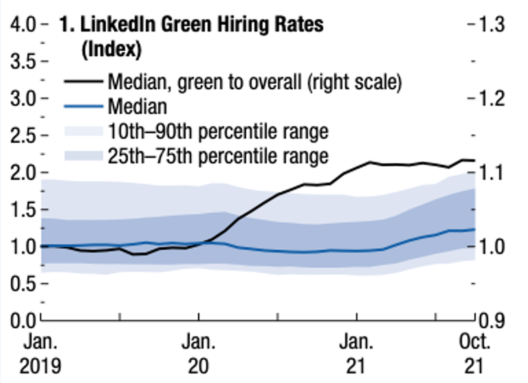

+++
title = "A Greener Labor Market: Employment, Policies, and Economic Transformation"
authors = ["John Bluedorn", "Niels-Jakob Hansen", "Diaa Noureldin", " Ippei Shibata", "Marina Mendes Tavares", "Jorge Alvarez"]
categories = ["Case Study"]
partner = ["LinkedIn"]
dev_partner = "International Monetary Fund"
tags = ["Jobs and Development"]
links = ["https://www.elibrary.imf.org/display/book/9781616359423/CH003.xml"] 
date = 2024-03-05T00:00:00Z
+++

How green is the labor market? Do workers have the skills needed for greener employment? The International Monetary Fund's Research Department utilized [LinkedIn](https://economicgraph.linkedin.com/) data to analyze global green employment trends.

## Challenge

The COVID-19 pandemic has been a strong external shock to the global economy. Lockdowns and decelerated economic activity have significantly affected the international job market, with substantial jumps in unemployment observed across various jurisdictions. While countries have been increasingly calling for pursuing green measures of economic recovery, scarcity of data has prevented effective monitoring of global transitions to low-carbon economies and their impacts on employment.

Official labor force surveys can provide an in-depth picture of the evolution of greener employment. However, these surveys are usually published with lags, making it challenging to track whether the ongoing COVID-19 recovery has accelerated or decelerated labor market greening. High-frequency data from online job networking and search platforms can help provide timelier insights.

<figure align="center"">
    
</figure>

## Solution

Through the Development Data Partnership, the International Monetary Fund's Research Department accessed data from [LinkedIn](www.linkedin.com) on green hiring rates and the growth of green skills. 

Recent patterns in hiring rates suggest greener jobs were relatively more resilient throughout 2020. Using self-reported worker profiles and expert judgments, LinkedIn identified green skills and categorized workers according to their "green talents."

Using information on workers' employment changes, gross hiring rate indices can be computed to follow short-term hiring fluctuations. Hiring rates for green talent workers were better than those for all jobs in the early months of the pandemic, and there was an uptick over 2021 as the recovery strengthened (Figure 1).

<figure align="center">
    

<figcaption> 
 Figure 1: Cross-Country Evolution of Green Hiring Rates and Job Postings 
</figcaption>

 
 </figure>

The hiring rate is a measure of hires normalized by LinkedIn membership. It is computed as the percentage of LinkedIn members who added a new employer at the same time their job began, divided by the total number of LinkedIn members in the corresponding location. The green hiring rate is computed considering only members classified as green talent. Workers are considered green talent if they have explicitly added at least one green skill to their profile, or are occupied in a green occupation, or both.

## Impact

As the green economic transformation has been taking place, it is vital to understand how this trend has led to changes in employment. The rich and timely [LinkedIn](https://economicgraph.linkedin.com/) data on green hiring rates and the growth of green skills enabled the IMF team to provide an in-depth picture of the evolution of greener employment. This can assist the IMF in strengthening its surveillance of global green employment growth, as well as contributing to the enhancement of capacity development and policy advice in this area. 

Additionally, this data can help IMF staff better advise country authorities on green job policies and achieving sustainable economic growth in the post-COVID-19 era.
