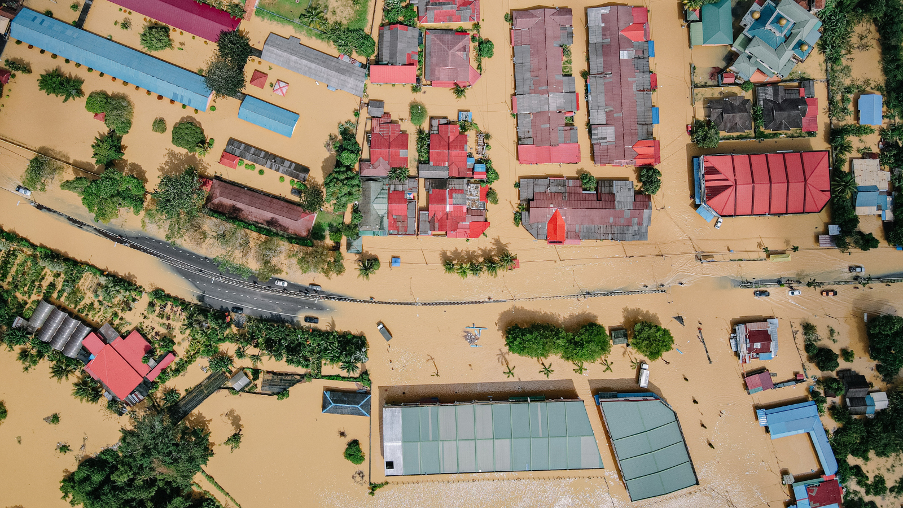
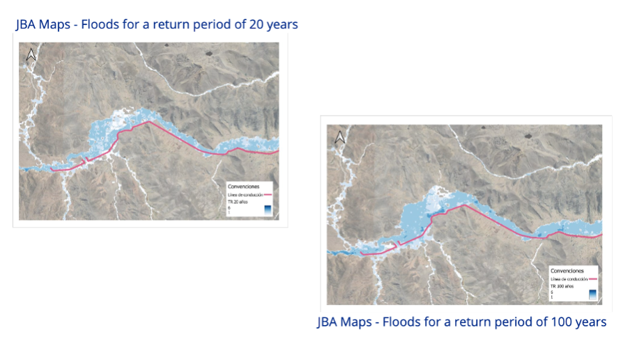

+++
title = "Harnessing Data to Build Resilience: Spotlight on Flood Risk Projects with JBA"
authors = ["Kwok Kin Lee"]
categories = ["Case Study"]
partner = ["Jba"]
dev_partner = ["World Bank", "Asian Development Bank", "Inter American Development Bank"]
tags = ["Disaster Risk Management"]
date = 2025-10-07T00:00:00Z
+++

Extreme weather events are occurring with greater intensity and frequency around the world. From devastating floods to prolonged droughts and heatwaves, vulnerable communities are facing increasing risks that threaten lives, livelihoods, and economic stability. Disaster risk reduction has become more vital than ever—not only to respond to emergencies, but to build long-term resilience and safeguard development gains.

One way to achieve this is by leveraging data. On this year’s International Day for Disaster Risk Reduction (October 13), we highlight how harnessing data can help countries better prepare for floods. Across the globe, our data projects with [JBA Global Resilience (JBA)](https://jbagr.com/) have provided support for governments and development partners to strengthen resilience, safeguard livelihoods, and plan more effectively for the future.

[JBA’s Global Flood Maps](https://jbagr.com/digital-tools/global-flood-maps/) provide high-resolution flood hazard data worldwide. This empowers policymakers and communities to understand vulnerabilities, prioritize investments, and design evidence-based strategies to protect people and economies.

<figure style="text-align: center;">
  
</figure>

**Strengthening Climate and Economic Resilience in the Western Balkans**

In the Western Balkans, comprising Albania, Bosnia and Herzegovina, Kosovo, Montenegro, North Macedonia, and Serbia, the World Bank collaborated with JBA to assess the economic impacts of flooding. The analysis revealed that riverine floods could cause GDP losses of up to 15% by 2050 in countries like Serbia. Vulnerability hotspots—such as municipalities along the Danube and Sava rivers—were identified, enabling targeted policy recommendations such as investing in regional early warning systems to monitor and forecast natural hazards in high-risk areas, as well as implementing disaster risk management plans to safeguard both communities and economic stability.  [Discover more](https://datapartnership.org/updates/assessing-how-floods-affect-economic-growththe-case-of-the-western-balkans/).

**Understanding Flood-Driven Displacement in Thailand**

The Asian Development Bank combined JBA’s Global Flood Maps with GPS mobility data and wealth indices to study how floods drive human displacement in Thailand. Results revealed that lower-income groups are especially vulnerable, often living outside flood-defended areas. This study’s methodology can be used in other flood-prone regions to aid proactive disaster planning. These insights can inform decisions on safer residential zoning, emergency response efforts, and equitable infrastructure investment. [Find out more](https://datapartnership.org/updates/mapping-vulnerability-and-mobility-leveraging-digital-data-to-inform-flood-displacement-and-resilience-planning/).

**Building Resilient Infrastructure in Peru**

In Peru’s Puno region, the Inter-American Development Bank (IDB) used JBA’s Global Flood Maps to identify flood-prone areas before launching a major infrastructure project. The $425 million initiative aims to improve water and sanitation services in the region, benefiting over 500,000 residents who have waited more than 15 years for such upgrades. JBA’s maps helped the team visualize flood risks for return periods of 20 and 100 years (maps below). This is especially important because the tool allows them to see geospatially how, at different return periods, areas are more exposed and vulnerable to flooding. This not only protects essential services but also reduces community vulnerability and supports long-term development. [Read more](https://datapartnership.org/updates/assessing-flood-risks-in-peru/).

<figure style="text-align: center;">
  
</figure>

These projects in the Western Balkans, Thailand, and Peru demonstrate the transformative power of data partnerships in reducing disaster risk. By combining global flood hazard data with socioeconomic, mobility, and infrastructure information, we are shifting from reactive crisis response to proactive disaster risk reduction—saving lives and building resilience. 

As the frequency and severity of natural hazards increase, prioritizing investments in data-driven resilience strategies becomes crucial. This is no longer optional; it is necessary to effectively prepare for, respond to, and recover from such threats, ultimately safeguarding vulnerable communities and critical infrastructure. 

