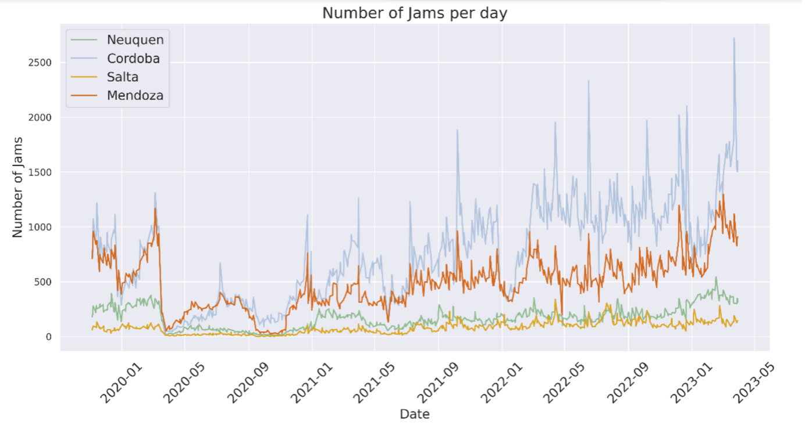
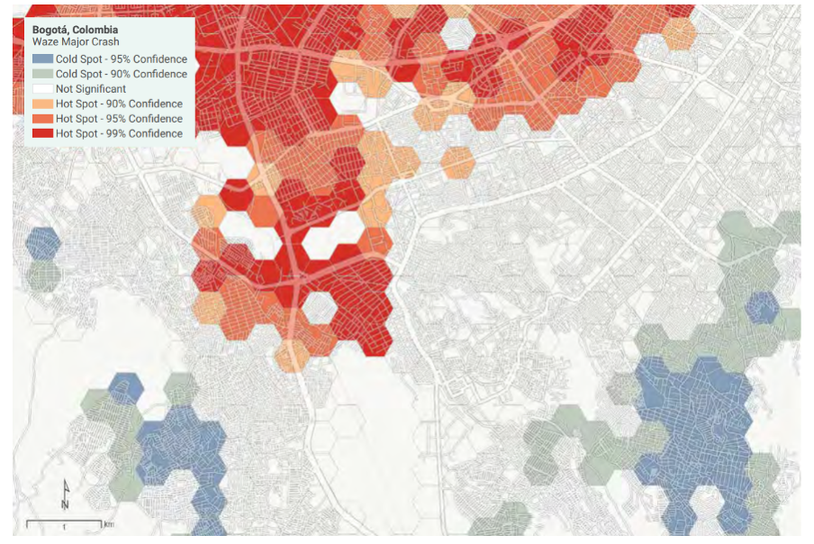

+++
title = "Harnessing Data to Transform City Planning and Management"
authors = ["Kwok Kin Lee"]
categories = ["Case Study"]
partner = ["Waze"]
dev_partner = ["World Bank"]
tags = ["Transport", "Urban Development"]
date = ["2025-04-27T00:00:00Z"]

+++

With the ongoing growth of the global population, cities are increasingly emerging as hubs of economic activity and innovation. However, if urbanization is not well-planned, it can result in a wide range of problems such as traffic jams.

Traffic congestion on road networks adversely affects sustainability and the economy in many cities across the world in different ways including worsening air pollution, hindering efficient transportation, and increasing operational costs and reducing productivity for businesses.

Effective traffic management enables road users to steer clear of congested areas, thereby reducing both pollutant concentration and time wasted in traffic. Through the Development Data Partnership, [Waze for Cities](https://www.waze.com/wazeforcities/) provides valuable data sets for international organizations, which can be utilized to develop smart and sustainable transportation solutions in urban environments.

For instance, the World Bank’s Poverty and Equity Team working in the South Caucasus, with financial support from Sweden, conducted an analysis of the sources and impacts of air pollution in Tbilisi, the capital of Georgia, to inform policymaking.

<figure align="center">
    
</figure>

As part of [this study](https://datapartnership.org/updates/role-of-traffic-related-emissions-on-air-pollution-in-tbilisi/), the team utilized traffic data from Waze for Cities through the Development Data Partnership, which was essential for understanding the extent of pollution in Tbilisi. Transportation is a major source of emissions within the city, so knowing where and when traffic congestion occurred helped the team create exposure maps. This information helped the team understand how pollution levels changed across different areas of the city as traffic patterns shifted.

The data was collected from an aggregation of Waze app users' locations and speed, covering the period from 2019 to 2021. This dataset had information on speed and waiting times for each road segment in Tbilisi at 5-minute intervals.

The team found that traffic jams were more concentrated near the city center. As the distance from the city center increased, the intensity of congestion decreased. [This study](https://datapartnership.org/updates/role-of-traffic-related-emissions-on-air-pollution-in-tbilisi/) also revealed a significant link between traffic congestion and air pollution. As the frequency of traffic jam days rose, there was a corresponding and consistent increase in air pollution levels.

To tackle air pollution in Tbilisi, the team recommended policies such as adopting carbon pricing to reduce the number of vehicles on roads and incentivizing public transport. Read more [here](https://datapartnership.org/updates/role-of-traffic-related-emissions-on-air-pollution-in-tbilisi/).

Traffic congestion not only contributes to air pollution but also restricts access to social and economic opportunities, diminishes productivity, and adversely affects the quality of life of citizens.

The World Bank’s Transport Global Practice in Latin America utilized data from Waze for Cities to evaluate mobility patterns within the Metropolitan Areas of Córdoba, Mendoza, Salta, and Neuquén-Cipolletti, being mid-sized cities in Argentina. Over recent decades, these areas have experienced disorderly urban growth, leading to increased traffic congestion that compromises road safety and environmental sustainability.

By analyzing data from Waze for Cities spanning from 2019 to 2023, the team observed an increase in daily traffic jams across all four metropolitan areas. While traffic jams decreased during the COVID-19 pandemic in 2020, they have been steadily increasing since the end of 2021. This trend was consistent across cities, with some variations in the intensity and spatial distribution of congestion.

<figure align="centre">
    
        

Figure 1: [Number of daily traffic jams, Nov 2019 to May 2023. The team’s own calculation based on Waze for Cities data.](https://datapartnership.org/updates/traffic-congestion-argentina/)
  

    </figcaption>
</figure>

The insights gained from the analysis of traffic congestion using Waze for Cities data carry significant implications for urban mobility planning. The findings underscore the urgent need for enhanced public transport and cycling infrastructure to offer viable alternatives to car travel. By concentrating on alleviating congestion on primary access routes and improving job accessibility through sustainable transport modes, urban areas can enhance overall mobility and lessen car dependency. Learn more [here](https://datapartnership.org/updates/traffic-congestion-argentina/).

Apart from the issue of traffic congestion, road safety is another major concern for cities and is crucial to protect people’s lives by preventing road fatalities and injuries. Waze for Cities supported a [project](https://datapartnership.org/updates/detecting-urban-clues-for-road-safety/) aimed at improving road safety, a key aspect of sustainable urban development, in Bogotá, Colombia. [The Detecting Urban Clues for Road Safety: Leveraging Big Data and Machine Learning report](https://documents1.worldbank.org/curated/en/099200002152227482/pdf/P170812026cd2b0550acec0ef8165301833.pdf) provided specific guidance on how big data and machine learning can be leveraged in road safety analysis to identify opportunities to reduce crashes. This publication used data from sources including Waze for Cities.

In the case study of Bogotá, Colombia, a machine-learning-based framework was implemented to assess road safety, employing two models to evaluate risks in selected areas. Researchers compared their road risk predictions with crash data from Waze for Cities, which allows users to report road crashes via mobile applications.

<figure align="centre">
    
        

Figure 2: [Hotspot analysis of major crashes reported by Waze application users](https://datapartnership.org/updates/detecting-urban-clues-for-road-safety/)
  

    </figcaption>
</figure>

The findings demonstrated that the framework accurately identified low-risk road segments 70% of the time and high-risk segments 75% of the time, showcasing the potential of big data and machine learning to enhance road safety analysis. Read more about the project [here](https://datapartnership.org/updates/detecting-urban-clues-for-road-safety/).

To conclude, these three studies illustrate how data plays an essential role in alleviating traffic congestion, its associated air pollution, and bolstering road safety. The support of [Waze for Cities](https://www.waze.com/wazeforcities/) is crucial as it equips researchers, city planners, and urban developers with insightful data analytics. This support informs strategic city planning and management, enabling a more effective allocation of resources and infrastructure investments for sustainable development.

