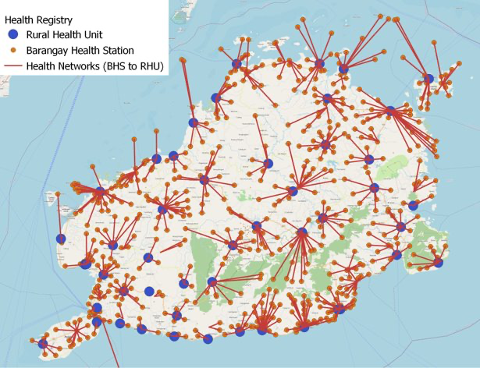
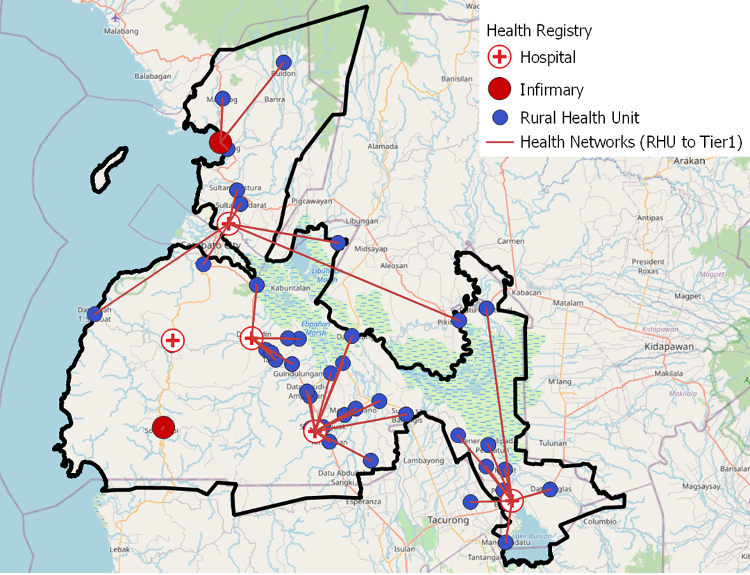
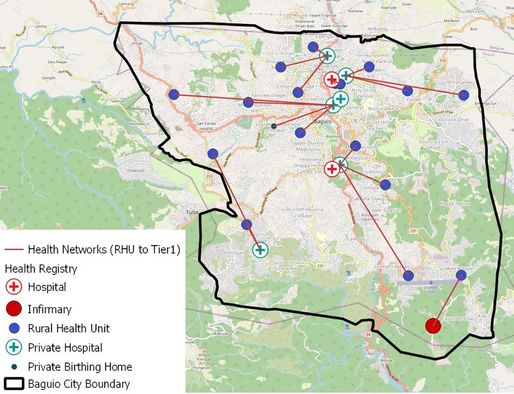

+++
title = "Health Planning in the Philippines"
authors = ["Andres Chamorro"]
categories = ["Case Study"]
partner = ["Mapbox"]
dev_partner = ["World Bank"]
tags = ["Health"]
date = 2025-05-15T00:00:00Z
+++

Access to health services is essential. However, in the Philippines, the delivery of health services is highly fragmented across different levels of administration. Leveraging [the Mapbox Matrix API](https://www.mapbox.com/matrix-api), the World Bank Health team calculated people’s access to health services. The team’s work was presented to staff from the health ministry in the Philippines to identify optimal ways to register citizens with health care providers.

## Challenge

The delivery of health services in the Philippines is highly fragmented across different levels of administration. Health systems are autonomously run by local government units (LGUs), whether they are barangays (the most local level), cities, municipalities, or provinces. Historically, these systems have been poorly coordinated, leading to overcrowded hospitals and clinics in some locations and varying health outcomes across regions.

Actions are underway to promote a more integrated approach to service delivery. The government has mandated the formation of province and city-wide healthcare provider networks. These systems shall integrate all public facilities and coordinate referrals across different levels of care, from local health stations to rural clinics and primary and emergency care. The World Bank Health team was asked to advise on the design of these systems, starting with a comprehensive mapping of existing health facilities and technical analysis to identify catchment areas and referral pathways.

<figure align="centre">
    
        

Photo: World Bank
  

    </figcaption>
</figure>

## Solution

The team conducted a geospatial analysis to advise on the following key questions that could inform a more integrated healthcare system, starting with three LGUs (Bohol, Baguio City, and Maguindanao).

1.	Where are the existing healthcare facilities?

First, we mapped all the health sites from the Department of Health’s official registry.

2.	How well are people connected to different health services?

We used [the Mapbox Matrix API](https://www.mapbox.com/matrix-api) to calculate people’s access to health services. The Mapbox data is proprietary but was facilitated through the Development Data Partnership. The API returns travel times from origin and destination pairs, according to different modes of transportation (for example, driving in traffic or walking). The API provided an efficient way to query travel time estimates without having to compile and refine road networks and create naive assumptions for travel speed.

In our assessment, we used the API to record the time it takes to travel from every 1km grid cell in the region to the nearest health clinic or hospital. This method is a big improvement over estimating access with straight distances. The flexibility of the API with regards to transport modes proved to yield more realistic travel time estimates than traditional GIS methods (road network analysis or friction surfacing).

3.	How are health facilities connected to each other?

We classified health facilities according to different service levels: tier 3 (barangay health stations), tier 2 (rural health units, municipal health offices, birthing homes), tier 1 (hospitals, infirmaries). Then we used the same method of travel time analysis to determine networks between facilities from each tier. These networks were displayed in maps and an Excel table. This table showed how the networks were organized in a hierarchy, along with details about population catchment and capacity.

The most important requirement for the analysis is a registry of geo-coded health facilities with good attribute information to categorize different tiers of health service.  After the health team provided registries for the three provinces, it took a week to develop an analytical workflow to query the API and produce initial results, with several iterations and consultations occurring over a few months.

<figure align="center">
     
</figure>

<figure align="center">
     
</figure>

<figure align="center">
     
</figure>

## Impact

The maps and tables were presented to staff from the health ministry for the three local government units in the Philippines. The work was well received and helped frame discussions around optimal ways to register citizens with healthcare providers. The question is, should referrals be based solely on proximity and travel time? In answer to this,  the methodology presented cannot be taken as a guaranteed solution on its own as there are multiple factors that affect efficiency and equity in health care delivery.  Nonetheless, the initial mapping serves as a valuable starting point and hopefully marks the first of many analyses aimed at developing a more integrated healthcare system in the Philippines.

