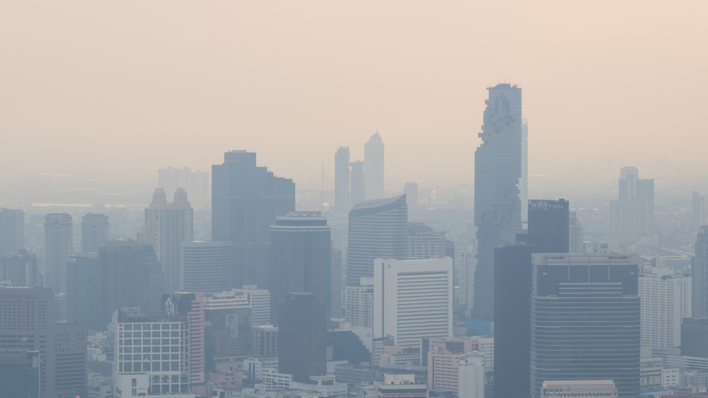
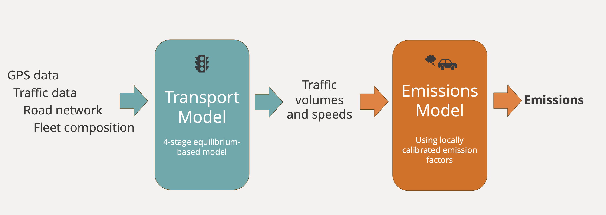

+++
title = "Helping Southeast Asian Cities Improve Air Quality with Data"
authors = ["Sebastian Mueller"]
categories = ["Case Study"]
partner = ["GrabMaps", "Quadrant", "VesselBot"]
dev_partner = ["Asian Development Bank"]
tags = ["Transport"]
date = 2026-08-27T00:00:00Z
+++

Traffic congestion is not only a mobility challenge. In many cities, it is also a public health challenge. An Asian Development Bank (ADB) project leverages data from [GrabMaps](https://grabmaps.grab.com), [Quadrant](https://www.quadrant.io), and [VesselBot](https://www.vesselbot.com) to model traffic and emissions in Southeast Asian cities, with the aim of helping policymakers better understand the impact of their transport policies.

## Challenge

Traffic-related air pollution is a serious public health issue. Air pollution is associated with millions of premature deaths worldwide each year, and in Southeast Asian cities, transport can account for as much as 80% of air pollution.

Cities across the region are considering policies such as low-emission zones, vehicle restrictions, and other traffic interventions. However, these policies can have complex effects. A restriction in one area may reduce emissions inside the zone but shift traffic to nearby roads. 

Conducting detailed transport studies for every possible policy option can be expensive and time-consuming. Cities therefore need a faster and rigorous way to compare policy scenarios before committing to a particular policy.

<figure style="text-align: center;">
  
</figure>

## Solution

ADB has built a scalable simulation pipeline that can model traffic flows and emissions under different policy scenarios.

The approach combines a transport model with an emissions model. The first stage uses an equilibrium-based transport model, drawing on GPS data, traffic data, road networks, and fleet composition to estimate traffic volumes and speeds. These outputs are then used in the second stage - an emissions model that applies locally calibrated emission factors to estimate pollutants such as carbon monoxide, nitrogen oxides, hydrocarbons, and particulate matter.

Mobile location data from Quadrant helps identify travel patterns and create origin-destination matrices for the transport model. Traffic data from GrabMaps helps validate and calibrate the model against observed traffic conditions. The data is anonymized, aggregated, or stripped of personally identifiable information (PII). Vessel emission data from VesselBot is combined with road traffic emissions to quantify port-related emissions.

The model can simulate different low-emission zone scenarios, including restrictions based on vehicle types, time of day, or emission standards. It can also quantify traffic and emissions impacts in and around the zones, with results available at the road-segment level for major roads and for different times of day.

<figure style="text-align: center;">
  
</figure>

## Impact

The model can help cities assess policy options and identify approaches that could more effectively reduce traffic-related emissions.

In Bangkok, ADB used the model to examine the contribution of port-related activity to city-wide traffic-related emissions. The analysis estimated that Bangkok port accounted for 1.2 percent of carbon monoxide, 9.1 percent of nitrogen oxides, and 2.1 percent of PM10 emissions across the city. This helped show that while the port contributed a relatively small share of particulate matter emissions, it accounted for a more sizable share of nitrogen oxides, which are linked to smog formation.

In Hanoi, ADB modeled the potential impact of a planned petrol-powered motorcycle ban in the central city. The model estimated a 32 percent reduction in traffic-related PM2.5 emissions within the proposed low-emission zone, with a roughly net-zero effect outside the zone. It also identified road segments outside the zone that could experience increased emissions because of traffic diversion or changes in travel behavior.

By providing rapid and rigorous analysis of different policy scenarios, the model can help cities better understand the trade-offs of transport policies before implementation. This supports more informed decisions on how to reduce traffic-related emissions, improve air quality, and protect public health.

