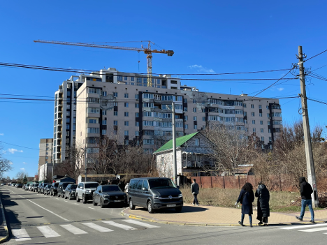
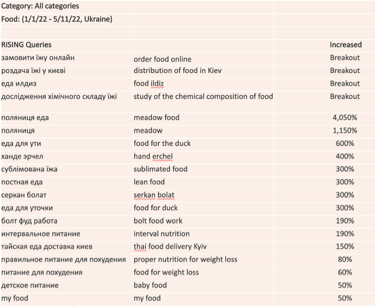
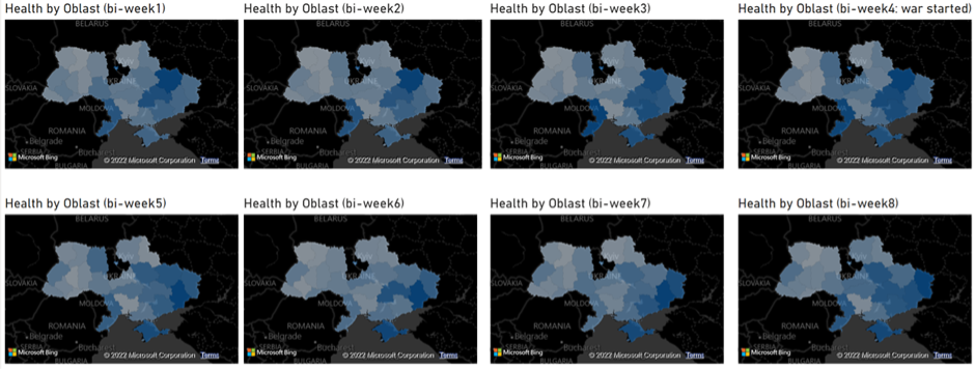
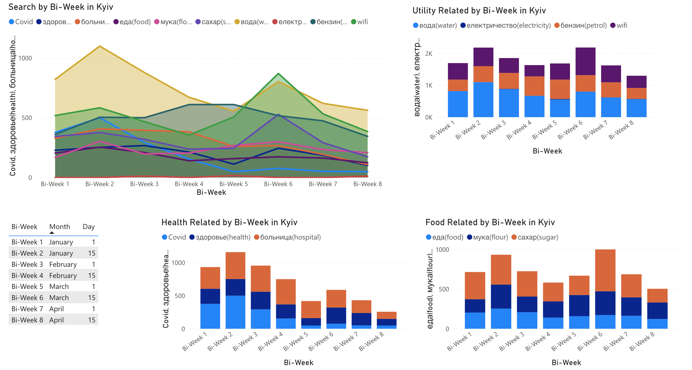

+++
title = "How Google Search Data Helped Reveal Critical Needs in Ukraine"
authors = ["Han Wang"]
categories = ["Case Study"]
partner = ["Google"]
dev_partner = ["World Bank "]
tags = ["Digital Development"]
date = 2025-12-16T00:00:00Z
+++

## Challenge

In the early days of the conflict in Ukraine, the World Bank’s Poverty and Equity team sought information on its socio-economic impacts as the situation unfolded. Because available data were limited and traditional survey work was not feasible, alternative methods were needed to understand people’s critical needs.

<figure style="text-align: center;">
  
  <figcaption style="text-align: center; font-size: 0.9em; color: #555;">Photo: World Bank Bank.</figcaption>
</figure>

## Solution

As part of a broader collaboration, the World Bank’s ITS Technology and Innovation Lab explored how the [Google Trends API](https://developers.google.com/search/apis/trends) could be used to monitor shifts in search activity by language, time, and location. The tool enables data collection over time for any region with Google penetration, down to the district or county level.

To assess the intensity of needs, the team leveraged the Google Trends API to analyze changes in search queries over time and across oblasts (regions) for key terms such as “water,” “food,” “gas,” “hospital,” “electricity,” “sugar,” “flour,” “Wi-Fi,” “healthcare,” and “meat.”

Figure 1 illustrates the types of queries related to ‘food’. The queries labeled as ‘breakout' have a very high number of people searching for that phrase. From the data, we can see that many individuals were trying to order food online or find information about food distribution in Kiev during the selected time period. Further analysis or application of Natural Language Processing techniques on this data could reveal new insights into the concerns that citizens may have.  

<figure style="text-align: center;">
  
  <figcaption style="text-align: center; font-size: 0.9em; color: #555;">Figure 1: Search queries related to the term “food” in Ukraine between January and May 2022</figcaption>
</figure>

The Google Trends API was also used to determine the volume of queries related to each search term, by oblast. The search volumes were updated for each oblast every two weeks. Figure 2 displays maps comparing search volumes over eight weeks for all queries related to “health”. These search volumes were then compared to the volumes before the crisis and to the volumes from the previous two weeks. The results include a table of regions and the percentage change in relevant queries over time.

<figure style="text-align: center;">
  
  <figcaption style="text-align: center; font-size: 0.9em; color: #555;">Figure 2: Comparing search volumes for queries related to ‘health’ per oblast across time</figcaption>
</figure>

Since this work was experimental, it was adjusted and validated using other datasets such as Premise field survey data, official price and inflation statistics, population movement, ACLED conflict information, and other sources. For example, Figure 3 shows the comparison of changes in fuel prices with the change in search volume for the queries related to “gas”.

<figure style="text-align: center;">
  
  <figcaption style="text-align: center; font-size: 0.9em; color: #555;">Figure 3: Comparing search volumes related to “gas” from Google search trends with the price of fuel</figcaption>
</figure>

The final output also included creating dashboards to help explore changes in observed search trends over time and by oblast (see Figure 4).

<figure style="text-align: center;">
  
  <figcaption style="text-align: center; font-size: 0.9em; color: #555;">Figure 4: Change in trends observed in Kyiv for all search terms between January and April 2022</figcaption>
</figure>

This methodology demonstrated that Google search trends can serve as a supplementary data source for understanding citizens’ evolving concerns during an ongoing crisis. However, the results reflect only those individuals who use Google and had internet access during the study period.

## Impact

Understanding the evolving socio-economic impacts of a crisis as it unfolds is challenging. By combining Google search trend data with field surveys conducted by [Premise](https://premise.com/), population mobility data from [Outlogic](https://outlogic.io/), NOAA night-time light imagery, damage assessments derived from ESA Sentinel radar data, and official price statistics, the team was able to inform and, most importantly, routinely update our understanding of how the conflict is affecting the well-being of people.

