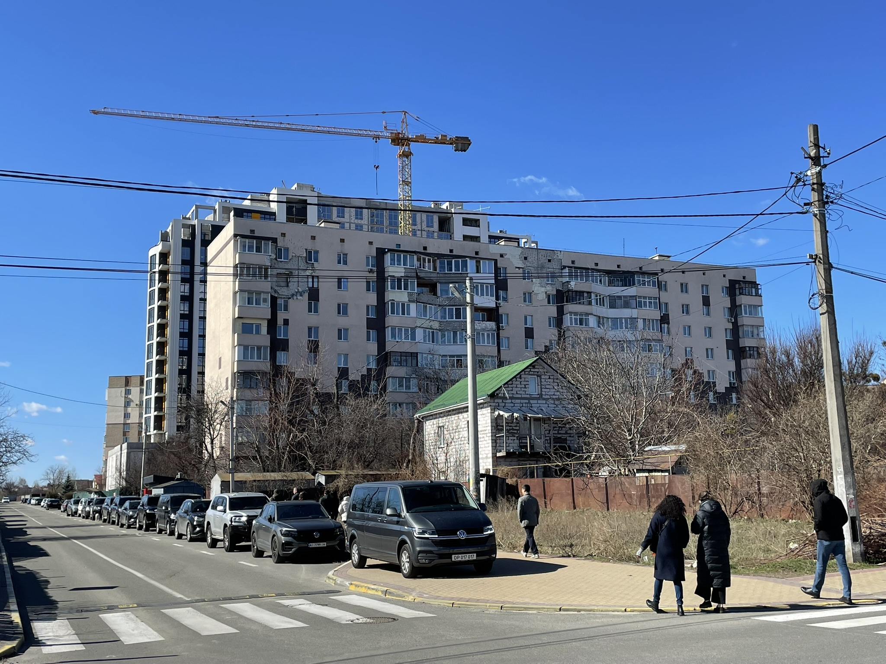
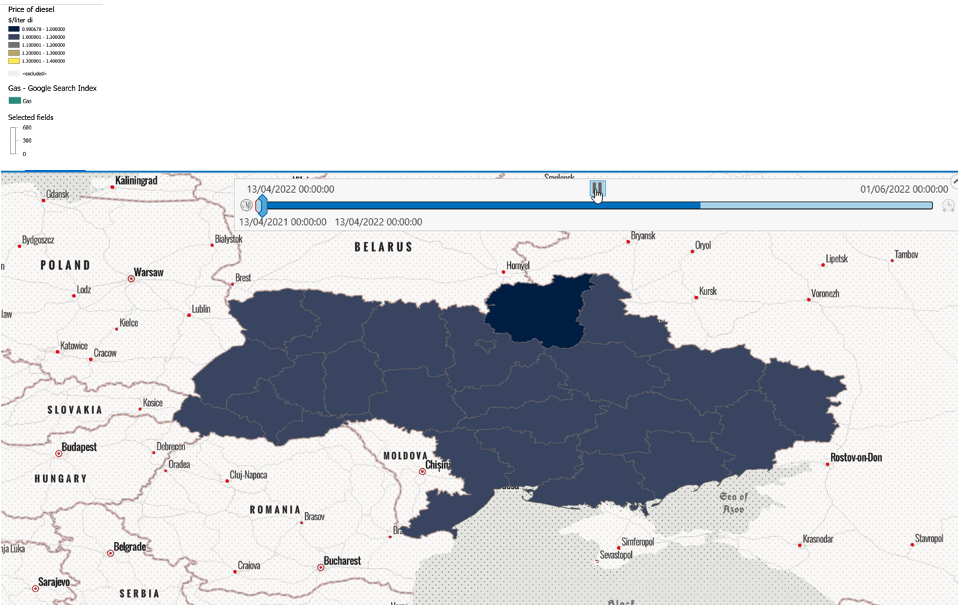

+++
title = "How Google Search Data Helped Reveal Critical Needs in Ukraine"
authors = ["Han Wang"]
categories = ["Case Study"]
partner = ["Google"]
dev_partner = ["World Bank"]
tags = ["Inequality and Shared Prosperity"]
date = 2026-02-19T00:00:00Z
+++

## Challenge

In the early days of the conflict in Ukraine, the World Bank’s Poverty and Equity team sought information on the conflict’s socio-economic impacts as the situation unfolded. Because available data were limited and traditional survey work was not feasible, alternative methods were needed to understand people’s critical needs.

<figure style="text-align: center;">
  
  <figcaption style="text-align: center; font-size: 0.9em; color: #555;">Photo Credit: World Bank</figcaption>
</figure>

## Solution

As part of a broader collaboration, the World Bank’s ITS Technology and Innovation Lab explored how [Google](https://developers.google.com/search/apis/trends)’s Research API, facilitated through the Development Data Partnership, could be used to monitor shifts in search interest by language, time, and location. The tool enables analysis of relative search interest over time for regions with Google search activity, including at the oblast (regional) level.

To assess the intensity of needs, the team leveraged the Research API to analyze changes in search interest over time and across oblasts for key terms such as “water,” “food,” “gas,” “hospital,” “electricity,” “sugar,” “flour,” “Wi-Fi,” “healthcare,” and “meat.”

Figure 1 illustrates the types of queries related to “food.” Queries labeled as “breakout” indicate terms that experienced significant growth in search interest. The results suggest a rapid rise in interest in online food ordering and food distribution information in Kyiv during the selected period. Further analysis, including Natural Language Processing techniques, could help surface additional insights into emerging concerns.

<figure style="text-align: center;">
  
  <figcaption style="text-align: center; font-size: 0.9em; color: #555;">Figure 1: Search queries related to the term “food” in Ukraine between January and May 2022
</figcaption>
</figure>

The Research API was also used to examine relative search interest for each search term across oblasts. Search interest was updated biweekly and compared with levels observed prior to the crisis and during preceding periods. Figure 2 presents maps showing changes in search interest over eight weeks for queries related to “health,” alongside tables summarizing percentage changes over time.

<figure style="text-align: center;">
  
  <figcaption style="text-align: center; font-size: 0.9em; color: #555;">Figure 2: Comparing search interest for queries related to ‘health’ per oblast across time
</figcaption>
</figure>

Since this work was experimental, it was adjusted and validated using other datasets such as Premise field survey data, official price and inflation statistics, population movement, ACLED conflict information, and other sources. For example, Figure 3 shows the comparison of changes in fuel prices with the change in search interest for the queries related to “gas”.

<figure style="text-align: center;">
  
  <figcaption style="text-align: center; font-size: 0.9em; color: #555;">Figure 3: Comparing search interest related to “gas” from Google search trends with the price of fuel
</figcaption>
</figure>

The final output also included creating dashboards to help explore changes in observed search trends over time and by oblast (see Figure 4).

<figure style="text-align: center;">
  
  <figcaption style="text-align: center; font-size: 0.9em; color: #555;">Figure 4: Change in trends observed in Kyiv for all search terms between January and April 2022
</figcaption>
</figure>

This methodology demonstrated that Google search trends can serve as a supplementary data source for understanding evolving concerns during an ongoing crisis. However, the data reflect sampled and aggregated search activity, not individual user data, and represent only populations with internet access and Google usage during the study period.

## Impact

Understanding the evolving socio-economic impacts of a crisis as it unfolds is challenging. By combining the Google data with field surveys conducted by [Premise](https://premise.com/), population mobility data from [Outlogic](https://outlogic.io/), NOAA night-time light imagery, damage assessments derived from ESA Sentinel radar data, and official price statistics, the team was able to inform and, most importantly, routinely update our understanding of how the conflict is affecting the well-being of people.

