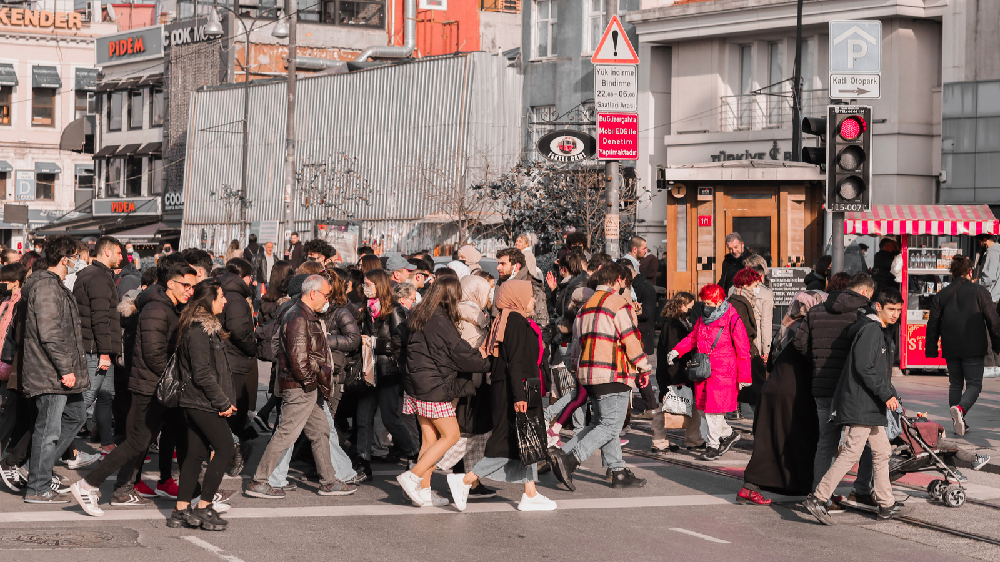
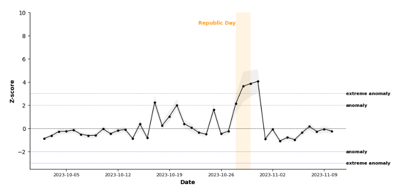

+++
title = "How Mobility Data Can Help Cities Prepare for Large Public Events"
authors = ["Giuliano Cornacchia", "Maria Sol Tadeo"]
categories = ["Case Study"]
partner = ["Veraset"]
dev_partner = ["World Bank"]
tags = ["Transport", "Urban Development"]
links = ["https://worldbank.github.io/eca-resilience/notebooks/Republic_day_report.html"]
date = 2026-10-01T00:00:00Z
+++

Turkey's Republic Day celebrations attract large public gatherings across the country, including in Istanbul. For city planners, an event of this scale raises practical questions: When do visits to different parts of the city begin to increase? Which areas experience the greatest changes? How quickly do patterns return to normal?

A World Bank analysis used aggregated and anonymized mobility data from [Veraset](https://www.veraset.com) to examine urban activity before, during, and after Republic Day in Istanbul on October 29, 2023. By comparing observed activity with a pre-event baseline, the study identified when and where patterns departed from typical conditions.

## Challenge

During a festival or other major public celebration, patterns of visits and movement may change across the city, not only at the main celebration sites. Increased activity may be observed around transport networks, commercial districts, residential neighborhoods, public spaces, and essential services.

Large-scale mobility data allow researchers to compare patterns before, during, and after an event and determine whether changes are concentrated in particular locations or spread across transport hubs, neighborhoods, public spaces, and service areas.

<figure style="text-align: center;">
  
</figure>

## Solution

The World Bank’s Development Data Partnership used anonymized mobility data from Veraset to examine changes in urban activity around Republic Day in Istanbul. The analysis covered October 2 to November 10, 2023. It treated October 2-27 as the baseline period, October 28-29 as the event period, and October 30-November 10 as the post-event period. 

The analysis divided Istanbul into hexagonal cells, spatial areas of analysis, of approximately 0.74 square kilometers. For each day and each spatial area, the team calculated an Urban Space Usage Index: the share of all active users observed that day who visited that spatial area. This normalization reduced the influence of daily changes in the overall volume of data.

After filtering out users and spatial areas with few observations per day , the final dataset contained approximately 22.3 million GPS observations from 131,500 anonymized users across 1,784 spatial areas.

The team then calculated a Z-score for every cell and day. In plain language, the score shows how far activity differed from the cell's normal pattern during the baseline period. A positive score indicates more activity than expected, while a negative score indicates less. The analysis also used January 2023 OpenStreetMap snapshots, accessed through Geofabrik, to classify cells by dominant land use and by nearby points of interest such as train stations, hospitals, parks, schools, shops, and airports. OpenStreetMap data are credited to OpenStreetMap contributors and licensed under the Open Database License.

Activity began rising before the main celebration. On October 28, the average Z-score reached 2 . As expected, on Republic Day, Z-score reached 4, doubling the previous day value. Activity remained elevated immediately after the event before returning close to baseline after October 31.

<figure style="text-align: center;">
  
  <figcaption style="text-align: center; font-size: 0.9em; color: #555;">Figure 1: Observed urban activity across Istanbul rose sharply around Republic Day, with the average Z-score reaching 4 on October 29 before returning close to typical levels after October 31. A score near zero indicates typical activity, while a score above three indicates activity far above the baseline. The shaded area marks October 28–29.
</figcaption>
</figure>

The increase was widespread across Istanbul rather than concentrated in a small number of locations. Every land-use category recorded an event-period average Z-score above 2. Among the point-of-interest layers, train stations, hospitals and tourist related exhibit scores above 3.3. The Urban Space Usage Index at train stations and parks more than doubled from baseline levels. Overall, Republic Day intensified activity across existing urban functions, including transport, recreation, commerce, and services.

## Impact

The Istanbul case study demonstrated that this analytical approach could detect and characterize a major, temporary change in urban activity and show how it unfolded over time and across the metropolitan area. It also showed that the increase extended beyond central gathering places to transport hubs, public spaces, and service locations.

The results could help authorities anticipate pressure on transport hubs, public spaces, commercial areas, tourism-related locations, and essential services during future large public events. This information could inform crowd management, public transport planning, pedestrian and road-flow control, emergency preparedness, and municipal service allocation.

The study is subject to several limitations. Mobility data may not represent the entire population because coverage depends on smartphone use and data availability. Aggregating observations into hexagonal cells can also smooth local differences. The Urban Space Usage Index therefore reflects patterns among observed users; it is not a complete count of everyone present in Istanbul.

