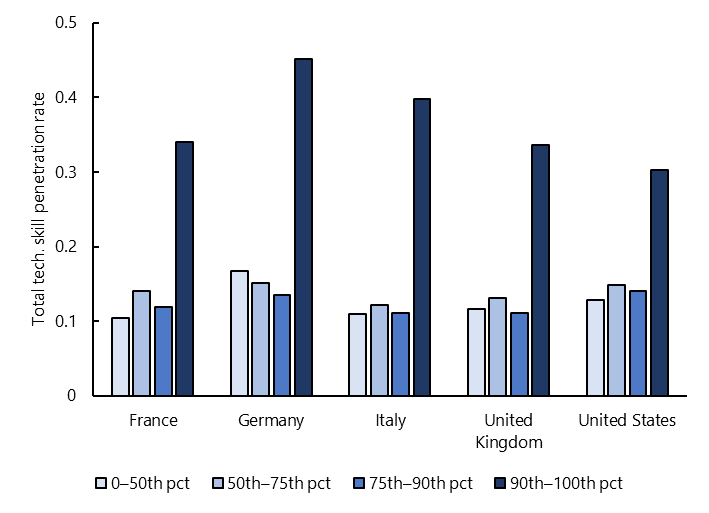
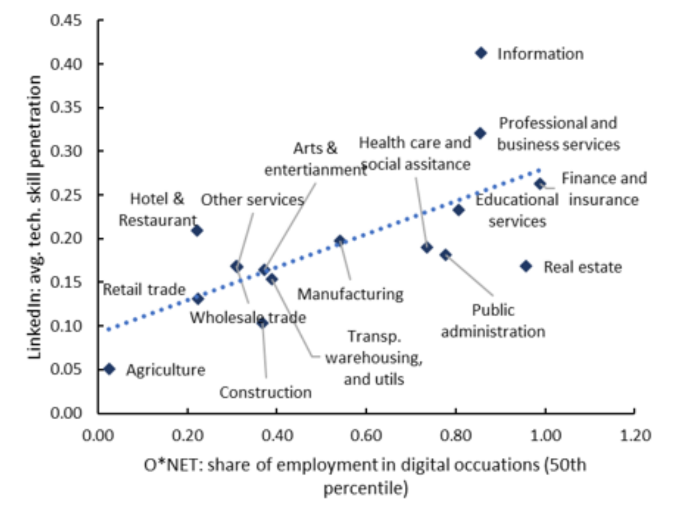

+++
title = " Understanding the Impact of Digitalization During COVID-19"
authors = ["Florence Jaumotte", "Longji Li", "Andrea Medici ", "Myrto Oikonomou", "Carlo Pizzinelli", "Ippei Shibata", " Jiaming Soh", "Marina Mendes Tavares"]
categories = ["Case Study"]
partner = ["LinkedIn"]
dev_partner = "International Monetary Fund"
tags = ["Jobs and Development"]
date = 2024-02-21T00:00:00Z
links = [
    "https://www.imf.org/en/Publications/Staff-Discussion-Notes/Issues/2023/03/13/Digitalization-During-the-COVID-19-Crisis-Implications-for-Productivity-and-Labor-Markets-529852",
]
+++

COVID-19 has disrupted almost every aspect of people's work activities, inducing a digitalization push in the demand for certain types of skills and labor. As part of its research on how digitalization induced by the pandemic has impacted productivity and labor markets in advanced economies, The International Monetary Fund's Research Department leveraged [LinkedIn](https://economicgraph.linkedin.com/) data on skills penetration to study whether workers had been asked to perform more digital tasks than they used to be during the pandemic.

## Challenge

At the onset of the COVID-19 pandemic, policymakers and academics alike expected that the pandemic and subsequent containment policies would accelerate digitalization, with potentially important implications for labor markets and productivity. Many workers had to switch from working in the office to working from home, and economic activities that are contact-intensive were restricted. As a result, many firms had to adjust to remote working and expand their activities online.

The intensive margin of digital employment may have played a significant role during the pandemic if it was the case that, within the same occupation, workers were asked to perform more digital tasks than they used to be. For instance, an office assistant may have needed to handle audio-video equipment to set up hybrid remote-in-person meetings. On the other hand, it is also possible that the basic infrastructure adopted in low-digital-intensity sectors during the pandemic did not require the kind of advanced skills that workers would include in their resumes.

However, tracking the intensive margin of digital work is challenging, because it requires a repeated measurement of the task's workers perform within each job. The O*NET [^1] repository is only slowly updated over time. Rich and high-quality data is thus essential to investigate whether the intensive margin of digitalization across occupations/industries (i.e., digital intensity for a given occupation/industry) changed during the health crisis.

<figure align="center">
    
</figure>

## Solution

Despite the measurement challenge, skills reported by workers in their online profiles can provide a real-time proxy for changes in the functions they perform in their jobs. Through the Development Data Partnership's support, the International Monetary Fund's Research Department accessed data from [LinkedIn](https://economicgraph.linkedin.com/), where workers can apply for new positions as well as showcase their expertise and skills from their current job. 

Using a vast amount of data extracted from individual profiles, the LinkedIn Economic Graph and Research Insights team constructs a yearly measure of "tech skill penetration" rate for each job title, industry, and country.  This measure represents the fraction of job-specific skills reported by workers in a given year that pertain to digital technologies within an industry and occupation. It therefore serves as a "flow" measure of the degree to which technology skills are being updated within an industry and/or occupation.

Leveraging LinkedIn data, the researchers found that there were no signs that the pandemic has impacted the intensive margin of digital employment by increasing the demand for digital skills within occupations.

Figures 1 and 2 examine whether the digital intensity of work has increased during the pandemic, using data from LinkedIn. Specifically, Figure 1 shows that occupations that were less digitally intensive to begin with ( i.e., those were the digital score based on O*NET is lower ) did not see a higher rate of skill updating relative to occupations that were ex-ante more digital. In fact, the opposite was true. And this pattern held in all the countries studied. In line with these results, we didn't find in the US a higher rate of digital skill updating in sectors that originally had a lower share of digital occupations, as shown in Figure 2. Overall, the analysis does not find evidence of an increase in the intensive margin of digitalization during the crisis. These findings are in line with Forsythe and others (2022), who found evidence of down-skilling after the pandemic as employers responded to increases in labor market tightness by relaxing skills and tenure requirements.

<figure align="center">
    
        

Figure 1: Technology Skill Penetration Rate for Occupations in Different Ranges of the O*NET Digital Score 
 
Sources: LinkedIn and IMF staff calculations.  
Note: The different bars report the average technology skill penetration rate for 4-digit ISCO-08 occupations within each percentile range of the O*NET digital score. The rates are computed as the average values over 2020-21
  

    </figcaption>
</figure>

<figure align="center">
    

Figure 2: Skill Penetration and O*NET  

Sources: LinkedIn; US Bureau of Labor Statistics; and IMF staff calculations. 
Note: The x-axis reports the 2019 share of workers in digital occupations for each sector based on the 50th percentile threshold of the O*NET digital score. The y-axis reports the average technology skill penetration rate in 2020-21. See [Annex 1](https://www.imf.org/en/Publications/Staff-Discussion-Notes/Issues/2023/03/13/Digitalization-During-the-COVID-19-Crisis-Implications-for-Productivity-and-Labor-Markets-529852) for details of the construction of industry-level average
  

  
</figcaption>
    </figcaption>
</figure>

## Impact

Studying whether the health crisis has led to shifts in labor demand toward digital occupations is crucial for policymakers in designing policies to help both firms and employees better equip. 

For instance, if digitalization has accelerated due to COVID-19, government policies need to invest in digital education. This study sheds light on how much and how persistently digitalization picked up across advanced economies during the COVID-19 crisis and draws implications for productivity, employment, and inequality.

Thanks to the rich LinkedIn data on skills penetration, the team studied the consequences from the rapid digitalization shock by examining whether the digital intensity of work has increased during the pandemic. Data like this can help researchers and policymakers better understand the changing landscape in the job markets in a comprehensive and timely way. 

[^1]: The O*NET system is maintained by a regularly updated database of occupational characteristics and worker requirements information across the U.S. economy. It describes occupations in terms of the knowledge, skills, and abilities required as well as how the work is performed in terms of tasks, work activities, and other descriptors. https://www.dol.gov/agencies/eta/onet  

