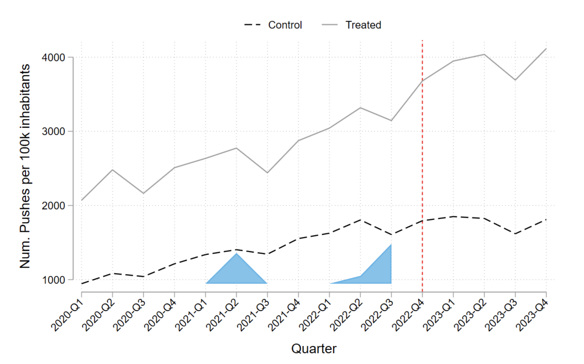

+++
title = "Impact of the Availability of ChatGPT on Software Development Activity"
authors = ["Alexander Quispe", "Rodrigo Grijalba"]
categories = ["Case Study"]
partner = ["GitHub"]
dev_partner = ["World Bank"]
tags = ["Digital Development", "AI"]
links = ["https://arxiv.org/abs/2406.11046", "https://github.blog/news-insights/policy-news-and-insights/how-researchers-are-using-github-innovation-graph-data-to-estimate-the-impact-of-chatgpt/"]
date = 2024-12-31T00:00:00Z

+++

Advancements in Artificial Intelligence, especially with ChatGPT, have greatly influenced software development. Leveraging novel data from [GitHub Innovation Graph](https://github.com/github/innovationgraph), the World Bank’s Data Lab hypothesized that ChatGPT improves the efficiency of software production. Their findings suggest that AI tools like ChatGPT can significantly enhance developer productivity, although further analysis is required to address potential drawbacks such as low-quality code.

## Challenge

The introduction of Large Language Models (LLMs) like OpenAI’s ChatGPT has brought significant changes to software development, revolutionizing tasks such as coding, debugging, and software design. However, the study of its impact on software productivity is still in its early stages due to the recent launch of the tool.

The scarcity of research presents a key challenge, as limited prior work exists to build upon or guide new analyses. Furthermore, methodological complexities arise from ChatGPT’s non-randomized availability, requiring advanced techniques like Difference-in-Differences and Synthetic Control to isolate its effects from external confounding factors, such as economic trends or regional differences in technological adoption.

Finally, the dynamic nature of AI tools compounds these challenges. The rapid development of newer versions, such as GPT-4, demands that researchers continuously adapt their methods to keep pace with evolving capabilities and changing contexts, ensuring findings remain relevant and actionable.

<figure align="centre">
    
        

Estimated synthetic difference-in-differences (SDID) trends—average number of Git pushes per 100k inhabitants for treated vs. (synthetic) control groups.
  

    </figcaption>
</figure>

## Solution

The team analyzed GitHub Innovation Graph data across multiple time periods to estimate the impact of ChatGPT access on software development at the country level. Since ChatGPT's availability was not randomized (e.g., it was not limited to a randomly selected group of countries), the study was designed as an observational study. To address the non-randomized nature of the data, the team employed the Synthetic Difference-in-Differences (SDID) method, enabling the construction of a robust counterfactual and isolating the effects of ChatGPT on software productivity metrics across countries.

They analyzed the impact of ChatGPT on the velocity of software development, finding that the availability of ChatGPT:

•	Significantly increased the number of Git[^1] pushes by approximately 645.623 per 100,000 inhabitants.

•	Had a positive (although not statistically significant) correlation with the number of repositories and developers per 100,000 inhabitants.

•	Generally enhanced developer engagement across various programming languages. High-level languages like Python and JavaScript showed significant increases in unique developers, while the impact on domain-specific languages like HTML and SQL varied.

## Impact

After conducting this study, the World Bank team concluded that the future likely holds increased integration of AI tools like ChatGPT and GitHub Copilot in software development processes. Given the significant positive impact observed on the number of Git pushes, repositories, and unique developers, they predict that AI-driven development tools will become standard in software engineering.

Policymakers should consider the beneficial effects of AI tools like ChatGPT and GitHub Copilot on productivity and support their integration into various sectors. Deregulating access to such tools could promote economic growth, improve developer efficiency and speed up software production.

Developers should embrace AI tools like ChatGPT and GitHub Copilot to boost their productivity and efficiency. By leveraging these tools for coding, debugging, and optimizing software, developers can concentrate on more complex and creative aspects of software engineering.

[^1]: Git is an intelligent version control system that monitors and records changes in files. Git is especially beneficial for collaborative work when you and a group of people are all modifying the same files at the same time. https://docs.github.com/en/get-started/start-your-journey/about-github-and-git

