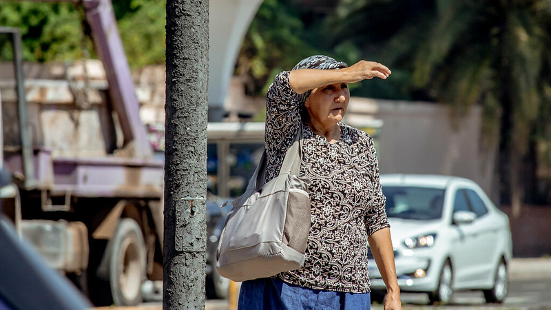

+++
title = "Evaluar El Impacto De Las Temperaturas Extremas En Los Sentimientos a Través De Datos De Redes Sociales En Argentina"
authors = ["Jose Daniel Aromi", "Mariana Conte Grand", "Mariano Rabassa", "Julie Rozenberg"]
categories = ["Case Study"]
partner = ["X"]
dev_partner = "World Bank"
tags = ["Salud"]
date = 2024-08-11T00:00:00Z
+++

¿Cómo afectan los fenómenos meteorológicos extremos a los sentimientos de las personas? A partir de los datos de la red social [X](https://x.com/) (antes conocido como Twitter), la Dirección Regional de Desarrollo Sostenible para América Latina y el Caribe del Banco Mundial trabajó con investigadores de universidades argentinas para estudiar cómo las temperaturas extremas impactan sobre el estado de ánimo de las personas en Argentina. 

## Desafío

El clima influye profundamente en la vida humana y en la sociedad. Las fluctuaciones de temperatura afectan a la productividad agrícola, la eficiencia laboral y la salud humana. En particular, las temperaturas extremas se correlacionan con un aumento de la violencia, el malestar social y tasas de suicidio y de delincuencia más altas.  

Argentina es un país cada vez más vulnerable al calor extremo; las seis temperaturas medias anuales más altas registradas ocurrieron en la última década (2012, 2015, 2017, 2020, 2021 y 2023). A medida que avanza el cambio climático, es fundamental comprender el impacto de la temperatura en los sentimientos de las personas para poder gestionar eficazmente medidas de prevención y así beneficiar a los ciudadanos, los profesionales de la salud y los responsables de formular políticas. 

<figure align="center">

<figcaption>

 Foto: Banco Mundial 

</figcaption>
</figure>

## Solución

Si bien el bienestar subjetivo y las precepciones usualmente se miden a través de encuestas, el advenimiento de las redes sociales ofrece un enfoque transformador para investigar sobre las interacciones entre los seres humanos y el medio ambiente. Los datos de las redes sociales, que se obtienen en tiempo real y de manera no intrusiva y costo-efectiva, proporcionan una lente novedosa para captar los sentimientos de las personas.  

Aprovechando la Alianza de Datos sobre el Desarrollo, un equipo de la Dirección Regional de Desarrollo Sostenible para América Latina y el Caribe del Banco Mundial, junto con investigadores de universidades argentinas, analizaron 80 millones de tuits geoetiquetados de Argentina entre los años 2017 y 2022 obtenidos a través de la API de X-Twitter. Estos datos se vincularon con los registros diarios de temperatura del Sistema Meteorológico de Argentina. 

Utilizando “minería de textos”, desarrollamos dos métricas cuantitativas: un índice de sentimiento (positivo y negativo) y un índice de agresión en las redes sociales basado en la frecuencia de las insultos e improperios. Nuestros hallazgos revelan que, si bien el calor intensifica los sentimientos negativos, no afecta significativamente a los positivos (Figura 1a y 1b). Las bajas temperaturas no parecen afectar el estado de ánimo de las personas. Además, nuestro índice de insultos, un indicador de la intensidad de los sentimientos negativos, refleja las tendencias observadas para los sentimientos negativos. 

 <figcaption>

Figura 1. Sentimientos positivos y negativos y temperatura máxima diaria  

    </figcaption> 
<figure align="center">
     
    

    
<figcaption>
        

Nota: En esta figura se informa el impacto estimado de los índices de sentimiento para los intervalos de temperatura máxima diaria. Representan las diferencias con respecto a los valores esperados para el intervalo de temperatura [20–25 °C]. Las líneas discontinuas corresponden a los intervalos de confianza de 95 por ciento.  

    </figcaption>
</figure>

## Impacto

Nuestra investigación indica que las altas temperaturas conducen a un aumento de los sentimientos negativos. La implementación de medidas de adaptación, como los sistemas de alerta temprana, es esencial no solo para preparar al público, sino también para proporcionar educación continua sobre las consecuencias psicológicas del calor extremo, lo que podría ayudar a aliviar los comportamientos nocivos.  Además, es fundamental que el sector de la salud esté preparado para enfrentar el aumento de los problemas de salud mental inducidos por el calor. Nuestra investigación sugiere que las temperaturas extremas pueden intensificar la irritabilidad, y existe un cuerpo significativo de evidencia que muestra que las personas con ciertas condiciones de salud mental son más susceptibles a los efectos del calor. 

El vínculo entre la agresión en el mundo virtual y la violencia en el mundo real subraya la importancia del monitoreo de las redes sociales, especialmente porque estudios demuestran que la actividad de las fuerzas de seguridad tiende a disminuir en condiciones de mayor calor. Los resultados de nuestra investigación  son fundamentales para configurar estrategias de adaptación que puedan garantizar la disponibilidad de financiamiento y personal para las líneas directas de prevención de la violencia y los organismos de seguridad, reforzando así la resiliencia durante las olas de calor. 