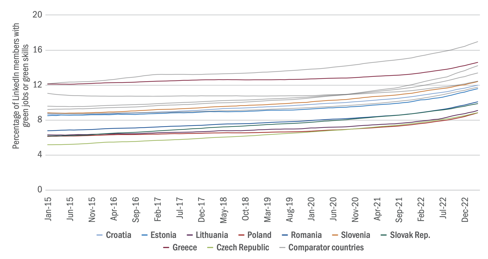
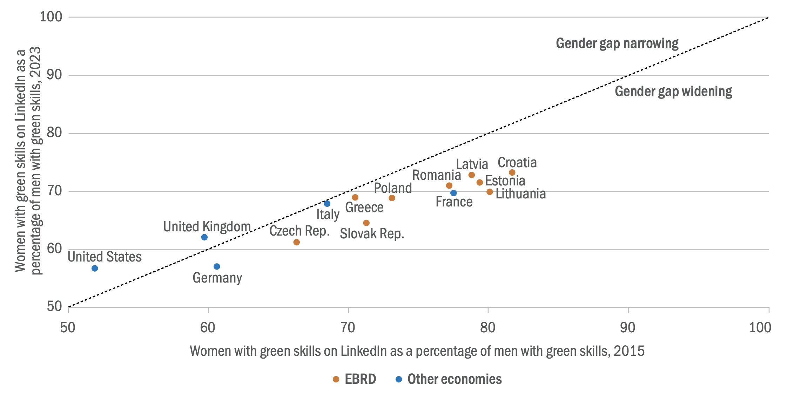
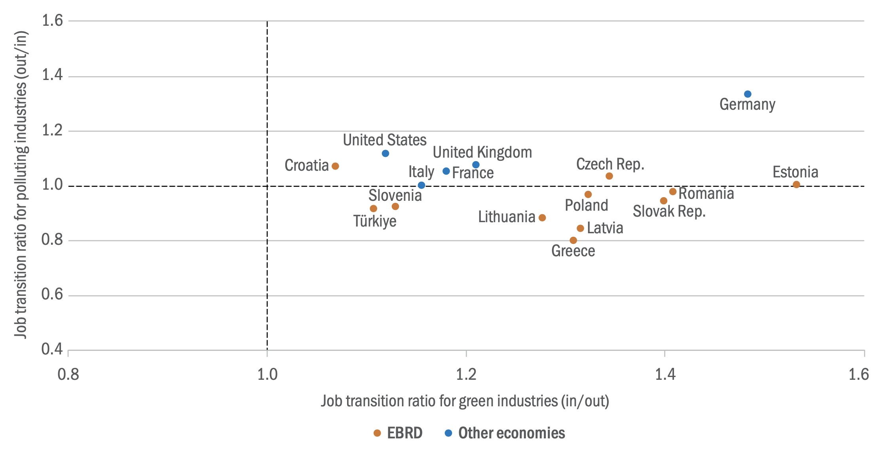

+++
title = "Implications of the Green Transition for the Labor Market"
authors = ["Cagatay Bircan", "Lucas Kitzmuller", "Sehar Noor", "Niharika Satish"]
categories = ["Case Study"]
partner = ["LinkedIn"]
dev_partner = "The European Bank for Reconstruction and Development"
tags = ["Jobs and Development"]
date = 2024-04-01T00:00:00Z
links = [
    "https://www.ebrd.com/news/publications/transition-report/transition-report-202324.html",
]

+++
The global shift towards a low-carbon economy is essential to address environmental challenges but will leave no area of economic and social life untouched.  This transition cannot take place without an adequately skilled workforce that is able to satisfy the demands of a greener economy. The European Bank for Reconstruction and Development (EBRD)'s Office of the Chief Economist leveraged [LinkedIn data](https://economicgraph.linkedin.com/) to examine labor markets in the green economy as part of [The Transition Report 2023-24]( https://www.ebrd.com/news/publications/transition-report/transition-report-202324.html).

## Challenge

People in the EBRD regions tend to be aware of climate change and its consequences.  As preferences of consumers shift and producers switch to cleaner production methods, there will be a significant increase in demand for green jobs throughout the economy, from the use of environmentally friendly materials in construction and manufacturing to a focus on sustainability in supply chain management and urban planning. At the same time, organizations providing financial and other services will be seeking individuals who can navigate the complexities of environmental regulations, carbon markets and sustainable investment. These various jobs will require new skill sets that many existing workers do not yet possess.

<figure align="center">
    
</figure>

## Solution

To understand the demand for green jobs, the EBRD team leveraged [LinkedIn data](https://economicgraph.linkedin.com/) to study the online activity of more than 200 million LinkedIn members. These members span several economies in the EBRD regions where LinkedIn Economic Graph data are sufficiently representative of job vacancies, job-to-job transitions and job seekers' skills. In addition, LinkedIn members in France, Germany, Italy, the United Kingdom and the United States of America were included as comparators.

In the [LinkedIn data](https://economicgraph.linkedin.com/), green jobs are defined as occupations that usually involve one or more green projects or are closely associated with green skills. To be defined as green, a project must include at least one green activity, such as pollution or waste prevention, energy management, generation of renewable energy, ecosystem management, sustainability education and research, environmental policy, sustainable procurement or environmental finance[^1].  Green skills, in turn, capture the top skills of LinkedIn members whose work predominantly involves one or more green projects (as listed in those members' profiles).

This study revealed that the EBRD regions have lower green jobs ratios than advanced economies, reflecting the slower pace of their transition to net zero, as well as an insufficient supply of qualified individuals with green skills. According to the [LinkedIn data](https://economicgraph.linkedin.com/), the percentage of members in the EBRD regions who had a green occupation or listed green skills in their online profile stood at around 10 per cent in April 2023, below the average for the advanced economy comparators (see figure 1). Within individual countries, the accumulation of green skills has accelerated somewhat over the past year, but it does not, overall, appear to have kept pace with the rise in demand.

The team also examined the green economy gender gap. In every economy, women are less likely to have a green occupation or list green skills in their online profile than men (see figure 2). This may reflect the fact that women are under- represented in STEM jobs, which are particularly common in sectors such as renewable energy.

Through the LinkedIn data, this study also discovered that there was a net flow of workers into green activities between 2015 and 2023 across all economies (that is to say, more workers moved into green industries than moved out of them; see figure 3). However, a net flow into polluting industries was also observed in the EBRD regions over that period. Thus, more workers found new employment in brown industries than left those industries. In advanced comparators, by contrast, more workers moved out of brown industries than moved into them (that is to say, there was a net outflow).

Brown industries are those that produce or support fossil fuels (including coal mining, oil extraction, and the use of fossil fuels to generate electrical power).

<figure align="center">
    
        

Figure 1: The percentage of LinkedIn members with green jobs or green skills has increased
 
Source: LinkedIn (via the Development Data Partnership) and authors' calculations.  
Note: Green jobs are either (i) in a green occupation or (ii) associated with green skills. The grey lines denote the comparator countries France, Germany, Italy, the United Kingdom and the United States.
  

    </figcaption>
</figure>

<figure align="center">
    
        

Figure 2: The gender gap is widening as the green transition progresses
 
Source: LinkedIn (via the Development Data Partnership) and authors' calculations.  
Note: LinkedIn members are considered to have green skills if (i) they explicitly list green skills in their profile or (ii) they have a green occupation.  

    </figcaption>
</figure>

<figure align="center">
    
        

Figure 3: Between 2015 and 2023, more workers moved into green industries than moved out of them  
Source: LinkedIn (via the Development Data Partnership) and authors' calculations.  
Note: The vertical axis measures the number of workers moving out of a brown sector divided by the number moving into such a sector (so figures in excess of 1.0 denote a net outflow). The horizontal axis indicates the number of workers moving into a green sector divided by the number moving out of such a sector (so figures in excess of 1.0 denote a net inflow). All data relate to the period 2015-23.

    </figcaption>
</figure>

## Impact

Transitioning to a greener economy is essential to address environmental challenges, but it can also have significant implications for the labor market. There are several lessons to be learned from this analysis using the [LinkedIn data](https://economicgraph.linkedin.com/). For instance, this study revealed the gender gap in the green economy. Policy measures with the potential to arrest and reverse that trend include support for the engagement of girls with STEM subjects in schools and career guidance after university. 
Also, as societies and economies adopt more energy-efficient practices and green policies take effect, individuals working in carbon-intensive industries will experience dramatic changes to their jobs. Labor market programs that focus on retraining and upskilling can help to ensure that the transition to a greener economy is fair and enjoys broad support, as can regional development initiatives. It is essential to acknowledge that the content of education and vocational training needs to be better aligned with the emerging demands of the green economy.

[^1]: There are 12 types of green activity in total, based on Dierdorff et al. (2009).