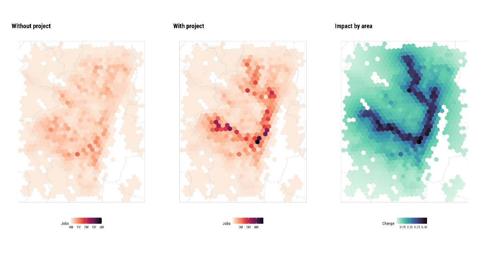
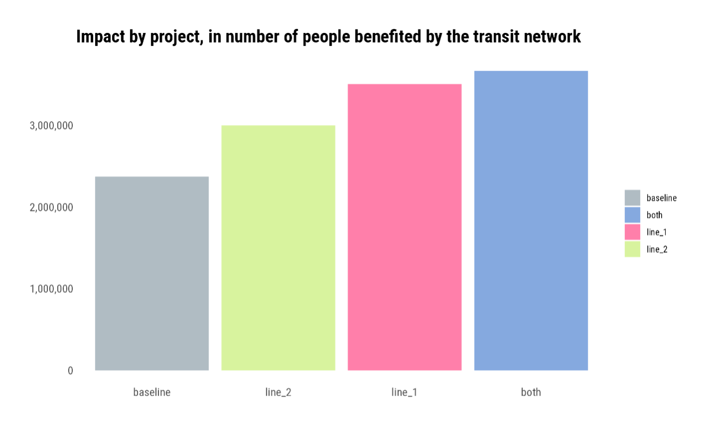

+++
title = "Improving Bogotá's Transportation System to Boost Job Accessibility through Data-Driven Insights"
authors = ["Ellin Ivarsson", "Juan Ignacio Fulponi"]
categories = ["Case Study"]
partner = ["Veraset", "Waze"]
dev_partner = ["World Bank"]
tags = ["Transport"]
date = 2026-01-05T00:00:00Z
+++

The World Bank used data from [Veraset](https://www.veraset.com/) and [Waze](https://www.waze.com/wazeforcities/) to analyze the potential impact of Metro Lines 1 and 2 in Bogotá as a key part of the city’s Metro expansion. 

## Challenge

Colombia has achieved steady progress in urban transport reform but continues to face challenges related to sustainable mobility and inclusion. [According to the World Bank](https://documents1.worldbank.org/curated/en/099090325134536587/pdf/P510687-9a7d2e45-0cf9-4096-873a-a6f4f650ccf4.pdf), over the past two decades, the country has allocated more than 2% of its GDP annually toward developing transport infrastructure, including expanding bus rapid transit (BRT) and integrated public transportation in major cities. However, in Bogotá, increasing motorization, air quality issues, and disparities in access—especially affecting low-income and female populations—highlight the necessity for high-capacity, low-emission rail systems to supplement the heavily used bus network and accommodate rising demand.

<figure style="text-align: center;">
  
</figure>

## Solution

Bogotá’s metro system can be the backbone of the city’s next-generation integrated transport system. Once complete, Line 1 and Line 2 can help ease congestion, cut travel times, and expand access to jobs and services across the capital.

The World Bank Transport team’s impact analysis of the Bogotá Metro expansion on job accessibility relied on a robust data-driven approach, combining traditional public transport data with spatial population and employment distributions. The primary methodology was based on accessibility indicators developed by the World Bank, focusing on how many jobs are reachable from each residential area within a 60-minute public transport window, including up to 20 minutes of walking. Two key metrics were used: raw job accessibility (how many jobs there are in an area) and population-weighted job accessibility (a more nuanced metric which considers how far people live from those jobs), allowing for both a general and a socially sensitive understanding of mobility gains. 

To construct these metrics, official General Transit Feed Specification (GTFS) data from 2021 was used as the baseline to model travel times and connections. Metro Lines 1 and 2 were integrated into the model using assumed service frequencies and operational speeds, with multi-modal connections accounted for in the transit network simulation.

In addition to official sources, the analysis incorporated enhanced mobility insights by leveraging aggregated and anonymized GPS data from Veraset and community-reported congestion information from Waze. Veraset data provided a high-resolution view of actual movement patterns across different times of day and days of the week, allowing for calibration of travel time assumptions beyond scheduled transit data. Waze incident and speed reports were used to identify recurring bottlenecks and delay-prone corridors, helping refine the effective reachability model in congested conditions. This hybrid integration enriched the baseline scenario, ensuring that modeled accessibility better reflected real-world travel behavior.

The spatial analysis was conducted using hexagonal grids (H3 resolution 8), enabling precise aggregation of employment and population data, and accurate interpolation of job accessibility values across the city. This revealed significant improvements in accessibility across wide urban areas of the model, especially under the scenario combining both Metro lines. Notably, due to network effects, the model detected improved accessibility even in regions not directly adjacent to the Metro lines, confirming the broader systemic benefits of such infrastructure.

<figure style="text-align: center;">
  
  <figcaption style="text-align: center; font-size: 0.9em; color: #555;">Figure 1: Impact with Metro Line 1</figcaption>
</figure>

<figure style="text-align: center;">
  
  <figcaption style="text-align: center; font-size: 0.9em; color: #555;">Figure 2: Impact with Metro Line 2</figcaption>
</figure>

Ultimately, the analysis underscored that while Line 1 delivers the largest absolute gains in accessibility, Line 2 offers concentrated benefits to central urban areas. The combination of both yields the most comprehensive improvement, supporting strategic planning toward a more inclusive and sustainable urban mobility network in Bogotá.

<figure style="text-align: center;">
  
</figure>

## Impact

This analysis combines mobility data from Veraset and Waze to provide a detailed view of the potential impact of Bogotá’s new metro lines. These insights are essential for guiding strategic planning to significantly reduce travel times, ease congestion, and increase access to jobs and services.

