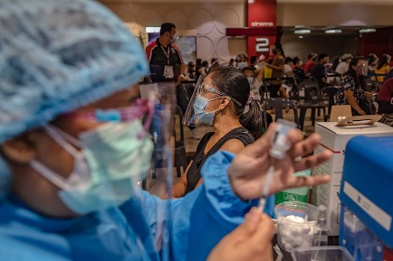
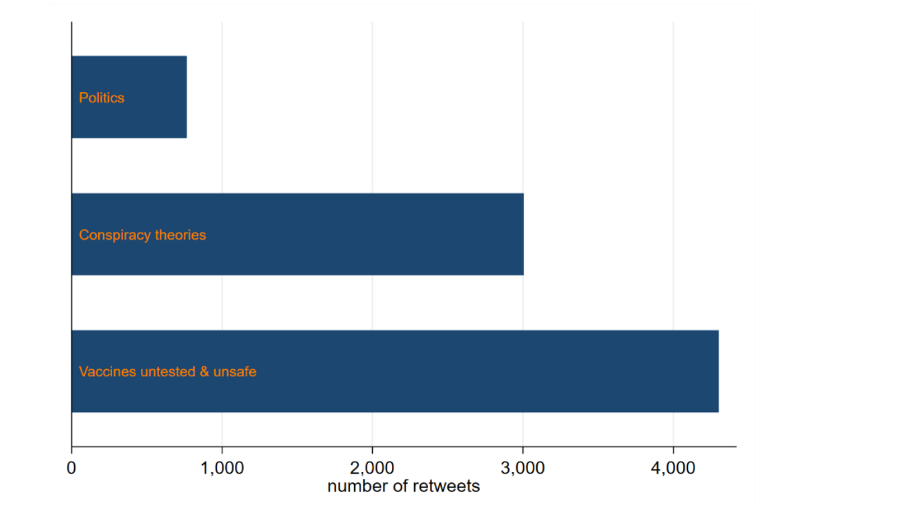

+++
title = "Inferring COVID-19 Vaccine Attitudes from X"
authors = ["Roy Van der Weide"]
categories = ["Case Study"]
partner = ["X"]
dev_partner = "World Bank"
post_type = "Case Study"
tags = ["Health", "COVID-19"]
links = ["https://documents.worldbank.org/en/publication/documents-reports/documentdetail/099545109062215988/idu09209a2550575104cbf0b5dc0990c0568bc5a"]
date = 2023-10-10T00:00:00Z
+++

Social media has become a platform for the public to openly advocate and express their opinions on various issues including health. Leveraging [X](https://twitter.com) (formerly known as Twitter) data, the World Bank's Poverty and Inequality Research team investigated whether the social media platform could be used to infer attitudes towards COVID-19 vaccination specifically with an application to the Arabic speaking world.

## Challenge

During the COVID-19 pandemic, vaccination became a prominent issue in the public eye. Discussions about the vaccination against COVID-19 not only took place offline, but also on social media. As one of the leading social media platforms, X provides an opportunity for users across the world to share content and opinions on various issues in real time.  During the COVID-19 health crisis, various perspectives on vaccination - both pro vaccine and anti-vaccine - were widely shared across X. This begs the question whether X data could be utilized to measure public perceptions and attitudes towards COVID-19 vaccines. How do estimates of vaccination hesitancy rates derived from X data compare to estimates obtained from more conventional survey data? Who are the most effective messengers on X and what are the most effective messages used on either side of the discourse (supporters versus opponents of COVID vaccination)?

<figure align="center">
    
    <figcaption>
        

  Photo: World Bank
  

    </figcaption>
</figure>

## Solution

The World Bank's Poverty and Inequality Research team investigated the above questions in relation to the Middle East, for which they had both conventional survey data on COVID vaccination attitudes and a database of tweets that featured the most prominent COVID hashtags in Arabic (notably كورونا#) spanning the period from mid-December 2020 until mid-April 2021. X's open API was used to download the tweets. The resulting database was filtered for vocabulary related to vaccination.

The team found that anti-vaccine sentiment estimated from X data was surprisingly low in comparison to estimates obtained from survey data. Only about 3 percent of X accounts in their database were identified as anti-COVID-vaccination (compared to 20 to 30 percent of survey respondents). This difference can be explained by the following reasons.

First, X accounts include both individuals and organizations, whereas survey respondents consist of individuals only. The organizations in the team's sample were primarily news organizations, NGOs, private companies, law firms, government entities, and international bodies - all of which are more likely to express overtly positive attitudes towards vaccination. Individuals, on the other hand, are more likely to be found on both sides of the spectrum. Second, X users are a selective sub-sample of the population biased towards higher levels of education, higher income and increased political engagement. Third, the vaccine rollout during the period in which the data for the team's sample was collected was slow and uneven. Therefore, users may not have developed strong views on vaccination during this period, nor did they have the incentive to express these views on X.

According to the study, the most effective messages on the anti-vaccine side highlighted claims that the vaccine caused serious life-threatening side effects. In the pro-vaccine camp, tweets containing content showing public figures receiving the vaccine were found to have the largest reach by far. Figure 1 ranks the arguments used by anti-vaccine users based on the number of retweets these arguments garnered. The most effective message adopted by anti-vaccine users featured news media coverage of side-effects and/or people becoming sick (in some cases fatally) after taking the vaccine.

The study also discovered that celebrity endorsements could influence beliefs about vaccination. With respect to messengers in their application to the MENA region, the team found that state-news accounts received the overwhelming majority of reposts in their database (see Figure 2).

<figure align="center">
    
    <figcaption>
        

  Figure 1: Number of retweets by argument (anti-vaccine camp)
  

    </figcaption>
</figure>

<figure align="center">
    
    <figcaption>
        

  Figure 2: Number of retweets by type of influencer
  

    </figcaption>
</figure>

## Impact

Understanding public attitudes regarding vaccination is essential during health crises. This World Bank study demonstrates that X is a valuable data source for identifying the general public's beliefs and attitudes towards important health issues such as vaccination. During the pandemic, pro-vaccination, anti-vaccination, and vaccine hesitancy supporters shared their arguments on their social media profiles on X. For instance, anti-vaccination users expressed overt and explicit rejection of COVID vaccines by posting content about cases of side effects post-vaccination. 

Utilizing the X data, the team was also able to find out who the most effective messengers were, and the most effective arguments used by the pro and anti-vaccine camps.

Social media is becoming more and more influential in public health and many other issues. The rich data they provide is essential for policymakers, economists, researchers, and others to collect and analyze the public's sentiments to study the effectiveness of public health campaigns.
