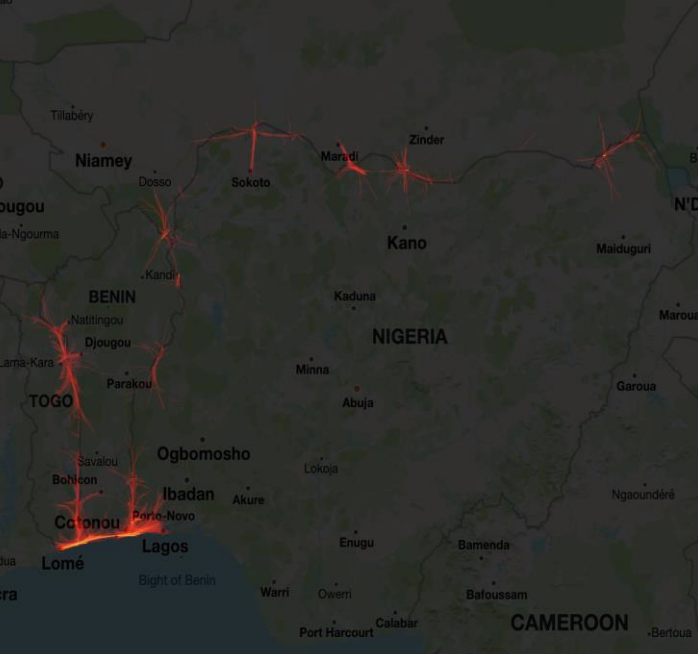
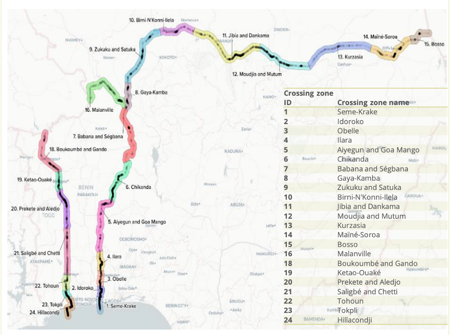

+++
title = "Understanding Informal Trade Dynamics in Benin"
authors = ["Jakob Engel", "Nathalie Picarelli", "Mathilde Lebrand", "Xun Yan"]
categories = ["Case Study"]
partner = ["Outlogic"]
dev_partner = "World Bank"
tags = ["Inequality and Shared Prosperity"]
links = ["https://documents1.worldbank.org/curated/en/156231646079813834/pdf/Increasing-Diversification-and-Integration-for-Economic-Transformation-Chapter-4.pdf"]
date = 2023-10-02T00:00:00Z
+++

Benin’s trade performance has been improving gradually in the past decade. Notably, informal trade, smuggling and small-scale cross border trade (SSCBT) are part of the large unrecorded trade dynamics in this African country. The World Bank’s Macroeconomics, Trade & Investment (MTI) Global Practice used [Outlogic](https://outlogic.io/)data to detect cross-border movements of goods and people, which are generally poorly monitored. This data gives an indication of informal trade flows and economic activity.

## Challenge

As a small open economy, Benin’s economic prospects depend on its ability to export and import goods and services regionally and globally to sustain growth. The country’s trade performance has been improving gradually in the past decade, but growth and diversification of official exports has been slow. 

In addition, informal trade remains pervasive in Benin due to its historically porous borders. As in many African countries, both smuggling and small-scale cross border trade (SSCBT) are common practices. These types of informal trade are not recorded in official statistics. In Benin, a comparison between official customs data and surveys of informal traders suggests an underestimation of 50% for imports, and about 85% for exports [Bensassi et al 2018](https://www.researchgate.net/publication/328138835_Regional_Integration_and_Informal_Trade_in_Africa_Evidence_from_Benin's_Borders).

It is essential to have alternative data to understand informal trade dynamics in Benin. However, informal trade is difficult to measure. Some trade goes unrecorded because of evasion at customs, while some trade occurs outside of official border crossing points, avoiding customs entirely.

<figure align="center">
    
    <figcaption>
        

		Photo: Getty Images Signature           
		

    </figcaption>
</figure>

## Solution

Despite the difficulty of measuring informal trade, non-conventional sources of data, such as cell-phone data, can be used to document cross-border movements of goods and people. In [Chapter 4](https://documents1.worldbank.org/curated/en/156231646079813834/pdf/Increasing-Diversification-and-Integration-for-Economic-Transformation-Chapter-4.pdf) of [the Benin Country Economic Memorandum](https://www.worldbank.org/en/region/afr/publication/benin-country-economic-memorandum-accelerating-the-growth-momentum-and-creating-better-jobs), the World Bank’s Macroeconomics, Trade & Investment (MTI) Global Practice leveraged Outlogic’s aggregated mobile data to monitor border activity at key official and unofficial crossing points. 

Mobile location data provide GPS locations over time that can help identify main crossing points irrespective of whether they are official. They provide time series with daily reports of anonymized and aggregated locations, but do not inform on the composition of trade as no information is included in the identity of the users. Figure 1 reports the hot spots identified for border crossings along the Nigeria’s and Benin’s borders. Additionally, the team utilized the Outlogic data to identify 24 crossing zones. Additionally, the team utilized the Outlogic data to identify 24 crossing zones, as shown in Figure 2. With this information, the team was able to study the patterns of informal trade within and outside Benin.

<figure align="center">
    
    <figcaption>
        

		Figure 1: Measuring linkages with GPS data (Source: Authors’ calculations based on GPS data provided by Outlogic before August 2019)
		

    </figcaption>
</figure>

<figure align="center">
    
    <figcaption>
        

		Figure 2: Detecting unofficial crossing zones by GPS data registered via mobile devices (Source: Outlogic and authors’ computation)
		

    </figcaption>
</figure>

## Impact

Informal trade impacts economic growth, affects the accuracy of national accounts and balance of payment, and undermines tax authorities’ effort to mobilize revenues. Therefore, to improve understanding of Benin’s trade dynamics, we must enhance data collection, especially on informal trade flows.

Leveraging the Outlogic data, the project was better able to understand the geography and dynamics of informal trade in Benin and study the impact of certain events, such as the closure of Nigeria’s borders to trade in 2019 and the COVID lockdown in 2020 on the location and intensity of movements across borders.

“It was very important to show our counterparts at the Ministry of Economy and Finance the key cross-border trading points we found along the border, and how innovative data could be leveraged to inform policy-making”, said Nathalie Picarell, the Task Team Leader for this project.
