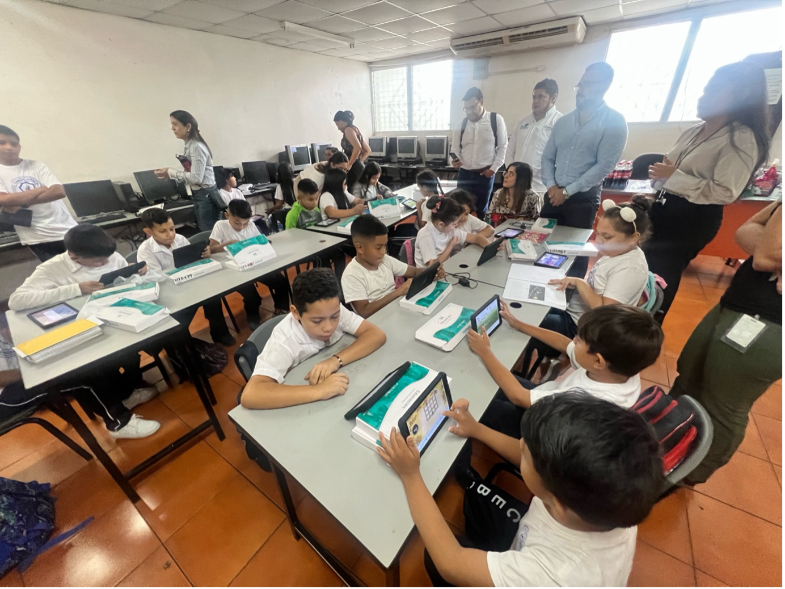
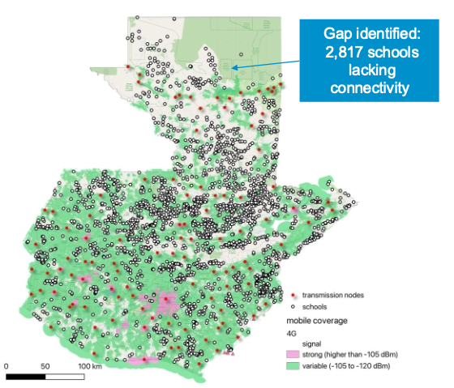
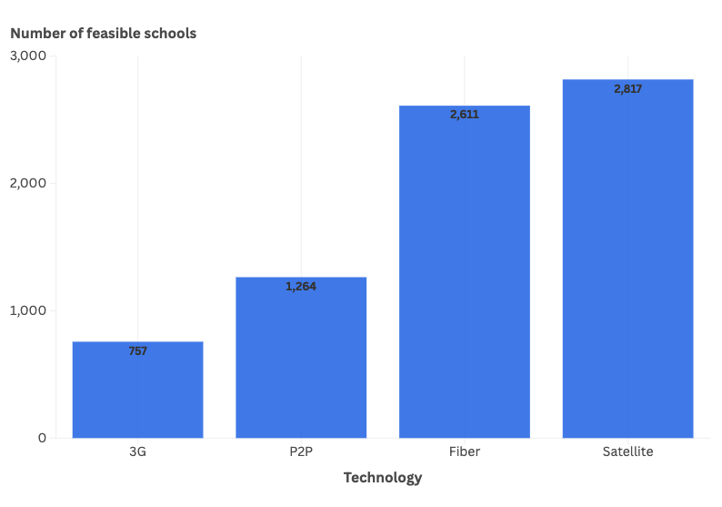

+++
title = "Investing in the Future: Connecting Guatemala’s Schools to the Internet"
authors = ["Enrique Iglesias", "Sébastien Peytrignet", "Walid Mathlouthi"]
categories = ["Case Study"]
partner = ["Ookla"]
dev_partner = ["Inter American Development Bank "]
tags = ["Digital Development"]
date = 2025-10-23T00:00:00Z
+++

Access to the internet is essential for quality education and opportunities, especially in low-income countries. The Inter-American Development Bank (IDB) collaborated with the International Telecommunication Union (ITU) to bridge Guatemala’s school connectivity gap, with support from [Ookla®](https://www.ookla.com/ookla-for-good).

## Challenge

Having reliable internet in schools enables students and teachers to go online without interruptions. This provides students with access to the latest information and resources, including digital textbooks and interactive learning tools. However, a significant number of schools in low-income countries remain disconnected from the internet, limiting opportunities for students.

Without access to reliable internet, students face significant barriers to their education. For instance, they are excluded from a wide range of essential learning resources, such as online textbooks, research materials, and interactive educational platforms. Moreover, digital tools that facilitate learning, collaboration, and skills development become inaccessible, hindering students' learning potential. This digital divide not only impacts immediate educational experiences but also limits future opportunities for development.

<figure style="text-align: center;">
  
  <figcaption style="text-align: center; font-size: 0.9em; color: #555;">Photo: Inter-American Development Bank.</figcaption>
</figure>

## Solution

As part of the ITU-IDB Digital Infrastructure Initiative, which aims to enhance digital infrastructure across Latin America and the Caribbean, ITU’s Future Networks and Spectrum (FNS) Division and IDB identified schools in Guatemala that lack connectivity to promote equitable digital education access. Focusing on schools beyond the reach of 4G coverage and far from fiber infrastructure, this analysis enables data-driven decisions to guide investments and help build inclusive, future-ready education systems.

Leveraging data from Ookla, the ITU and IDB teams revealed that in Guatemala, 2,817 schools, which make up 12% of the 22,635 schools in their dataset, likely lack adequate connectivity. To address this issue, the study applied three models to identify feasible connectivity options: first, an assessment of 3G mobile coverage to serve as a fallback where 4G is not available; second, fiber path modeling to explore potential extensions of the existing network; and third, point-to-point visibility analysis to determine whether microwave links could be deployed between schools and nearby towers.

<figure style="text-align: center;">
  
  <figcaption style="text-align: center; font-size: 0.9em; color: #555;">Assumption: These schools do not have current connectivity.</figcaption>
</figure>

The chart below illustrates the different technology options for connecting the 2,817 unconnected schools in Guatemala.

<figure style="text-align: center;">
  
</figure>

•	3G (757 schools): These schools can still rely on existing 3G networks where 4G is unavailable.

•	P2P – Point-to-Point microwave (1,264 schools): These schools have line-of-sight to towers, making microwave links possible.

•	Fiber (2,611 schools): These schools are within feasible range of existing infrastructure and could be connected by extending fiber networks.

•	Satellite (2,817 schools): All schools could technically be connected by satellite, which is the universal fallback option.

The numbers overlap across technologies, meaning one school may appear in more than one category. In practice, each school is assigned only one solution based on a technology priority ladder: Fiber first, then cellular, then microwave, and finally satellite.

## Impact

The proposed rollout would transform education and opportunities in Guatemala. By connecting schools located in densely populated areas, the initiative has the potential to provide reliable internet to over 525,000 students in a country where nearly 40% of the population is young, and school enrollment reaches 96%. 

Additionally, the benefits go far beyond classrooms. Expanding fiber infrastructure stimulates economic growth by increasing industrial productivity and helping businesses adopt digital tools more effectively. The initiative is expected to create around 1,000 direct jobs and 4,000 indirect jobs, while generating approximately USD 88 million in direct economic value and USD 378 million in indirect value. 

All in all, investing in school connectivity is not just about improving education; it’s about building a stronger, more inclusive digital economy for the entire country.

Learn about ITU’s Digital Infrastructure Investment Initiative: [https://www.itu.int/hub/2025/01/digital-infrastructure-investment-the-school-connection](https://www.itu.int/hub/2025/01/digital-infrastructure-investment-the-school-connection) 

